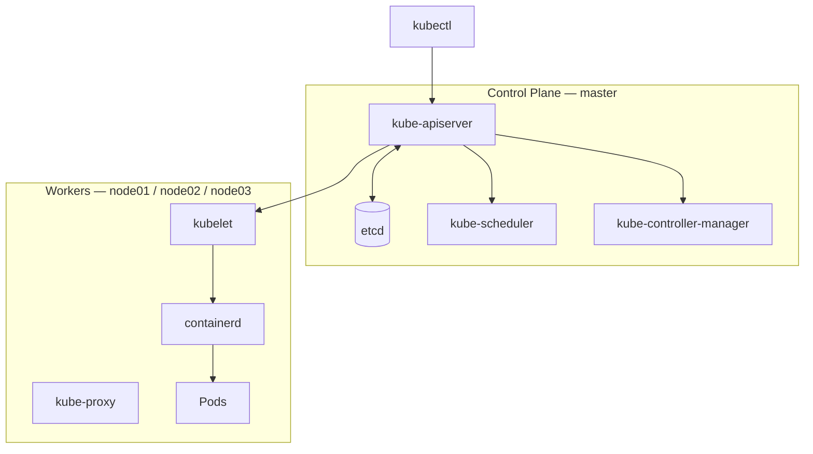
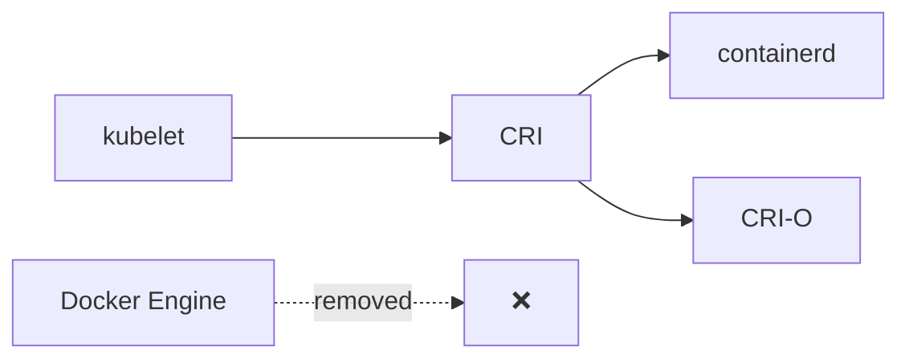
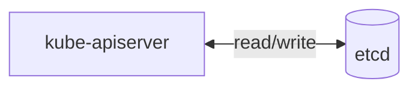
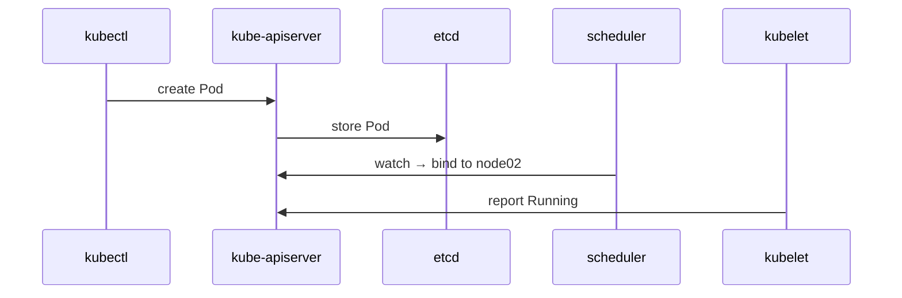
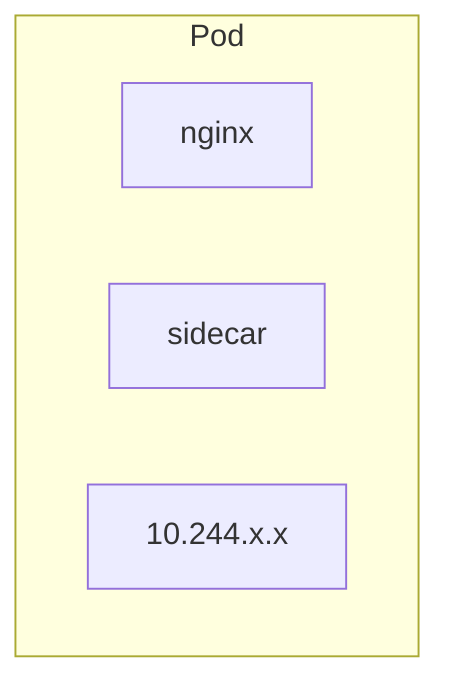
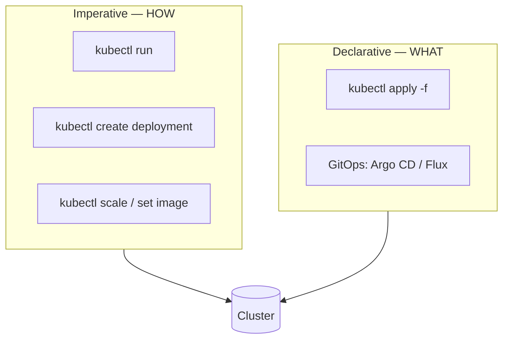
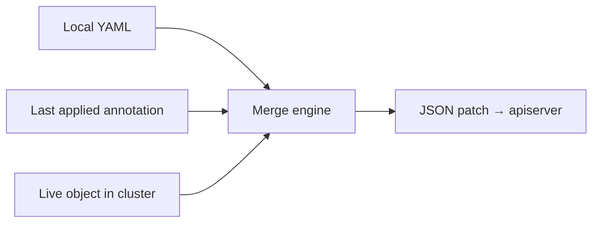
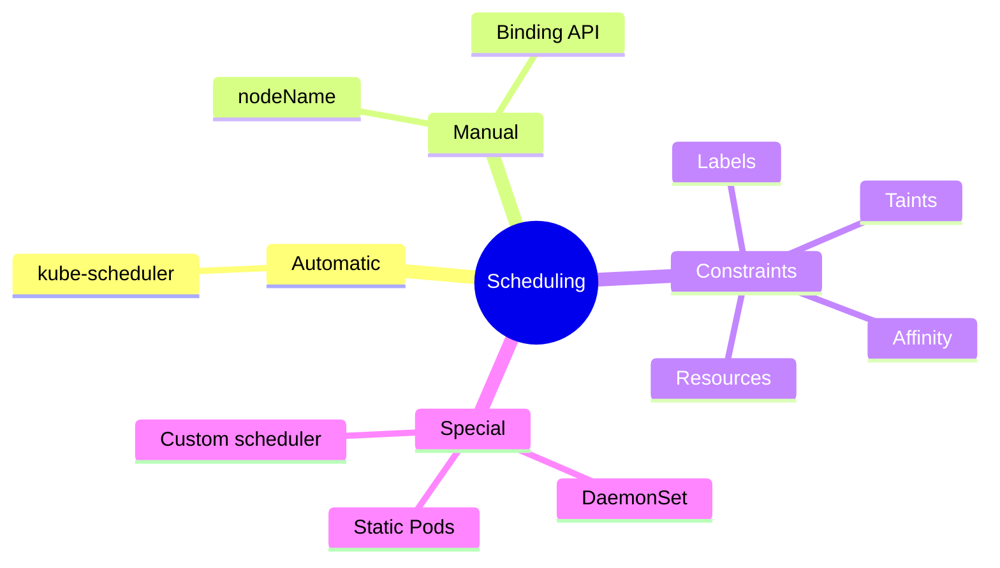
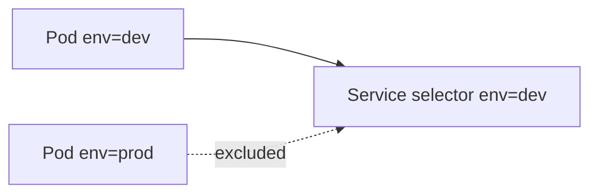
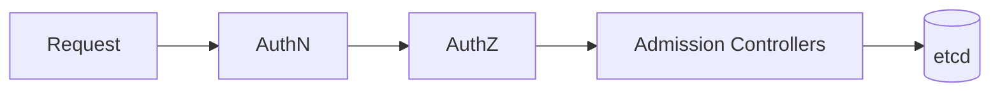

# CKA Study — Core Concepts (Enhanced)

> **Goal:** Deep reference for the Certified Kubernetes Administrator (CKA) exam — architecture, workloads, kubectl workflows, and scheduling fundamentals.  
> Every actionable section includes **Imperative** (command-line) and **Declarative** (YAML + `apply`) approaches.

## Lab environment

| VM | Role |
|----|------|
| **master** | Control plane |
| **node01** | Worker |
| **node02** | Worker |
| **node03** | Worker |

## Imperative vs Declarative — read this first

| Approach | Meaning | When to use |
|----------|---------|-------------|
| **Imperative** | You tell Kubernetes *how* to do each step (`run`, `create`, `scale`, `expose`) | Quick tests, CKA speed tasks, one-off changes |
| **Declarative** | You declare *what* you want in YAML; `kubectl apply` reconciles the cluster | Production, GitOps, repeatable configs |

| Command | Idempotent? | Stores `last-applied-configuration`? |
|---------|-------------|--------------------------------------|
| `kubectl create -f` | No — fails if exists | No |
| `kubectl replace -f` | No — needs full object | No |
| `kubectl apply -f` | **Yes** | **Yes** |

**YAML examples in this repo:**

| Path | Resource |
|------|----------|
| [../../yaml_examples/pod_intro.yaml](../../yaml_examples/pod_intro.yaml) | Pod |
| [../../yaml_examples/pod.yaml](../../yaml_examples/pod.yaml) | Multi-container Pod |
| [../../yaml_examples/replicasey-difination.yaml](../../yaml_examples/replicasey-difination.yaml) | ReplicaSet |
| [../../yaml_examples/rc-defenation.yaml](../../yaml_examples/rc-defenation.yaml) | ReplicationController |
| [../../yaml_examples/daemonset.yaml](../../yaml_examples/daemonset.yaml) | DaemonSet |
| [../../practice/deployment/deployment.yaml](../../practice/deployment/deployment.yaml) | Deployment |
| [../../practice/service/service-definition.yaml](../../practice/service/service-definition.yaml) | NodePort Service |
| [../../practice/exams/](../../practice/exams/) | 10 hands-on practice exams |

---

## Table of Contents

**Part I — Architecture**
1. [Cluster Architecture](#1-cluster-architecture)
2. [Docker vs containerd & CRI](#2-docker-vs-containerd--cri)
3. [etcd](#3-etcd)
4. [kube-apiserver](#4-kube-apiserver)
5. [kube-controller-manager](#5-kube-controller-manager)
6. [kube-scheduler](#6-kube-scheduler)
7. [kubelet](#7-kubelet)
8. [kube-proxy & Pod Networking](#8-kube-proxy--pod-networking)

**Part II — Workloads**
9. [Pods](#9-pods)
10. [ReplicaSet & ReplicationController](#10-replicaset--replicationcontroller)
11. [Deployments](#11-deployments)
12. [Services](#12-services)

**Part III — Namespaces & kubectl**
13. [Namespaces & Resource Quotas](#13-namespaces--resource-quotas)
14. [Imperative vs Declarative (deep dive)](#14-imperative-vs-declarative-deep-dive)
15. [How `kubectl apply` Works](#15-how-kubectl-apply-works)

**Part IV — Scheduling**
16. [Scheduling Overview](#16-scheduling-overview)
17. [Manual Scheduling](#17-manual-scheduling)
18. [Labels & Selectors](#18-labels--selectors)
19. [Taints & Tolerations](#19-taints--tolerations)
20. [Node Selectors & Node Affinity](#20-node-selectors--node-affinity)
21. [Resource Requests, Limits & Quotas](#21-resource-requests-limits--quotas)
22. [DaemonSets](#22-daemonsets)
23. [Static Pods](#23-static-pods)
24. [Priority Classes & Preemption](#24-priority-classes--preemption)
25. [Multiple Schedulers & Profiles](#25-multiple-schedulers--profiles)
26. [Admission Controllers](#26-admission-controllers)

**Reference**
27. [Useful Commands Cheat Sheet](#27-useful-commands-cheat-sheet)
28. [Docs & Resources](#28-docs--resources)

---

## 1. Cluster Architecture

### What & why

Kubernetes is a **container orchestration** platform. You declare desired state (e.g. "run 3 nginx replicas"); Kubernetes continuously reconciles the cluster to match that state.

A **cluster** has:
- **Control plane** (master) — brain: API, scheduling, controllers, etcd
- **Worker nodes** (node01–node03) — muscle: run application Pods




| Layer | Components | Responsibility |
|-------|------------|----------------|
| Control plane | apiserver, etcd, scheduler, controller-manager | Store state, schedule, heal, expose API |
| Worker | kubelet, kube-proxy, containerd, CNI | Run containers, route traffic, report health |

> **CKA note:** ReplicationController is a *workload controller* inside controller-manager — not a control-plane binary.

### Imperative — inspect the cluster

```bash
kubectl get nodes -o wide
kubectl cluster-info
kubectl get pods -n kube-system -o wide
kubectl describe node master | grep -E "Roles:|Taints:"
```

**Expected on your lab:**

```
NAME     STATUS   ROLES           ...
master   Ready    control-plane   ...
node01   Ready    <none>          ...
node02   Ready    <none>          ...
node03   Ready    <none>          ...
```

### Declarative — not applicable

Cluster architecture is infrastructure you install (kubeadm, static Pods). You do not `apply` a "cluster" resource — but control-plane components are **declarative static Pod manifests** on master (see [Section 23](#23-static-pods)).

---

## 2. Docker vs containerd & CRI

### What & why

Kubernetes does not run containers directly. It talks to a **container runtime** through **CRI (Container Runtime Interface)**. Runtimes must follow **OCI** (Open Container Initiative) image/runtime specs.

| Era | What happened |
|-----|---------------|
| Early K8s | Docker Engine used directly |
| CRI added | Pluggable runtimes (containerd, CRI-O) |
| dockershim | Temporary bridge so Docker worked without CRI |
| **v1.24+** | **dockershim removed** — use containerd or CRI-O |



| CLI tool | Purpose |
|----------|---------|
| **crictl** | Debug any CRI runtime (CKA exam) |
| **nerdctl** | Docker-like CLI for containerd |
| **ctr** | Low-level containerd (debug only) |

### Imperative — inspect runtime on a worker

```bash
ssh node01
sudo crictl ps
sudo crictl images
sudo crictl info | grep runtimeName
```

### Declarative — configure runtime (kubelet)

Runtime is configured in kubelet config (not kubectl). Example fragment in `/var/lib/kubelet/config.yaml`:

```yaml
containerRuntimeEndpoint: unix:///run/containerd/containerd.sock
```

---

## 3. etcd

### What & why

**etcd** is the **only** database for Kubernetes. Everything the control plane knows — Pods, nodes, secrets, RBAC — is stored as **key-value** pairs. If etcd is lost without backup, you lose the cluster brain.



| DB type | Example | Model |
|---------|---------|-------|
| Relational | PostgreSQL | Tables |
| Document | MongoDB | JSON docs |
| **Key-value** | **etcd** | key → value |

### Imperative — health & debug

```bash
# On master (kubeadm paths)
export ETCDCTL_API=3
sudo ETCDCTL_API=3 etcdctl \
  --endpoints=https://127.0.0.1:2379 \
  --cacert=/etc/kubernetes/pki/etcd/ca.crt \
  --cert=/etc/kubernetes/pki/etcd/server.crt \
  --key=/etc/kubernetes/pki/etcd/server.key \
  endpoint health

sudo ETCDCTL_API=3 etcdctl member list \
  --cacert=/etc/kubernetes/pki/etcd/ca.crt \
  --cert=/etc/kubernetes/pki/etcd/server.crt \
  --key=/etc/kubernetes/pki/etcd/server.key
```

> **CKA tip:** Always `export ETCDCTL_API=3` — v2 and v3 commands differ.

### Declarative — etcd static Pod manifest

On master: `/etc/kubernetes/manifests/etcd.yaml` — edited declaratively; kubelet applies changes.

```bash
ssh master "sudo ls /etc/kubernetes/manifests/etcd.yaml"
```

---

## 4. kube-apiserver

### What & why

The **API server** is the **only** component you should talk to. Every `kubectl` command, scheduler watch, and kubelet sync goes through it. It authenticates, validates, and reads/writes **etcd**.



### Imperative — interact with API

```bash
kubectl get nodes                    # GET /api/v1/nodes
kubectl run test --image=nginx --restart=Never   # POST Pod
kubectl api-resources                # discover API groups
kubectl explain pod.metadata --recursive
```

### Declarative — any Kubernetes object

All YAML manifests are declarative requests to the apiserver:

```bash
kubectl apply -f pod.yaml
```

Static Pod manifest: `/etc/kubernetes/manifests/kube-apiserver.yaml` on **master**.

---

## 5. kube-controller-manager

### What & why

Controllers are **control loops**: watch desired state vs actual state, then fix drift.

| Controller | Fixes what |
|------------|------------|
| ReplicaSet | Too few/many Pods |
| Deployment | Rollout, scaling |
| Node | Unreachable nodes, eviction |
| Endpoints | Service → Pod IP mapping |
| Job/CronJob | Batch workloads |

**Node controller timing (CKA):**

| Event | Time |
|-------|------|
| Health check | Every **5s** |
| Mark unreachable | **40s** without heartbeat |
| Evict Pods | **5 min** still down |

### Imperative — observe controllers working

```bash
# Self-healing: delete a Pod owned by Deployment
kubectl create deployment heal --image=nginx --replicas=2
POD=$(kubectl get pods -l app=heal -o jsonpath='{.items[0].metadata.name}')
kubectl delete pod $POD
kubectl get pods -l app=heal -w   # new Pod appears immediately
```

### Declarative — Deployment manifest

Controllers react to objects you `apply` — you never start controllers via kubectl:

```bash
kubectl apply -f ../../practice/deployment/deployment.yaml
```

Static Pod: `/etc/kubernetes/manifests/kube-controller-manager.yaml`

---

## 6. kube-scheduler

### What & why

The scheduler **only assigns** Pods to nodes. It does **not** run containers.

**Pipeline:** Filter (remove bad nodes) → Score (rank survivors) → Bind (pick winner)

Factors: resources, taints, affinity, image locality, spread.

### Imperative — see scheduling in action

```bash
kubectl run sched-demo --image=nginx --restart=Never
kubectl get pod sched-demo -o wide
kubectl describe pod sched-demo | grep -A2 Events
```

**Expected event:**

```
Successfully assigned default/sched-demo to node0X
```

### Declarative — influence scheduler via Pod spec

Scheduling constraints live in Pod/Deployment YAML (`nodeSelector`, `affinity`, `tolerations`, `resources`) — see Sections 17–21.

Force custom scheduler:

```yaml
spec:
  schedulerName: my-custom-scheduler
```

Static Pod: `/etc/kubernetes/manifests/kube-scheduler.yaml`

---

## 7. kubelet

### What & why

**kubelet** is the node agent. It registers the node, receives Pod specs from apiserver, tells **containerd** to start containers, and reports health.

> **Important:** kubelet is installed **manually** on every node — kubeadm does not deploy it as a Pod.

### Imperative — verify kubelet on workers

```bash
kubectl get nodes -o wide
ssh node01 "sudo systemctl status kubelet | head -5"
kubectl describe node node01 | grep -A6 Allocatable
```

### Declarative — kubelet configuration

`/var/lib/kubelet/config.yaml` — declarative config including `staticPodPath`, cgroup driver, etc.

---

## 8. kube-proxy & Pod Networking

### What & why

| Layer | Component | Role |
|-------|-----------|------|
| L3 Pod network | **CNI** (Calico, Flannel…) | Each Pod gets unique IP |
| DNS | **CoreDNS** | `mysvc.ns.svc.cluster.local` |
| Service routing | **kube-proxy** | ClusterIP → Pod IPs (iptables/IPVS) |

Without Services, Pods are reachable by IP only — IPs change when Pods restart.

### Imperative — inspect networking

```bash
kubectl get pods -o wide                    # Pod IPs
kubectl get svc
kubectl get endpoints <service-name>
kubectl get pods -n kube-system -l k8s-app=kube-proxy -o wide
kubectl run dns-test --image=busybox:1.36 --restart=Never -- sleep 3600
kubectl exec dns-test -- nslookup kubernetes.default
```

### Declarative — Service manifest

See [Section 12](#12-services). CNI and kube-proxy are cluster addons (often DaemonSets in `kube-system`).

---

## 9. Pods

### What & why

A **Pod** is the smallest deployable unit — one or more containers sharing:
- Network namespace (one IP)
- Storage volumes (optional)

Usually **1 Pod = 1 app instance**. Multi-container Pods use **sidecar** pattern (e.g. app + log shipper).



Pods are **ephemeral** — use controllers (Deployment, ReplicaSet) to recreate them.

### Imperative

```bash
kubectl run nginx --image=nginx --restart=Never
kubectl run multi --image=nginx --restart=Never --labels="app=web"
kubectl get pods -o wide
kubectl describe pod nginx
kubectl logs nginx
kubectl exec -it nginx -- /bin/sh
kubectl delete pod nginx
kubectl get pod nginx -o yaml > exported-pod.yaml
```

### Declarative

```yaml
apiVersion: v1
kind: Pod
metadata:
  name: mypod
  namespace: default
  labels:
    app: myapp
spec:
  containers:
    - name: nginx-container
      image: nginx
```

```bash
kubectl apply -f ../../yaml_examples/pod_intro.yaml
kubectl apply -f ../../yaml_examples/pod.yaml    # multi-container
```

### Verify

```bash
kubectl get pod mypod
# READY 1/1  STATUS Running
```

---

## 10. ReplicaSet & ReplicationController

### What & why

Both keep **N identical Pods** running. If a Pod dies, the controller creates another.

| Feature | ReplicationController (legacy) | ReplicaSet |
|---------|-------------------------------|------------|
| Selector | Equality only | `matchLabels` + `matchExpressions` |
| Status | Deprecated | Use this (via Deployment) |

ReplicaSet matches Pods by **labels** (`selector` ↔ Pod `labels`).

### Imperative

```bash
# ReplicaSet has no single imperative create — use Deployment instead, or:
kubectl apply -f ../../yaml_examples/replicasey-difination.yaml

kubectl get rs
kubectl scale rs myapp-replicaset --replicas=6
kubectl describe rs myapp-replicaset
kubectl delete rs myapp-replicaset
```

### Declarative

```yaml
apiVersion: apps/v1
kind: ReplicaSet
metadata:
  name: myapp-replicaset
spec:
  replicas: 3
  selector:
    matchLabels:
      type: front-end
  template:
    metadata:
      labels:
        app: myapp
        type: front-end
    spec:
      containers:
        - name: myapp-container
          image: nginx
```

```bash
kubectl apply -f ../../yaml_examples/replicasey-difination.yaml
kubectl apply -f ../../yaml_examples/rc-defenation.yaml   # legacy RC
```

### Verify

```bash
kubectl get rs,pods -l type=front-end
# DESIRED 3  CURRENT 3  READY 3
```

---

## 11. Deployments

### What & why

**Deployment** is what you use in production — it manages ReplicaSets and adds:

- **Self-healing** — replace crashed Pods
- **Scaling** — change replica count
- **Rolling updates** — zero-downtime image changes
- **Rollback** — revert to previous version

**Hierarchy:** `Deployment → ReplicaSet → Pod(s)`

| Strategy | Behavior | Downtime |
|----------|----------|----------|
| **RollingUpdate** (default) | Replace Pods one-by-one | No |
| **Recreate** | Kill all, then start new | Yes |

### Imperative

```bash
kubectl create deployment web --image=nginx --replicas=3
kubectl scale deployment web --replicas=5
kubectl set image deployment/web nginx=nginx:1.25
kubectl rollout status deployment/web
kubectl rollout history deployment/web
kubectl rollout undo deployment/web
kubectl edit deployment web
```

### Declarative

```bash
kubectl apply -f ../../practice/deployment/deployment.yaml
```

```yaml
apiVersion: apps/v1
kind: Deployment
metadata:
  name: myapp-deployment
spec:
  replicas: 3
  selector:
    matchLabels:
      app: myapp
  strategy:
    type: RollingUpdate
  template:
    metadata:
      labels:
        app: myapp
    spec:
      containers:
        - name: nginx
          image: nginx:1.25
```

Update image in YAML → `kubectl apply -f deployment.yaml` (preferred for GitOps).

### Verify

```bash
kubectl get deploy,rs,pods -l app=myapp
kubectl rollout status deployment/myapp-deployment
```

---

## 12. Services

### What & why

Pods have ephemeral IPs. A **Service** provides:
- Stable **ClusterIP** (virtual IP)
- **DNS name** (`myapp.default.svc.cluster.local`)
- **Load balancing** across matching Pods (via label **selector**)

| Type | Access | Use case |
|------|--------|----------|
| **ClusterIP** (default) | Internal only | App-to-app |
| **NodePort** | `<any-node-ip>:30000-32767` | Dev/lab external access |
| **LoadBalancer** | Cloud LB IP | Production (cloud) |

| Port field | Meaning |
|------------|---------|
| `targetPort` | Port on Pod/container |
| `port` | Port on Service (cluster-internal) |
| `nodePort` | Port on every node (30000–32767) |

### Imperative

```bash
kubectl expose deployment web --port=80 --target-port=80 --name=web-svc
kubectl expose deployment web --type=NodePort --port=80 --name=web-np
kubectl expose pod redis --port=6379 --name=redis-svc
kubectl get svc
kubectl describe svc web-svc
```

Generate YAML without applying:

```bash
kubectl expose pod redis --port=6379 --name=redis-service --dry-run=client -o yaml
```

### Declarative

```bash
kubectl apply -f ../../practice/service/service-definition.yaml
```

```yaml
apiVersion: v1
kind: Service
metadata:
  name: myapp-service
spec:
  type: NodePort
  selector:
    app: myapp
  ports:
    - port: 80
      targetPort: 80
      nodePort: 30004
```

### Verify

```bash
kubectl get endpoints myapp-service
curl http://node01:30004    # NodePort from any worker
```

---

## 13. Namespaces & Resource Quotas

### What & why

**Namespaces** isolate resources inside one cluster (teams, envs: dev/staging/prod). They do **not** isolate nodes — all namespaces share node01–node03.

| Namespace | Purpose |
|-----------|---------|
| `default` | User resources if none specified |
| `kube-system` | Control plane addons (CoreDNS, kube-proxy) |
| `kube-public` | Public cluster info |
| `kube-node-lease` | Node heartbeat leases |

**ResourceQuota** = max total resources per namespace.  
**LimitRange** = default/min/max per container in namespace.

### Imperative

```bash
kubectl create namespace dev
kubectl get namespaces
kubectl get pods -n dev
kubectl get pods --all-namespaces
kubectl config set-context $(kubectl config current-context) --namespace=dev
kubectl describe quota -n dev
```

### Declarative

```yaml
apiVersion: v1
kind: Namespace
metadata:
  name: dev
---
apiVersion: v1
kind: ResourceQuota
metadata:
  name: cpu-quota
  namespace: dev
spec:
  hard:
    requests.cpu: "4"
    requests.memory: 4Gi
    limits.cpu: "10"
    limits.memory: 10Gi
    pods: "20"
```

```bash
kubectl apply -f namespace-and-quota.yaml
```

---

## 14. Imperative vs Declarative (deep dive)

### What & why



**CKA pattern:** Generate YAML fast, then apply:

```bash
kubectl create deployment nginx --image=nginx --replicas=3 --dry-run=client -o yaml > deploy.yaml
kubectl apply -f deploy.yaml
```

### Imperative command reference

```bash
kubectl run POD --image=IMAGE --restart=Never
kubectl create deployment NAME --image=IMAGE --replicas=N
kubectl expose deployment NAME --port=80
kubectl scale deployment NAME --replicas=N
kubectl set image deployment/NAME CONTAINER=IMAGE:TAG
kubectl create -f file.yaml          # once only
kubectl replace -f file.yaml         # full replace
kubectl delete -f file.yaml
```

### Declarative command reference

```bash
kubectl apply -f file.yaml
kubectl apply -f directory/
kubectl diff -f file.yaml            # preview changes
kubectl delete -f file.yaml          # remove what's in file
```

---

## 15. How `kubectl apply` Works

### What & why

`apply` uses a **three-way merge**:



| Input | Source |
|-------|--------|
| Local file | Your YAML on disk |
| Last applied | `kubectl.kubernetes.io/last-applied-configuration` annotation |
| Live object | Current cluster state |

| Scenario | Result |
|----------|--------|
| Object missing | Created |
| Field changed | Patched |
| Field removed from YAML | Removed from live object |
| Created with `create`/`run` | No last-applied annotation |

### Imperative — compare approaches

```bash
kubectl run demo --image=nginx:1.24 --restart=Never
kubectl get pod demo -o yaml | grep last-applied    # empty

kubectl apply -f - <<EOF
apiVersion: v1
kind: Pod
metadata:
  name: demo
spec:
  containers:
    - name: demo
      image: nginx:1.25
EOF
kubectl get pod demo -o yaml | grep last-applied    # present
```

### Declarative — this IS apply

Always prefer `kubectl apply -f` for manifests under version control.

---

## 16. Scheduling Overview

### What & why

Scheduling = **which node** runs each Pod.



| Mechanism | Section |
|-----------|---------|
| Default scheduler | §6 |
| Manual (`nodeName`, Binding) | §17 |
| Labels & selectors | §18 |
| Taints & tolerations | §19 |
| Node selector & affinity | §20 |
| Requests, limits, quotas | §21 |
| DaemonSets | §22 |
| Static Pods | §23 |

---

## 17. Manual Scheduling

### What & why

By default the **scheduler** picks the node. Override when you need a Pod on a **specific** node (debugging, hardware, compliance).

| Method | When |
|--------|------|
| `nodeName` in spec | At **creation** only — skips scheduler |
| **Binding API** | Bind unscheduled Pod at runtime |

### Imperative — Binding via patch (lab shortcut)

```bash
kubectl run bind-target --image=nginx --restart=Never
kubectl patch pod bind-target -p '{"spec":{"nodeName":"node02"}}'
kubectl get pod bind-target -o wide
```

CKA exam: POST Binding JSON to apiserver with curl + certs.

### Declarative — nodeName in Pod YAML

```yaml
apiVersion: v1
kind: Pod
metadata:
  name: pinned
spec:
  nodeName: node02    # master | node01 | node02 | node03
  containers:
    - name: nginx
      image: nginx
```

```bash
kubectl apply -f pinned-pod.yaml
kubectl get pod pinned -o wide
# NODE = node02
```

```yaml
# Binding object (POST to API)
apiVersion: v1
kind: Binding
metadata:
  name: nginx
target:
  apiVersion: v1
  kind: Node
  name: node02
```

---

## 18. Labels & Selectors

### What & why

**Labels** are key=value metadata on objects. **Selectors** filter objects by labels.

Used by: Services, ReplicaSets, Deployments, `kubectl get -l`, NetworkPolicies.



### Imperative

```bash
kubectl run web --image=nginx --labels="env=dev,tier=frontend" --restart=Never
kubectl label pod web version=v1
kubectl label pod web version-                    # remove label
kubectl get pods -l env=dev
kubectl get pods -l env=dev,tier=frontend
kubectl get pods --selector env=dev
```

### Declarative — labels in metadata; selectors in spec

```yaml
# Pod
metadata:
  labels:
    env: dev
    tier: frontend
---
# Service
spec:
  selector:
    env: dev
---
# ReplicaSet
spec:
  selector:
    matchLabels:
      app: myapp
  template:
    metadata:
      labels:
        app: myapp
```

---

## 19. Taints & Tolerations

### What & why

| Concept | Effect |
|---------|--------|
| **Taint** (on node) | Repels Pods |
| **Toleration** (on Pod) | Allows Pod onto tainted node |

> **Critical:** Taints say who **may** run on a node. They do **not** **force** a Pod there — use **node affinity** for attraction.

| Taint effect | Behavior |
|--------------|----------|
| `NoSchedule` | No new Pods without toleration |
| `PreferNoSchedule` | Scheduler tries to avoid |
| `NoExecute` | Evicts existing Pods without toleration |

Master default taint: `node-role.kubernetes.io/control-plane:NoSchedule`

### Imperative

```bash
kubectl taint nodes node02 dedicated=gpu:NoSchedule
kubectl describe node node02 | grep Taints
kubectl taint nodes node02 dedicated=gpu:NoSchedule-   # remove (note trailing -)
```

### Declarative — tolerations in Pod spec

```yaml
spec:
  tolerations:
    - key: dedicated
      operator: Equal
      value: gpu
      effect: NoSchedule
  affinity:                              # optional: force node02
    nodeAffinity:
      requiredDuringSchedulingIgnoredDuringExecution:
        nodeSelectorTerms:
          - matchExpressions:
              - key: kubernetes.io/hostname
                operator: In
                values: [node02]
  containers:
    - name: nginx
      image: nginx
```

```bash
kubectl apply -f gpu-pod.yaml
```

---

## 20. Node Selectors & Node Affinity

### What & why

| Feature | Power | Syntax |
|---------|-------|--------|
| **nodeSelector** | Simple equality | `disktype: ssd` |
| **nodeAffinity** | Rich rules | In, NotIn, Exists, Gt, Lt |

| Affinity type | Meaning |
|---------------|---------|
| `requiredDuringSchedulingIgnoredDuringExecution` | **Hard** — must match |
| `preferredDuringSchedulingIgnoredDuringExecution` | **Soft** — prefer, not required |
| `...RequiredDuringExecution` | Evict if node stops matching |

### Imperative — label nodes first

```bash
kubectl label nodes node01 disktype=hdd --overwrite
kubectl label nodes node02 disktype=ssd --overwrite
kubectl get nodes --show-labels
```

### Declarative — nodeSelector

```yaml
spec:
  nodeSelector:
    disktype: ssd
  containers:
    - name: nginx
      image: nginx
```

### Declarative — nodeAffinity

```yaml
spec:
  affinity:
    nodeAffinity:
      requiredDuringSchedulingIgnoredDuringExecution:
        nodeSelectorTerms:
          - matchExpressions:
              - key: disktype
                operator: In
                values: [ssd]
              - key: kubernetes.io/hostname
                operator: NotIn
                values: [node03]
  containers:
    - name: nginx
      image: nginx
```

---

## 21. Resource Requests, Limits & Quotas

### What & why

| Field | Who uses it |
|-------|-------------|
| **requests** | **Scheduler** — "reserve this much when placing Pod" |
| **limits** | **kubelet/runtime** — "max usage allowed" |

| QoS class | Condition |
|-----------|-----------|
| **Guaranteed** | requests == limits (all containers) |
| **Burstable** | requests set, limits differ or missing |
| **BestEffort** | no requests/limits |

| Unit | Example |
|------|---------|
| CPU | `1` = 1 core, `500m` = 0.5 core |
| Memory (binary) | `1Gi`, `512Mi` (1024-based) |
| Memory (decimal) | `1G`, `500M` (1000-based) |

**LimitRange** → per-container defaults in namespace.  
**ResourceQuota** → namespace totals.

### Imperative

```bash
kubectl run res-pod --image=nginx --restart=Never \
  --requests=cpu=200m,memory=256Mi \
  --limits=cpu=500m,memory=512Mi

kubectl top nodes    # needs metrics-server
kubectl top pods
kubectl describe pod res-pod | grep -A6 "Limits:"
kubectl describe quota -n dev
kubectl describe limitrange -n dev
```

### Declarative — Pod resources

```yaml
spec:
  containers:
    - name: nginx
      image: nginx
      resources:
        requests:
          cpu: 200m
          memory: 256Mi
        limits:
          cpu: 500m
          memory: 512Mi
```

### Declarative — LimitRange + ResourceQuota

```yaml
apiVersion: v1
kind: LimitRange
metadata:
  name: mem-limit-range
  namespace: dev
spec:
  limits:
    - type: Container
      default:
        cpu: 500m
        memory: 1Gi
      defaultRequest:
        cpu: 200m
        memory: 512Mi
      max:
        cpu: "1"
        memory: 2Gi
      min:
        cpu: 100m
        memory: 256Mi
---
apiVersion: v1
kind: ResourceQuota
metadata:
  name: mem-quota
  namespace: dev
spec:
  hard:
    requests.memory: 4Gi
    limits.memory: 8Gi
    pods: "10"
```

```bash
kubectl apply -f limits-and-quota.yaml
```

---

## 22. DaemonSets

### What & why

**DaemonSet** = exactly **one Pod per matching node** (or subset via nodeSelector/affinity).

| Use case | Example |
|----------|---------|
| Logs | fluentd, Filebeat |
| Monitoring | node-exporter |
| Networking | **kube-proxy** |
| Custom agent | your `log-agent` on every worker |

Unlike Deployment (fixed replica count), DaemonSet scales when nodes join/leave.

### Imperative

```bash
kubectl apply -f ../../yaml_examples/daemonset.yaml
kubectl get daemonset -n kube-system
kubectl get ds -n kube-system kube-proxy -o wide
kubectl describe ds log-agent -n kube-system
```

### Declarative

```yaml
apiVersion: apps/v1
kind: DaemonSet
metadata:
  name: log-agent
  namespace: kube-system
spec:
  selector:
    matchLabels:
      app: log-agent
  template:
    metadata:
      labels:
        app: log-agent
    spec:
      tolerations:                          # run on master too
        - key: node-role.kubernetes.io/control-plane
          operator: Exists
          effect: NoSchedule
      containers:
        - name: agent
          image: busybox
          command: ["sleep", "3600"]
```

```bash
kubectl apply -f daemonset.yaml
```

### Verify (4-node lab)

```bash
kubectl get pods -l app=log-agent -o wide
# Expect 3 on workers, or 4 if toleration for control-plane
```

---

## 23. Static Pods

### What & why

**Static Pods** are created by **kubelet** from manifest files — **not** by scheduler or Deployment.

| Trait | Detail |
|-------|--------|
| Manager | kubelet only |
| Path | `/etc/kubernetes/manifests/` (default) |
| API visibility | Mirror Pod named `<name>-<nodeName>` |
| Delete via kubectl? | Recreated — remove manifest file instead |

Control plane on **master** (kubeadm): etcd, apiserver, scheduler, controller-manager.

### Imperative — inspect (do not delete in prod)

```bash
kubectl get pods -n kube-system --field-selector spec.nodeName=master
ssh master "sudo ls /etc/kubernetes/manifests/"
kubectl get pod kube-apiserver-master -n kube-system -o yaml | grep ownerReferences
```

### Declarative — manifest on disk

```yaml
# /etc/kubernetes/manifests/static-nginx.yaml  (on node01 — lab only)
apiVersion: v1
kind: Pod
metadata:
  name: static-nginx
  namespace: default
spec:
  containers:
    - name: nginx
      image: nginx
```

kubelet config (`/var/lib/kubelet/config.yaml`):

```yaml
staticPodPath: /etc/kubernetes/manifests
```

---

## 24. Priority Classes & Preemption

### What & why

**PriorityClass** assigns numeric priority to Pods. Higher priority Pods can **preempt** (evict) lower priority Pods when nodes are full.

| Value range | |
|-------------|---|
| Min | -2,147,483,648 |
| Max | 1,000,000,000 |
| Default Pod priority | 0 |

| `preemptionPolicy` | Behavior |
|--------------------|----------|
| `PreemptLowerPriority` (default) | Can evict lower priority Pods |
| `Never` | Will not preempt others |

### Imperative

```bash
kubectl get priorityclasses
kubectl describe priorityclass high-priority
```

### Declarative

```yaml
apiVersion: scheduling.k8s.io/v1
kind: PriorityClass
metadata:
  name: high-priority
value: 1000000
globalDefault: false
description: "Mission-critical workloads"
preemptionPolicy: PreemptLowerPriority
---
apiVersion: v1
kind: Pod
metadata:
  name: critical-pod
spec:
  priorityClassName: high-priority
  containers:
    - name: nginx
      image: nginx
```

```bash
kubectl apply -f priority.yaml
```

---

## 25. Multiple Schedulers & Profiles

### What & why

Default scheduler: `default-scheduler`. You can run **custom schedulers** as Pods and assign Pods via `spec.schedulerName`.

**Scheduling framework phases:**

| Phase | Default plugins |
|-------|-----------------|
| Queue sort | PrioritySort |
| Filter | NodeResourceFit, NodeName, NodeUnschedulable, … |
| Score | NodeResourcesFit, ImageLocality, … |
| Bind | DefaultBinder |

Custom logic → write **Scheduling Plugins** at Extension Points.

### Imperative — use custom scheduler name

```bash
kubectl run custom --image=nginx --restart=Never \
  --overrides='{"spec":{"schedulerName":"my-scheduler"}}'
```

### Declarative — scheduler config + Pod

```yaml
# KubeSchedulerConfiguration
apiVersion: kubescheduler.config.k8s.io/v1
kind: KubeSchedulerConfiguration
profiles:
  - schedulerName: my-scheduler
leaderElection:
  leaderElect: true
  resourceNamespace: kube-system
  resourceName: my-scheduler
```

```yaml
# Custom scheduler Pod (kube-system)
apiVersion: v1
kind: Pod
metadata:
  name: my-custom-scheduler
  namespace: kube-system
spec:
  containers:
    - name: kube-scheduler
      image: registry.k8s.io/kube-scheduler:v1.29.0
      command:
        - kube-scheduler
        - --config=/etc/kubernetes/my-scheduler-config.yaml
        - --kubeconfig=/etc/kubernetes/scheduler.conf
```

```yaml
# Pod assigned to custom scheduler
spec:
  schedulerName: my-scheduler
  containers:
    - name: nginx
      image: nginx
```

---

## 26. Admission Controllers

### What & why

**Admission controllers** gate requests **after** authentication/authorization, **before** data is saved to etcd. They can **mutate** (change) or **validate** (accept/reject) objects.



| Controller | Role |
|------------|------|
| `NamespaceLifecycle` | Block ops in terminating namespaces |
| `LimitRanger` | Apply LimitRange defaults |
| `ResourceQuota` | Enforce namespace quotas |
| `PodSecurity` | Pod Security Standards |
| `MutatingAdmissionWebhook` | Custom mutations |
| `ValidatingAdmissionWebhook` | Custom validation |

Enabled on **kube-apiserver**: `--enable-admission-plugins=NodeRestriction,LimitRanger,...`

### Imperative — see admission effects

```bash
# ResourceQuota rejection (ValidatingAdmission + ResourceQuota controller)
kubectl create namespace quota-test
kubectl apply -f - <<EOF
apiVersion: v1
kind: ResourceQuota
metadata:
  name: tiny
  namespace: quota-test
spec:
  hard:
    pods: "1"
EOF
kubectl run p1 -n quota-test --image=nginx --restart=Never
kubectl run p2 -n quota-test --image=nginx --restart=Never   # forbidden
```

### Declarative — apiserver static Pod flags

Edit `/etc/kubernetes/manifests/kube-apiserver.yaml` on master:

```yaml
# In container command:
- --enable-admission-plugins=NodeRestriction,LimitRanger,ResourceQuota,PodSecurity
```

---

## 27. Useful Commands Cheat Sheet

```bash
alias k=kubectl

# Cluster
kubectl get nodes -o wide
kubectl cluster-info
kubectl get pods -n kube-system

# Workloads
kubectl get pods,rs,deploy,svc
kubectl get po,rs,deploy,svc -A
kubectl describe pod <name>
kubectl logs <pod> -c <container>
kubectl exec -it <pod> -- /bin/sh

# Imperative create
kubectl run <name> --image= --restart=Never
kubectl create deployment <name> --image= --replicas=3
kubectl expose deployment <name> --port=80
kubectl scale deployment <name> --replicas=5

# Declarative
kubectl apply -f <file.yaml>
kubectl diff -f <file.yaml>
kubectl delete -f <file.yaml>

# Scheduling
kubectl label nodes node01 disktype=ssd
kubectl taint nodes node02 key=value:NoSchedule
kubectl get pods -o wide

# Debug
kubectl explain pod.spec --recursive
kubectl api-resources
kubectl get pod <name> -o yaml > export.yaml
export ETCDCTL_API=3
```

| Resource | Short name |
|----------|------------|
| Pod | `po` |
| ReplicaSet | `rs` |
| Deployment | `deploy` |
| Service | `svc` |
| DaemonSet | `ds` |
| Namespace | `ns` |

---

## 28. Docs & Resources

- [Kubernetes Architecture](https://kubernetes.io/docs/concepts/architecture/)
- [Pods](https://kubernetes.io/docs/concepts/workloads/pods/)
- [Deployments](https://kubernetes.io/docs/concepts/workloads/controllers/deployment/)
- [Services](https://kubernetes.io/docs/concepts/services-networking/service/)
- [Scheduling](https://kubernetes.io/docs/concepts/scheduling-eviction/)
- [Taints and Tolerations](https://kubernetes.io/docs/concepts/scheduling-eviction/taint-and-toleration/)
- [Resource Management](https://kubernetes.io/docs/concepts/configuration/manage-resources-containers/)
- [Static Pods](https://kubernetes.io/docs/tasks/configure-pod-container/static-pod/)
- [Pod Priority](https://kubernetes.io/docs/concepts/scheduling-eviction/pod-priority-preemption/)
- [Admission Controllers](https://kubernetes.io/docs/reference/access-authn-authz/admission-controllers/)
- [kubectl Cheat Sheet](https://kubernetes.io/docs/reference/kubectl/cheatsheet/)
- [Practice exams](../../practice/exams/)

### Official docs — YAML example locations

| Topic | Link |
|-------|------|
| Pod | [Configure a Pod](https://kubernetes.io/docs/tasks/configure-pod-container/) |
| Deployment | [Run a Stateless Application](https://kubernetes.io/docs/tasks/run-application/run-stateless-application-deployment/) |
| Service | [Service](https://kubernetes.io/docs/concepts/services-networking/service/) |
| Namespace / Quota | [Namespaces](https://kubernetes.io/docs/tasks/administer-cluster/namespaces/) · [Resource Quotas](https://kubernetes.io/docs/concepts/policy/resource-quotas/) |
| Taints / Affinity | [Taints](https://kubernetes.io/docs/concepts/scheduling-eviction/taint-and-toleration/) · [Node Affinity](https://kubernetes.io/docs/tasks/configure-pod-container/assign-pods-nodes-using-node-affinity/) |
| DaemonSet | [DaemonSet](https://kubernetes.io/docs/concepts/workloads/controllers/daemonset/) |
| PriorityClass | [Pod Priority](https://kubernetes.io/docs/concepts/scheduling-eviction/pod-priority-preemption/) |
