# CKA Study — Core Concepts (Enhanced)

> **Goal:** Complete reference for the Certified Kubernetes Administrator (CKA) exam — cluster architecture, workloads, namespaces, kubectl workflows, and foundational scheduling concepts.

**YAML examples in this repo:**

| Path | Resource |
|------|----------|
| [pod_intro.yaml](./pod_intro.yaml) | Pod |
| [pod.yaml](./pod.yaml) | Multi-container Pod |
| [replicasey-difination.yaml](./replicasey-difination.yaml) | ReplicaSet |
| [rc-defenation.yaml](./rc-defenation.yaml) | ReplicationController |
| [daemonset.yaml](./daemonset.yaml) | DaemonSet |
| [practice/deployment/deployment.yaml](./practice/deployment/deployment.yaml) | Deployment |
| [practice/service/service-definition.yaml](./practice/service/service-definition.yaml) | NodePort Service |
| [practice/voting-app/](./practice/voting-app/) | Multi-service microservices app |
| [practice/python_app/](./practice/python_app/) | Master/slave Python app |
| [practice/exams/](./practice/exams/) | **10 hands-on practice exams** |

---

## Table of Contents

1. [Cluster Architecture](#1-cluster-architecture)
2. [Docker vs containerd & CRI](#2-docker-vs-containerd--cri)
3. [etcd](#3-etcd)
4. [kube-apiserver — Request Flow](#4-kube-apiserver--request-flow)
5. [kube-controller-manager](#5-kube-controller-manager)
6. [kube-scheduler](#6-kube-scheduler)
7. [kubelet](#7-kubelet)
8. [kube-proxy & Pod Networking](#8-kube-proxy--pod-networking)
9. [Pods](#9-pods)
10. [ReplicaSet & ReplicationController](#10-replicaset--replicationcontroller)
11. [Deployments](#11-deployments)
12. [Services](#12-services)
13. [Namespaces & Resource Quotas](#13-namespaces--resource-quotas)
14. [Imperative vs Declarative](#14-imperative-vs-declarative)
15. [How `kubectl apply` Works](#15-how-kubectl-apply-works)
16. [Scheduling Overview](#16-scheduling-overview)
17. [Manual Scheduling](#17-manual-scheduling)
18. [Labels & Selectors](#18-labels--selectors)
19. [Taints & Tolerations](#19-taints--tolerations)
20. [Node Selectors & Node Affinity](#20-node-selectors--node-affinity)
21. [Resource Requests, Limits & Quotas](#21-resource-requests-limits--quotas)
22. [DaemonSets](#22-daemonsets)
23. [Static Pods](#23-static-pods)
24. [Priority Classes & Preemption](#24-priority-classes--preemption)
25. [Multiple Schedulers & Profiles](#25-multiple-schedulers--profiles)
26. [Admission Controllers](#26-admission-controllers)
27. [Useful Commands Cheat Sheet](#27-useful-commands-cheat-sheet)
28. [Docs & Resources](#28-docs--resources)

---

## 1. Cluster Architecture

Kubernetes runs on a **cluster** of machines. **Control plane** nodes manage the cluster; **worker nodes** run application workloads.


*Source: [kubernetes.io — Cluster Architecture](https://kubernetes.io/docs/concepts/architecture/)*

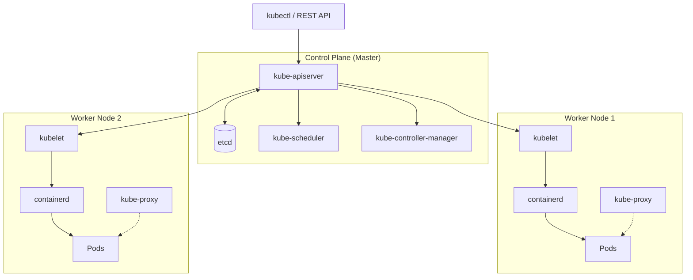

### Control Plane Components

| Component | Role |
|-----------|------|
| **etcd cluster** | Distributed key-value store — cluster source of truth |
| **kube-apiserver** | Front door; authenticates, validates, reads/writes etcd |
| **kube-scheduler** | Assigns unscheduled Pods to nodes |
| **kube-controller-manager** | Reconciles desired vs actual state via controllers |
| **Container runtime** | Runs containers (containerd, CRI-O) |

### Worker Node Components

| Component | Role |
|-----------|------|
| **kubelet** | Registers node; creates/destroys Pods; reports status |
| **kube-proxy** | Maintains network rules for Services |
| **Container runtime** | Actually runs containers |


---

## 2. Docker vs containerd & CRI

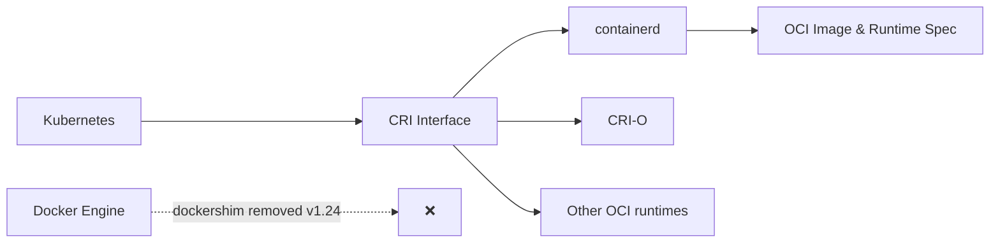

| Era | What happened |
|-----|---------------|
| Early K8s | Supported Docker directly |
| CRI introduced | Standard interface for OCI-compliant runtimes |
| Docker + dockershim | Bridge outside CRI kept Docker working |
| **v1.24+** | **dockershim removed** — use containerd or CRI-O |

### containerd CLI tools

| Tool | Purpose |
|------|---------|
| **ctr** | Low-level containerd CLI (debugging) |
| **nerdctl** | Docker-like CLI for containerd |
| **crictl** | CRI debugging CLI (any CRI runtime) |

```bash
crictl pull busybox
crictl images
crictl ps -a
crictl logs <container_id>
crictl pods
```

---

## 3. etcd

**etcd** is the **only** datastore for Kubernetes cluster state — a distributed, reliable key-value store.

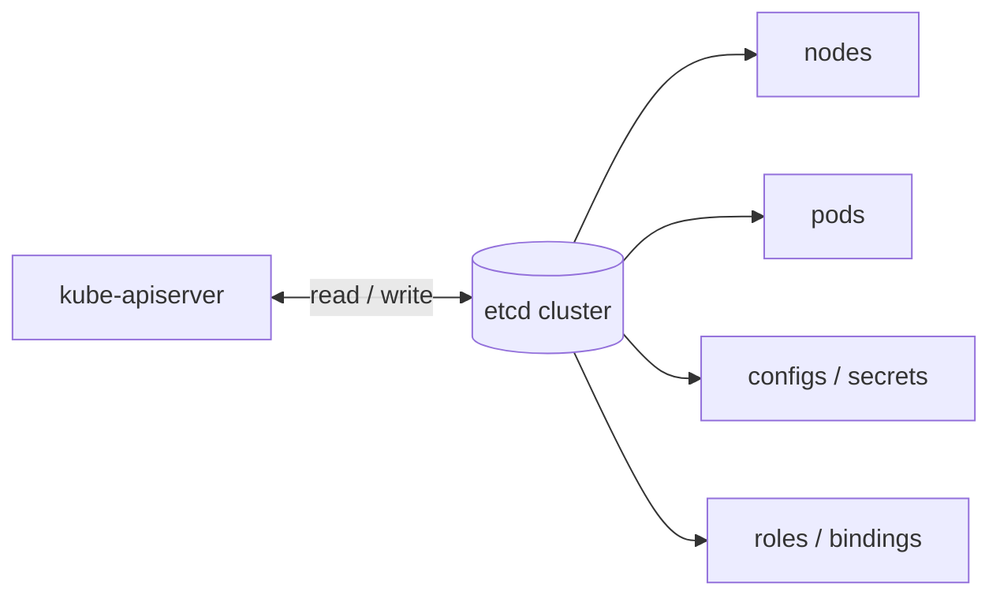

### What etcd stores

- Nodes, Pods, Deployments, Services
- ConfigMaps, Secrets
- ServiceAccounts, Roles, RoleBindings
- All cluster configuration and desired state

```bash
export ETCDCTL_API=3
etcdctl put key value
etcdctl get key
etcdctl member list
```

> **CKA tip:** Know `ETCDCTL_API=3` — v3 is default in modern exams.

---

## 4. kube-apiserver — Request Flow

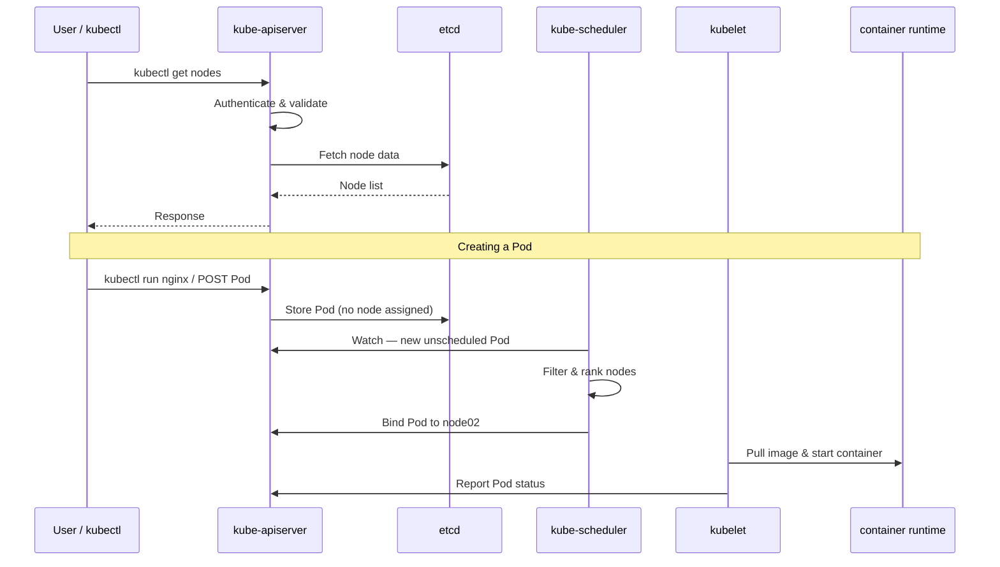

### Static Pod manifests (kubeadm)

| Component | Path |
|-----------|------|
| kube-apiserver | `/etc/kubernetes/manifests/kube-apiserver.yaml` |
| kube-controller-manager | `/etc/kubernetes/manifests/kube-controller-manager.yaml` |
| kube-scheduler | `/etc/kubernetes/manifests/kube-scheduler.yaml` |
| etcd | `/etc/kubernetes/manifests/etcd.yaml` |

---

## 5. kube-controller-manager

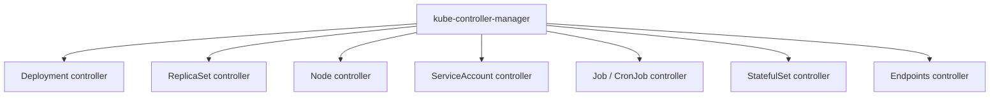

### Node controller behavior

| Event | Action |
|-------|--------|
| Health check interval | Every **5 seconds** |
| Missed heartbeats | After **40s** → **Unreachable** |
| Node still down | After **5 min** → Pods evicted; rescheduled if managed |

---

## 6. kube-scheduler

The scheduler decides **which node** each Pod runs on — it does **not** run containers.

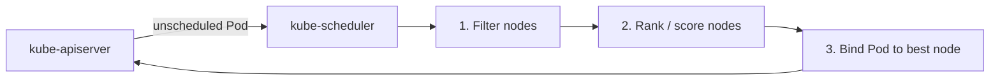

1. **Filtering** — remove nodes that don't meet requirements
2. **Scoring** — rank remaining nodes
3. **Binding** — assign Pod to highest-scoring node

---

## 7. kubelet

Agent on **every node** that talks to the apiserver and container runtime.

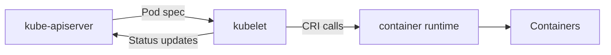

> **Important:** kubelet must be installed **manually on every node** — kubeadm does not deploy it as a Pod.

---

## 8. kube-proxy & Pod Networking

Every Pod gets its own IP (via **CNI plugin**). **kube-proxy** maintains rules so **Services** load-balance to backend Pods.

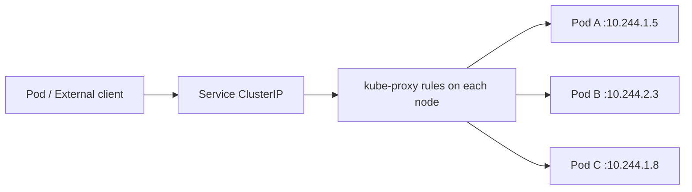

| Layer | Component | Purpose |
|-------|-----------|---------|
| Pod network | CNI plugin | Assigns IP per Pod |
| Service discovery | CoreDNS | DNS resolution |
| Service routing | kube-proxy | iptables or IPVS rules |

---

## 9. Pods

Smallest deployable unit — one or more containers sharing network namespace and volumes.

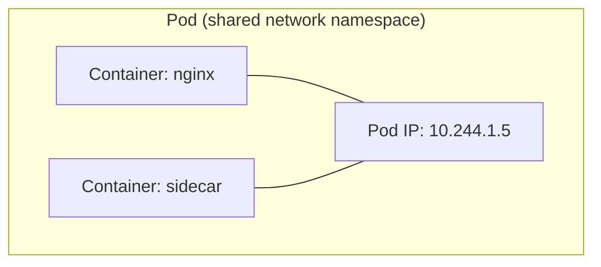

```yaml
apiVersion: v1
kind: Pod
metadata:
  name: mypod
  labels:
    app: myapp
spec:
  containers:
    - name: nginx-container
      image: nginx
```

```bash
kubectl run nginx --image=nginx
kubectl apply -f pod_intro.yaml
kubectl get pods
kubectl describe pod nginx
kubectl delete pod nginx
kubectl get pod webapp -o yaml > my-new-pod.yaml
```

---

## 10. ReplicaSet & ReplicationController

Ensure a specified number of Pod replicas are always running.

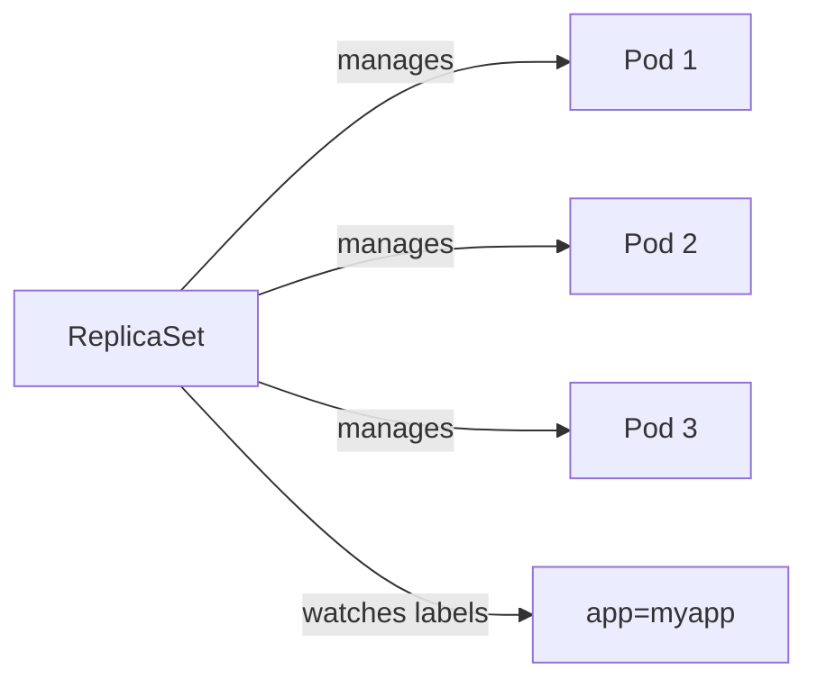

| Feature | ReplicationController (legacy) | ReplicaSet (current) |
|---------|-------------------------------|---------------------|
| Selector | Equality only | `matchLabels` + `matchExpressions` |
| Status | Deprecated | Standard |

```bash
kubectl apply -f replicasey-difination.yaml
kubectl get replicaset
kubectl scale --replicas=6 replicaset myapp-replicaset
```

---

## 11. Deployments

Manages ReplicaSets with rolling updates, rollbacks, and scaling.

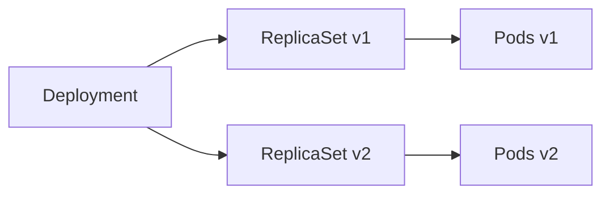

**Hierarchy:** `Deployment → ReplicaSet → Pod(s)`

| Strategy | Behavior | Downtime |
|----------|----------|----------|
| **RollingUpdate** (default) | Replace Pods incrementally | None |
| **Recreate** | Kill all old Pods, then start new | Yes |

```bash
kubectl apply -f practice/deployment/deployment.yaml
kubectl rollout status deployment/myapp-deployment
kubectl rollout history deployment/myapp-deployment
kubectl set image deployment/myapp-deployment nginx=nginx:1.9.1
kubectl rollout undo deployment/myapp-deployment
```

---

## 12. Services

Expose Pods as a stable network endpoint. Services select Pods by **labels**.

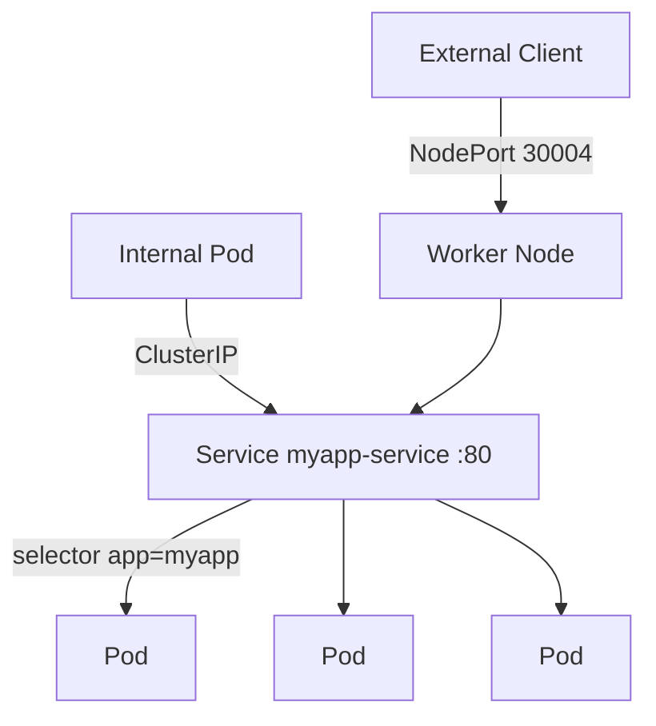

| Type | Scope | Use case |
|------|-------|----------|
| **ClusterIP** (default) | Internal only | Pod-to-Pod communication |
| **NodePort** | Port 30000–32767 on every node | Dev/test external access |
| **LoadBalancer** | Cloud LB + NodePort | Production external access |

```yaml
apiVersion: v1
kind: Service
metadata:
  name: myapp-service
spec:
  type: NodePort
  selector:
    app: myapp
  ports:
    - port: 80
      targetPort: 8080
      nodePort: 30004
```

---

## 13. Namespaces & Resource Quotas

Logical isolation within a cluster.

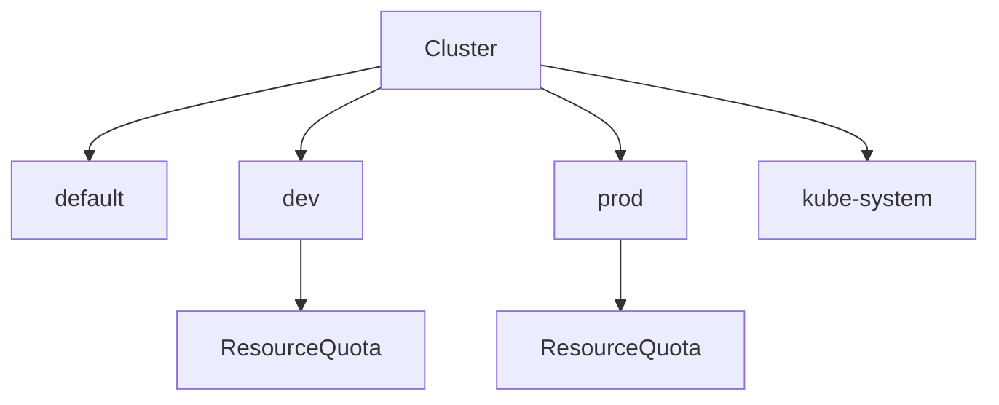

| Namespace | Purpose |
|-----------|---------|
| `default` | Default for user resources |
| `kube-system` | System components |
| `kube-public` | Publicly readable resources |
| `kube-node-lease` | Node heartbeat leases |

```yaml
apiVersion: v1
kind: Namespace
metadata:
  name: dev
---
apiVersion: v1
kind: ResourceQuota
metadata:
  name: cpu-resource-quota
spec:
  hard:
    requests.cpu: "4"
    requests.memory: 4Gi
    limits.cpu: "10"
    limits.memory: 10Gi
```

---

## 14. Imperative vs Declarative

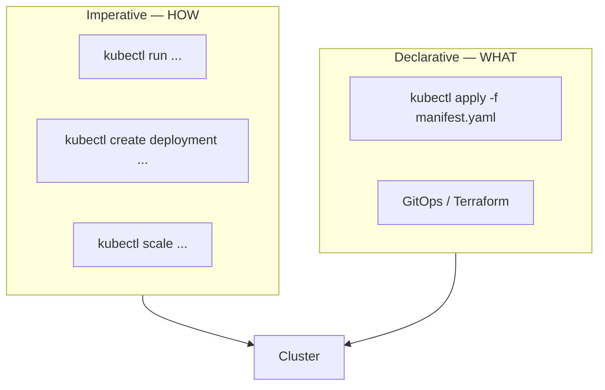

| Command | Idempotent? | Stores last-applied config? |
|---------|-------------|----------------------------|
| `kubectl create -f` | No | No |
| `kubectl replace -f` | No | No |
| `kubectl apply -f` | **Yes** | **Yes** (annotation) |

---

## 15. How `kubectl apply` Works

Three-way merge:

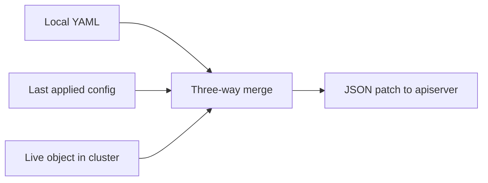

Annotation: `kubectl.kubernetes.io/last-applied-configuration`

---

## 16. Scheduling Overview

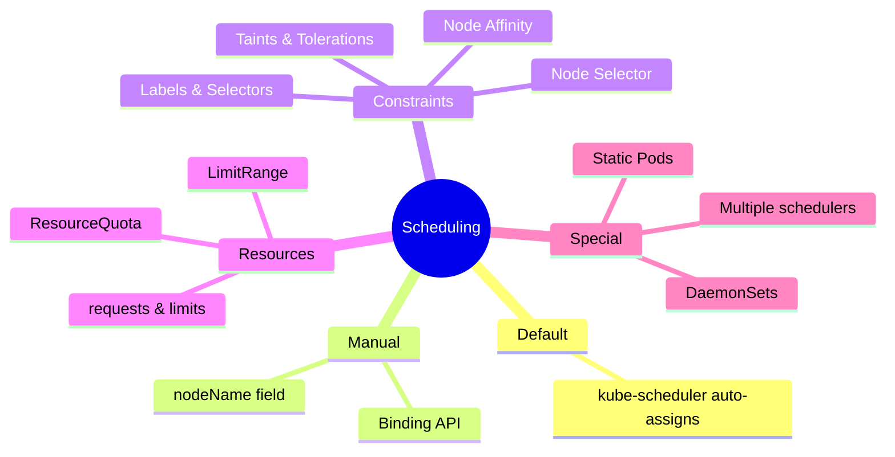

---

## 17. Manual Scheduling

### Option 1 — `nodeName` in Pod spec

```yaml
apiVersion: v1
kind: Pod
metadata:
  name: nginx
spec:
  containers:
    - name: nginx
      image: nginx
  nodeName: node02
```

### Option 2 — Binding API

```yaml
apiVersion: v1
kind: Binding
metadata:
  name: nginx
target:
  apiVersion: v1
  kind: Node
  name: node02
```

---

## 18. Labels & Selectors

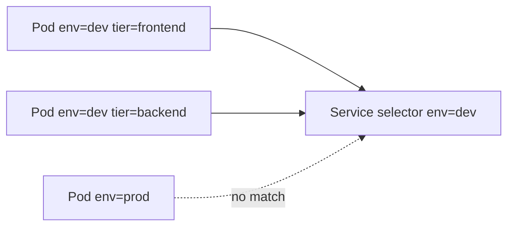

```bash
kubectl get pods --selector env=dev
kubectl get pods -l env=dev,tier=frontend
kubectl label pods mypod status=active
kubectl label pods mypod status-
```

---

## 19. Taints & Tolerations

**Taints** repel Pods. **Tolerations** allow scheduling onto tainted nodes.

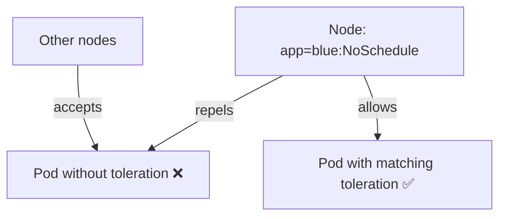

| Effect | Behavior |
|--------|----------|
| `NoSchedule` | Pod will not be scheduled (unless tolerates) |
| `PreferNoSchedule` | Scheduler tries to avoid the node |
| `NoExecute` | Existing Pods without toleration are **evicted** |

```bash
kubectl taint nodes node1 app=blue:NoSchedule
kubectl taint nodes controlplane node-role.kubernetes.io/control-plane:NoSchedule-
```

```yaml
tolerations:
  - key: app
    operator: Equal
    value: blue
    effect: NoSchedule
```

---

## 20. Node Selectors & Node Affinity

### Node Selector (simple)

```yaml
spec:
  nodeSelector:
    size: Large
```

### Node Affinity (advanced)

| Operator | Meaning |
|----------|---------|
| `In` | Value is in the list |
| `NotIn` | Value is not in the list |
| `Exists` | Key exists |
| `Gt` / `Lt` | Greater/less than (numeric) |

```yaml
affinity:
  nodeAffinity:
    requiredDuringSchedulingIgnoredDuringExecution:
      nodeSelectorTerms:
        - matchExpressions:
            - key: size
              operator: In
              values:
                - Large
```

---

## 21. Resource Requests, Limits & Quotas

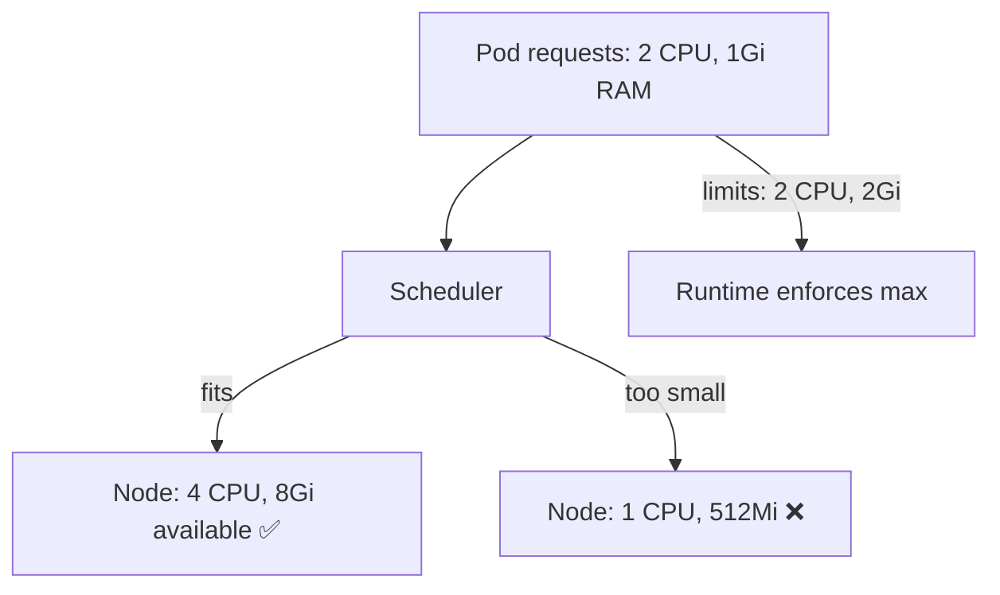

| Resource | Unit | Notes |
|----------|------|-------|
| CPU | `1` = 1 core | `500m` = 0.5 core |
| Memory (decimal) | `1G`, `1M` | 1000-based |
| Memory (binary) | `1Gi`, `1Mi` | 1024-based |

```yaml
resources:
  requests:
    memory: "1Gi"
    cpu: "2"
  limits:
    memory: "2Gi"
    cpu: "2"
```

---

## 22. DaemonSets

One Pod per (matching) node.

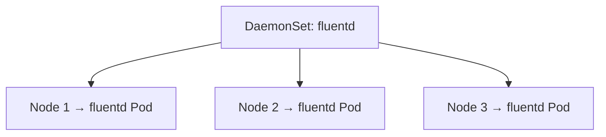

| Use case | Example |
|----------|---------|
| Log collection | fluentd, Filebeat |
| Monitoring | node-exporter |
| Networking | kube-proxy |

```yaml
apiVersion: apps/v1
kind: DaemonSet
metadata:
  name: elasticsearch
  namespace: kube-system
spec:
  selector:
    matchLabels:
      app: elasticsearch
  template:
    metadata:
      labels:
        app: elasticsearch
    spec:
      containers:
        - name: fluentd-elasticsearch
          image: registry.k8s.io/fluentd-elasticsearch:1.20
```

---

## 23. Static Pods

Managed directly by **kubelet** — not by apiserver/scheduler/controllers.

```mermaid
flowchart LR
    MANIFEST["/etc/kubernetes/manifests/*.yaml"] --> KL[kubelet]
    KL -->|creates & monitors| SP[Static Pod]
    KL -->|mirror Pod reported| API[kube-apiserver]
```

| Feature | Detail |
|---------|--------|
| Config location | `--pod-manifest-path=/etc/kubernetes/manifests` or `staticPodPath` in kubelet config |
| Visible in API | Mirror Pods (name suffix `-nodeName`) |

Control-plane components (apiserver, scheduler, controller-manager, etcd) are static Pods with kubeadm.

---

## 24. Priority Classes & Preemption

Priority range: **-2,147,483,648** to **1,000,000,000**

```yaml
apiVersion: scheduling.k8s.io/v1
kind: PriorityClass
metadata:
  name: high-priority
value: 1000000000
description: "Priority class for mission-critical pods"
preemptionPolicy: PreemptLowerPriority   # or Never
```

```yaml
spec:
  priorityClassName: high-priority
```

| Policy | Behavior |
|--------|----------|
| `PreemptLowerPriority` (default) | Higher priority Pods can evict lower priority Pods |
| `Never` | Pod will not preempt others |

```bash
kubectl get priorityclasses
```

---

## 25. Multiple Schedulers & Profiles

Deploy a custom scheduler as a Pod:

```yaml
apiVersion: v1
kind: Pod
metadata:
  name: my-custom-scheduler
  namespace: kube-system
spec:
  containers:
    - name: kube-scheduler
      image: registry.k8s.io/kube-scheduler:v1.29.0
      command:
        - kube-scheduler
        - --kubeconfig=/etc/kubernetes/scheduler.conf
        - --config=/etc/kubernetes/my-scheduler-config.yaml
```

Assign scheduler to a Pod:

```yaml
spec:
  schedulerName: my-custom-scheduler
  containers:
    - name: nginx
      image: nginx
```

### Scheduling Plugins (framework phases)

| Phase | Default plugins |
|-------|-----------------|
| Queue sort | PrioritySort |
| Filter | NodeResourceFit, NodeName, NodeUnschedulable |
| Score | NodeResourceFit, ImageLocality |
| Bind | DefaultBinder |

Custom plugins use **Extension Points**.

---

## 26. Admission Controllers

Gatekeepers that intercept requests **after** authentication/authorization, **before** persistence in etcd.

```mermaid
flowchart LR
    REQ[API Request] --> AUTH[Authentication]
    AUTH --> AUTHZ[Authorization]
    AUTHZ --> ADM[Admission Controllers]
    ADM --> ETCD[(etcd)]
```

Common admission controllers:

| Controller | Purpose |
|------------|---------|
| `NamespaceLifecycle` | Prevents creation in terminating namespaces |
| `LimitRanger` | Enforces LimitRange defaults |
| `ResourceQuota` | Enforces namespace quotas |
| `PodSecurity` | Enforces pod security standards |
| `MutatingAdmissionWebhook` | Custom mutations |
| `ValidatingAdmissionWebhook` | Custom validation |

Enable/disable via `--enable-admission-plugins` on kube-apiserver.

---

## 27. Useful Commands Cheat Sheet

```bash
alias k=kubectl
kubectl config set-context $(kubectl config current-context) --namespace=dev
kubectl get pods --all-namespaces
kubectl get pods,rs,deploy,svc
kubectl describe pod <name>
kubectl logs <pod> -c <container>
kubectl exec -it <pod> -- /bin/sh
kubectl get nodes --show-labels
kubectl describe node <name>
kubectl taint nodes <node> key=value:NoSchedule
kubectl label nodes <node> size=Large
kubectl top nodes
kubectl top pods
kubectl get pod <name> -o yaml > exported.yaml
kubectl explain pod.spec --recursive
kubectl api-resources
kubectl get pods -n kube-system
```

| Resource | Short |
|----------|-------|
| Pod | `po` |
| ReplicaSet | `rs` |
| Deployment | `deploy` |
| Service | `svc` |
| DaemonSet | `ds` |
| Namespace | `ns` |

---

## 28. Docs & Resources

- [Kubernetes Architecture](https://kubernetes.io/docs/concepts/architecture/)
- [etcd documentation](https://etcd.io/docs/)
- [Pods](https://kubernetes.io/docs/concepts/workloads/pods/)
- [Deployments](https://kubernetes.io/docs/concepts/workloads/controllers/deployment/)
- [Services](https://kubernetes.io/docs/concepts/services-networking/service/)
- [Scheduling](https://kubernetes.io/docs/concepts/scheduling-eviction/)
- [Taints and Tolerations](https://kubernetes.io/docs/concepts/scheduling-eviction/taint-and-toleration/)
- [Resource Management](https://kubernetes.io/docs/concepts/configuration/manage-resources-containers/)
- [DaemonSet](https://kubernetes.io/docs/concepts/workloads/controllers/daemonset/)
- [Static Pods](https://kubernetes.io/docs/tasks/configure-pod-container/static-pod/)
- [kubectl Cheat Sheet](https://kubernetes.io/docs/reference/kubectl/cheatsheet/)

---

## Kubernetes Docs — YAML Example Locations

Official pages where each resource/topic includes copy-paste YAML manifests:

| Topic / Resource | Kubernetes docs (YAML examples) |
|------------------|----------------------------------|
| **Pod** | [Pods concept](https://kubernetes.io/docs/concepts/workloads/pods/) · [Configure a Pod](https://kubernetes.io/docs/tasks/configure-pod-container/) |
| **Multi-container Pod** | [Configure Pod initialization](https://kubernetes.io/docs/tasks/configure-pod-container/configure-pod-initialization/) |
| **ReplicaSet** | [ReplicaSet](https://kubernetes.io/docs/concepts/workloads/controllers/replicaset/) |
| **ReplicationController** | [ReplicationController](https://kubernetes.io/docs/concepts/workloads/controllers/replicationcontroller/) |
| **Deployment** | [Deployment](https://kubernetes.io/docs/concepts/workloads/controllers/deployment/) · [Run a Stateless Application](https://kubernetes.io/docs/tasks/run-application/run-stateless-application-deployment/) |
| **Service (ClusterIP / NodePort)** | [Service](https://kubernetes.io/docs/concepts/services-networking/service/) · [Exposing an External IP](https://kubernetes.io/docs/tasks/access-application-cluster/service-access-application-cluster/) |
| **Namespace** | [Share a Cluster with Namespaces](https://kubernetes.io/docs/tasks/administer-cluster/namespaces/) |
| **ResourceQuota** | [Resource Quotas](https://kubernetes.io/docs/concepts/policy/resource-quotas/) |
| **LimitRange** | [Limit Ranges](https://kubernetes.io/docs/concepts/policy/limit-range/) |
| **Manual scheduling (`nodeName`)** | [Assign Pods to Nodes](https://kubernetes.io/docs/tasks/configure-pod-container/assign-pods-nodes/) |
| **Taints & tolerations** | [Taints and Tolerations](https://kubernetes.io/docs/concepts/scheduling-eviction/taint-and-toleration/) |
| **Node affinity** | [Assign Pods to Nodes using Node Affinity](https://kubernetes.io/docs/tasks/configure-pod-container/assign-pods-nodes-using-node-affinity/) |
| **Pod affinity / anti-affinity** | [Assign Pods to Nodes using Inter-Pod Affinity](https://kubernetes.io/docs/tasks/configure-pod-container/assign-pods-nodes-using-inter-pod-affinity-and-anti-affinity/) |
| **Resource requests & limits** | [Manage Resources for Containers](https://kubernetes.io/docs/tasks/configure-pod-container/assign-memory-resource/) · [Assign CPU](https://kubernetes.io/docs/tasks/configure-pod-container/assign-cpu-resource/) |
| **DaemonSet** | [DaemonSet](https://kubernetes.io/docs/concepts/workloads/controllers/daemonset/) |
| **Static Pod** | [Create static Pods](https://kubernetes.io/docs/tasks/configure-pod-container/static-pod/) |
| **PriorityClass** | [Pod Priority and Preemption](https://kubernetes.io/docs/concepts/scheduling-eviction/pod-priority-preemption/) |
| **KubeSchedulerConfiguration** | [Configure Multiple Schedulers](https://kubernetes.io/docs/tasks/administer-cluster/configure-multiple-schedulers/) |
| **Admission controllers** | [Admission Controllers](https://kubernetes.io/docs/reference/access-authn-authz/admission-controllers/) |
| **kube-apiserver static Pod** | [Manual kubeadm — control plane manifests](https://kubernetes.io/docs/setup/production-environment/tools/kubeadm/setup-kubeadm/) |
