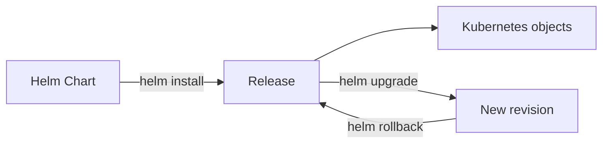
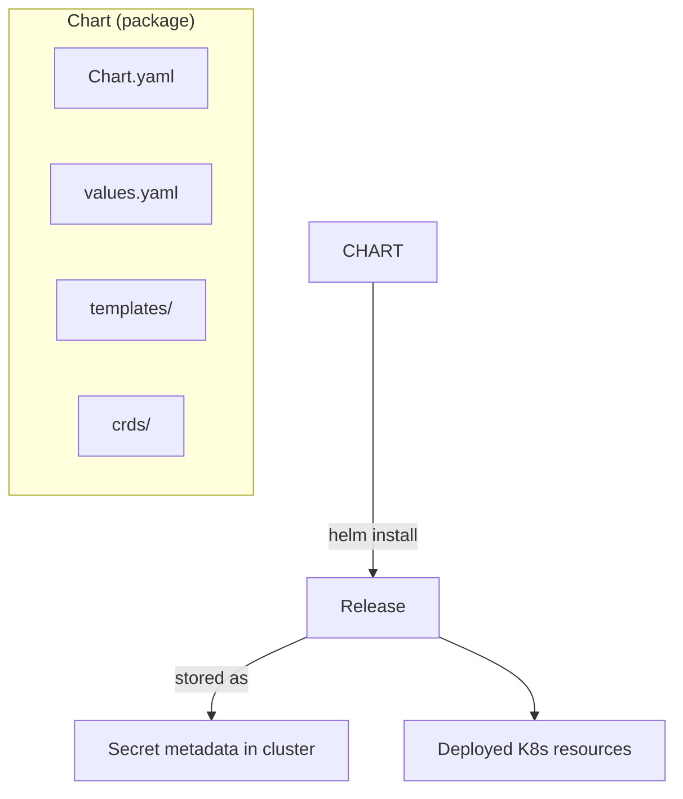
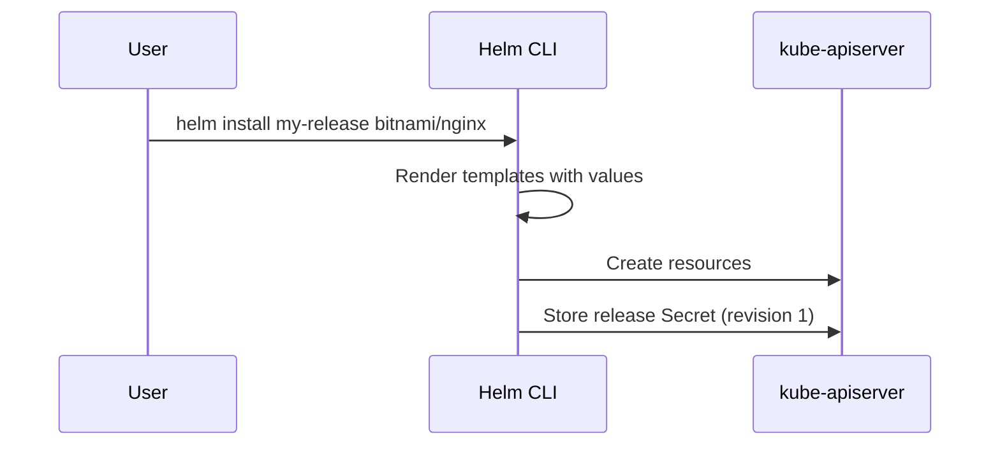
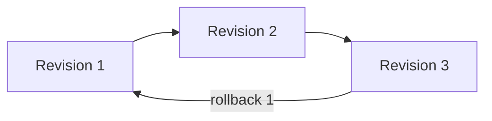

# CKA Study — Helm (Enhanced)

> **Goal:** Package, install, upgrade, and manage Kubernetes applications using Helm charts and releases.

---

## Table of Contents

1. [What is Helm?](#1-what-is-helm)
2. [Helm 2 vs Helm 3](#2-helm-2-vs-helm-3)
3. [Helm Components](#3-helm-components)
4. [Installation](#4-installation)
5. [Charts & Repositories](#5-charts--repositories)
6. [Installing Releases](#6-installing-releases)
7. [Customizing Chart Parameters](#7-customizing-chart-parameters)
8. [Lifecycle Management](#8-lifecycle-management)
9. [Chart Hooks](#9-chart-hooks)
10. [Cheat Sheet & Resources](#10-cheat-sheet--resources)

---

## 1. What is Helm?

Helm is the **package manager for Kubernetes** — treat apps as installable packages, not loose YAML files.



| Benefit | Description |
|---------|-------------|
| Single install command | `helm install my-release bitnami/wordpress` |
| Centralized config | One values file for all parameters |
| Upgrades | `helm upgrade` with revision history |
| Rollback | `helm rollback` to previous revision |
| Uninstall | `helm uninstall` removes all chart resources |

---

## 2. Helm 2 vs Helm 3

| Feature | Helm 2 | Helm 3 |
|---------|--------|--------|
| **Tiller** | Required (cluster-side, root permissions) | **Removed** — no Tiller |
| **Security** | Tiller had cluster-admin risk | Direct kube-apiserver access |
| **Release storage** | ConfigMaps/Secrets via Tiller | Secrets in release namespace |
| **Upgrade strategy** | 2-way merge | **3-way strategic merge** (chart + live + last release) |
| **Namespaces** | Limited | First-class namespace support |
| **CRDs** | Problematic | CRDs in `crds/` folder, not auto-deleted |

> **CKA:** Know Helm 3 has **no Tiller** and uses **3-way merge** preserving live state.

---

## 3. Helm Components



| Component | Description |
|-----------|-------------|
| **Chart** | Collection of files describing K8s resources (templates + defaults) |
| **Release** | Running instance of a chart in a cluster |
| **Repository** | HTTP server hosting packaged charts |
| **values.yaml** | Default configuration parameters |
| **templates/** | Go templates rendered into manifests |

### Chart.yaml example

```yaml
apiVersion: v2
name: wordpress
description: A Helm chart for WordPress
type: application
version: 12.1.27        # chart version
appVersion: "5.8.1"     # application version
dependencies:
  - name: mariadb
    version: "9.x.x"
    repository: https://charts.bitnami.com/bitnami
    condition: mariadb.enabled
keywords:
  - wordpress
  - blog
maintainers:
  - name: Bitnami
    email: containers@bitnami.com
```

---

## 4. Installation

```bash
# Snap (Linux)
sudo snap install helm --classic

# Script
curl https://raw.githubusercontent.com/helm/helm/main/scripts/get-helm-3 | bash

# Verify
helm version
```

---

## 5. Charts & Repositories

### Search charts

```bash
helm search hub wordpress          # Artifact Hub
helm search repo wordpress         # Local repo cache
```

### Add & update repositories

```bash
helm repo add bitnami https://charts.bitnami.com/bitnami
helm repo list
helm repo update
helm repo remove bitnami
```

Popular repos: **Bitnami**, **AppsCode**, **TrueCharts**, charts listed on [Artifact Hub](https://artifacthub.io).

---

## 6. Installing Releases

```bash
helm install my-release bitnami/wordpress
helm install my-release bitnami/wordpress --namespace blog --create-namespace
helm list
helm list -A
helm status my-release
helm uninstall my-release
```



---

## 7. Customizing Chart Parameters

### Override with --set

```bash
helm install my-release bitnami/wordpress \
  --set wordpressBlogName="Helm Tutorials"
```

### Override with values file

```yaml
# custom-values.yaml
wordpressBlogName: "Helm Tutorials"
replicaCount: 3
service:
  type: NodePort
```

```bash
helm install my-release bitnami/wordpress -f custom-values.yaml
helm upgrade my-release bitnami/wordpress -f custom-values.yaml
```

### Download and customize chart locally

```bash
helm pull bitnami/wordpress
helm pull bitnami/wordpress --untar
# Edit values.yaml or templates
helm install my-release ./wordpress
```

---

## 8. Lifecycle Management

Each `helm install` or `helm upgrade` creates a new **revision**.

```bash
helm list
helm history my-release
helm upgrade my-release bitnami/wordpress --set replicaCount=5
helm rollback my-release 1
helm uninstall my-release
```

| Command | Action |
|---------|--------|
| `helm install` | Create release (revision 1) |
| `helm upgrade` | New revision with changes |
| `helm rollback <rev>` | Revert to previous revision |
| `helm history` | List all revisions |
| `helm uninstall` | Remove release and resources |



### Helm template (dry-run)

```bash
helm template my-release bitnami/nginx
helm install my-release bitnami/nginx --dry-run --debug
```

---

## 9. Chart Hooks

Hooks run Jobs or Pods at specific points in the release lifecycle.

| Hook | When |
|------|------|
| `pre-install` | Before resources created |
| `post-install` | After resources created |
| `pre-delete` | Before delete |
| `post-delete` | After delete |
| `pre-upgrade` / `post-upgrade` | Around upgrade |
| `pre-rollback` / `post-rollback` | Around rollback |

```yaml
apiVersion: batch/v1
kind: Job
metadata:
  name: db-migrate
  annotations:
    "helm.sh/hook": post-install,post-upgrade
    "helm.sh/hook-weight": "1"
    "helm.sh/hook-delete-policy": hook-succeeded
spec:
  template:
    spec:
      containers:
        - name: migrate
          image: migrate-tool:latest
      restartPolicy: Never
```

---

## 10. Cheat Sheet & Resources

```bash
helm repo add/update/list
helm search hub/repo <keyword>
helm install <release> <chart> [-f values.yaml] [--set k=v]
helm upgrade <release> <chart>
helm rollback <release> <revision>
helm history/list/status/uninstall <release>
helm template <release> <chart>   # render without installing
```

- [Helm documentation](https://helm.sh/docs/)
- [Chart best practices](https://helm.sh/docs/chart_best_practices/)
- [Artifact Hub](https://artifacthub.io/)

---

## Kubernetes Docs — YAML Example Locations

Helm charts generate standard Kubernetes resources. Reference manifests:

| Generated resource | Kubernetes docs (YAML examples) |
|--------------------|----------------------------------|
| **Deployment** | [Deployment](https://kubernetes.io/docs/concepts/workloads/controllers/deployment/) |
| **Service** | [Service](https://kubernetes.io/docs/concepts/services-networking/service/) |
| **ConfigMap** | [ConfigMap](https://kubernetes.io/docs/concepts/configuration/configmap/) |
| **Secret** | [Secrets](https://kubernetes.io/docs/concepts/configuration/secret/) |
| **Ingress** | [Ingress](https://kubernetes.io/docs/concepts/services-networking/ingress/#the-ingress-resource) |
| **Job (hooks)** | [Jobs](https://kubernetes.io/docs/concepts/workloads/controllers/job/) |
| **Helm chart structure** | [Helm Chart Guide](https://helm.sh/docs/topics/charts/) |
