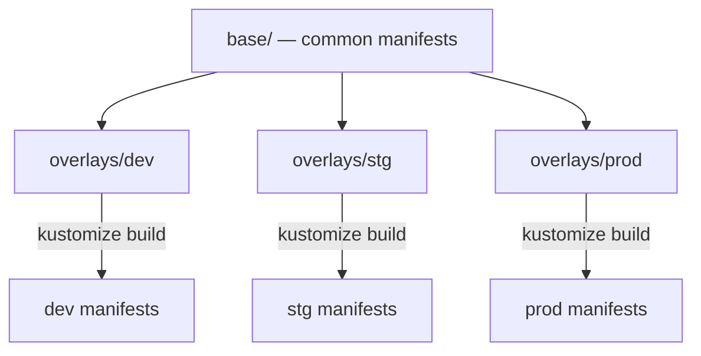

# CKA Study — Kustomize (Enhanced)

> **Goal:** Manage Kubernetes manifests across environments using bases, overlays, transformers, and patches — without templating.

---

## Table of Contents

1. [Problem Statement & Ideology](#1-problem-statement--ideology)
2. [Kustomize vs Helm](#2-kustomize-vs-helm)
3. [Installation & kubectl Integration](#3-installation--kubectl-integration)
4. [The kustomization.yaml File](#4-the-kustomizationyaml-file)
5. [Building & Applying](#5-building--applying)
6. [Managing Directories](#6-managing-directories)
7. [Common Transformers](#7-common-transformers)
8. [Image Transformers](#8-image-transformers)
9. [Patches](#9-patches)
10. [Overlays (Base + Environment)](#10-overlays-base--environment)
11. [Components](#11-components)
12. [Cheat Sheet & Resources](#12-cheat-sheet--resources)

---

## 1. Problem Statement & Ideology

Duplicating full YAML files per environment (dev/stg/prod) is hard to maintain.

**Kustomize** uses a **base** + **overlays** pattern — same manifests, environment-specific patches.



### Folder structure

```
k8s/
├── base/
│   ├── kustomization.yaml
│   ├── nginx-depl.yaml
│   ├── service.yaml
│   └── redis-depl.yaml
└── overlays/
    ├── dev/
    │   ├── kustomization.yaml
    │   └── config-map.yaml
    ├── stg/
    │   ├── kustomization.yaml
    │   └── config-map.yaml
    └── prod/
        ├── kustomization.yaml
        └── config-map.yaml
```

---

## 2. Kustomize vs Helm

| | Kustomize | Helm |
|--|-----------|------|
| Approach | Patch/overlay native YAML | Templated charts |
| Templating | No Go templates | Yes (Go templates) |
| Built into kubectl | **Yes** (`kubectl apply -k`) | No (separate CLI) |
| Package manager | No | Yes (repos, releases) |
| Best for | Environment variants | Distributable app packages |

---

## 3. Installation & kubectl Integration

Kustomize is **built into kubectl** (v1.14+).

```bash
# Standalone install (optional)
curl -s "https://raw.githubusercontent.com/kubernetes-sigs/kustomize/master/hack/install_kustomize.sh" | bash

# Via kubectl (preferred)
kubectl apply -k ./k8s/
kubectl delete -k ./k8s/
```

---

## 4. The kustomization.yaml File

Every Kustomize directory needs `kustomization.yaml`:

```yaml
apiVersion: kustomize.config.k8s.io/v1beta1
kind: Kustomization

resources:
  - nginx-deployment.yaml
  - nginx-service.yaml

commonLabels:
  company: hopa
```

### Minimal base example

**base/nginx-deployment.yaml:**

```yaml
apiVersion: apps/v1
kind: Deployment
metadata:
  name: nginx-deployment
spec:
  replicas: 1
  selector:
    matchLabels:
      app: nginx
  template:
    metadata:
      labels:
        app: nginx
    spec:
      containers:
        - name: nginx
          image: nginx
```

**base/kustomization.yaml:**

```yaml
apiVersion: kustomize.config.k8s.io/v1beta1
kind: Kustomization
resources:
  - nginx-deployment.yaml
```

---

## 5. Building & Applying

```bash
# Preview rendered YAML
kustomize build k8s/

# Apply
kustomize build k8s/ | kubectl apply -f -
kubectl apply -k k8s/

# Delete
kustomize build k8s/ | kubectl delete -f -
kubectl delete -k k8s/
```

---

## 6. Managing Directories

Reference subdirectories instead of individual files:

```yaml
# k8s/kustomization.yaml
apiVersion: kustomize.config.k8s.io/v1beta1
kind: Kustomization
resources:
  - api/
  - db/
```

Each subdirectory has its own `kustomization.yaml`:

```yaml
# k8s/api/kustomization.yaml
resources:
  - api-deployment.yaml
  - api-service.yaml
```

One command deploys everything: `kubectl apply -k ./k8s/`

---

## 7. Common Transformers

Apply changes to **all** resources in the kustomization:

```yaml
apiVersion: kustomize.config.k8s.io/v1beta1
kind: Kustomization

resources:
  - nginx-deployment.yaml

commonLabels:
  owner: hopa

namespace: lap

namePrefix: start-
nameSuffix: -end

commonAnnotations:
  branch: master
```

| Transformer | Effect |
|-------------|--------|
| `commonLabels` | Add labels to all resources + selectors |
| `namespace` | Set namespace on all resources |
| `namePrefix` / `nameSuffix` | Prefix/suffix all resource names |
| `commonAnnotations` | Add annotations to all resources |

---

## 8. Image Transformers

Change container images across all resources:

```yaml
images:
  - name: nginx
    newName: haproxy
    newTag: "2.4"
```

| Config | Result |
|--------|--------|
| `newName: haproxy` | nginx → haproxy |
| `newTag: "2.4"` | nginx → nginx:2.4 |
| Both | nginx → haproxy:2.4 |

---

## 9. Patches

Surgical changes to specific resources (more precise than transformers).

### JSON 6902 patch (inline)

```yaml
patches:
  - target:
      kind: Deployment
      name: nginx-deployment
    patch: |-
      - op: replace
        path: /spec/replicas
        value: 6
```

### Strategic merge patch

```yaml
patches:
  - patch: |-
      apiVersion: apps/v1
      kind: Deployment
      metadata:
        name: myapp-deployment
      spec:
        replicas: 6
```

### Patch from separate file

```yaml
patches:
  - path: replica-patch.yaml
    target:
      kind: Deployment
      name: nginx-deployment
```

**replica-patch.yaml:**

```yaml
- op: replace
  path: /spec/replicas
  value: 6
```

| Patch type | Use |
|------------|-----|
| **JSON 6902** | RFC 6902 operations: add, remove, replace |
| **Strategic merge** | Kubernetes-aware merge (Deployment, Service, etc.) |

---

## 10. Overlays (Base + Environment)

**base/kustomization.yaml:**

```yaml
apiVersion: kustomize.config.k8s.io/v1beta1
kind: Kustomization
resources:
  - nginx-depl.yaml
  - service.yaml
  - redis-depl.yaml
```

**overlays/dev/kustomization.yaml:**

```yaml
apiVersion: kustomize.config.k8s.io/v1beta1
kind: Kustomization
resources:
  - ../../base
patches:
  - patch: |-
      - op: replace
        path: /spec/replicas
        value: 2
    target:
      kind: Deployment
      name: nginx-deployment
```

**overlays/prod/kustomization.yaml:**

```yaml
apiVersion: kustomize.config.k8s.io/v1beta1
kind: Kustomization
resources:
  - ../../base
patches:
  - patch: |-
      - op: replace
        path: /spec/replicas
        value: 5
    target:
      kind: Deployment
      name: nginx-deployment
resources:
  - hpa.yaml    # prod-only resource
```

```bash
kubectl apply -k overlays/dev/
kubectl apply -k overlays/prod/
```

> Modern syntax uses `resources: [../../base]` instead of deprecated `bases:`.

---

## 11. Components

Reusable optional add-ons (DB, caching) imported by overlays.

```
k8s/
├── base/
├── overlays/
│   ├── dev/          # imports db component
│   └── premium/      # imports db + caching
└── components/
    ├── db/
    │   └── kustomization.yaml
    └── caching/
        └── kustomization.yaml
```

**overlays/dev/kustomization.yaml:**

```yaml
apiVersion: kustomize.config.k8s.io/v1beta1
kind: Kustomization
resources:
  - ../../base
components:
  - ../../components/db
```

---

## 12. Cheat Sheet & Resources

```bash
kustomize build <dir>
kubectl apply -k <dir>
kubectl delete -k <dir>
kubectl kustomize <dir>    # same as kustomize build
```

- [Kustomize documentation](https://kubectl.docs.kubernetes.io/references/kustomize/)
- [kubectl -k flag](https://kubernetes.io/docs/tasks/manage-kubernetes-objects/kustomization/)

---

## Kubernetes Docs — YAML Example Locations

| Topic / Resource | Kubernetes docs (YAML examples) |
|------------------|----------------------------------|
| **Kustomize overview** | [Declarative Management of K8s Objects (Kustomize)](https://kubernetes.io/docs/tasks/manage-kubernetes-objects/kustomization/) |
| **Deployment (base)** | [Deployment](https://kubernetes.io/docs/concepts/workloads/controllers/deployment/) |
| **Service** | [Service](https://kubernetes.io/docs/concepts/services-networking/service/) |
| **ConfigMap (overlay)** | [ConfigMap](https://kubernetes.io/docs/concepts/configuration/configmap/) |
| **Multi-base overlays** | [Kustomize — bases and overlays](https://kubectl.docs.kubernetes.io/references/kustomize/kustomization/bases/) |
| **Patches** | [Kustomize — patches](https://kubectl.docs.kubernetes.io/references/kustomize/kustomization/patches/) |
| **Components** | [Kustomize — components](https://kubectl.docs.kubernetes.io/references/kustomize/kustomization/components/) |
