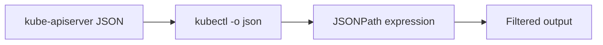

# CKA Study — JSON Path in Kubernetes (Enhanced)

> **Goal:** Query and filter Kubernetes API output using JSONPath, `kubectl` output formats, custom columns, and sorting.

---

## Table of Contents

1. [What is JSONPath?](#1-what-is-jsonpath)
2. [kubectl JSON Output Workflow](#2-kubectl-json-output-workflow)
3. [JSONPath Syntax](#3-jsonpath-syntax)
4. [Common Examples](#4-common-examples)
5. [Formatting Output](#5-formatting-output)
6. [Range Loops](#6-range-loops)
7. [Custom Columns](#7-custom-columns)
8. [Sorting](#8-sorting)
9. [Other Output Formats](#9-other-output-formats)
10. [Cheat Sheet & Resources](#10-cheat-sheet--resources)

---

## 1. What is JSONPath?

**JSONPath** is a query language for extracting data from JSON documents — used by `kubectl` to filter API server responses.



| Symbol | Meaning |
|--------|---------|
| `$` or `.` | Root object |
| `.field` | Child field |
| `[0]` | Array index |
| `[*]` | All elements in array |
| `['field']` | Field with special chars |

---

## 2. kubectl JSON Output Workflow

Four steps:

1. **Identify command** — `kubectl get nodes`
2. **See JSON structure** — `kubectl get nodes -o json`
3. **Form JSONPath** — `.items[0].status.capacity.cpu`
4. **Query** — `kubectl get nodes -o=jsonpath='{.items[0].status.capacity.cpu}'`

```bash
# Step 2 — explore structure
kubectl get pods -o json | jq .
kubectl get nodes -o json

# Step 4 — extract field
kubectl get pods -o=jsonpath='{.items[0].metadata.name}'
```

---

## 3. JSONPath Syntax

### Pod list structure

```json
{
  "items": [
    {
      "metadata": { "name": "nginx", "namespace": "default" },
      "spec": {
        "containers": [
          { "name": "nginx", "image": "nginx:1.14" }
        ]
      },
      "status": { "phase": "Running" }
    }
  ]
}
```

| Query | Result |
|-------|--------|
| `.items[0].metadata.name` | First Pod name |
| `.items[*].metadata.name` | All Pod names |
| `.items[0].spec.containers[0].image` | First container image |
| `.items[*].spec.containers[*].image` | All images |

---

## 4. Common Examples

```bash
# First Pod name
kubectl get pods -o=jsonpath='{.items[0].metadata.name}'

# All Pod names
kubectl get pods -o=jsonpath='{.items[*].metadata.name}'

# First container image in first Pod
kubectl get pods -o=jsonpath='{.items[0].spec.containers[0].image}'

# All container images across all Pods
kubectl get pods -o=jsonpath='{.items[*].spec.containers[*].image}'

# Node names
kubectl get nodes -o=jsonpath='{.items[*].metadata.name}'

# CPU capacity per node
kubectl get nodes -o=jsonpath='{.items[*].status.capacity.cpu}'

# Pod IP of specific Pod (by name filter)
kubectl get pod nginx -o=jsonpath='{.status.podIP}'

# Labels
kubectl get pods -o=jsonpath='{.items[*].metadata.labels}'

# Namespace of all Pods
kubectl get pods -A -o=jsonpath='{range .items[*]}{.metadata.namespace}{"\t"}{.metadata.name}{"\n"}{end}'
```

### Deployment examples

```bash
kubectl get deploy -o=jsonpath='{.items[0].spec.replicas}'
kubectl get deploy myapp -o=jsonpath='{.status.availableReplicas}'
```

### Node examples

```bash
kubectl get nodes -o=jsonpath='{.items[0].status.nodeInfo.kubeletVersion}'
kubectl get nodes -o=jsonpath='{.items[*].status.addresses[?(@.type=="InternalIP")].address}'
```

---

## 5. Formatting Output

### Multiple fields (space-separated)

```bash
kubectl get nodes -o=jsonpath='{.items[*].metadata.name}{" "}{.items[*].status.capacity.cpu}'
```

### Newline between values

```bash
kubectl get nodes -o=jsonpath='{.items[*].metadata.name}{"\n"}'
```

### Tab-separated table-like output

```bash
kubectl get nodes -o=jsonpath='{.items[*].metadata.name}{"\t"}{.items[*].status.capacity.cpu}{"\n"}'
```

---

## 6. Range Loops

`{range}` iterates over array items; `{end}` closes the loop.

```bash
kubectl get nodes -o=jsonpath='{range .items[*]}{.metadata.name}{"\t"}{.status.capacity.cpu}{"\n"}{end}'
```

```bash
kubectl get pods -o=jsonpath='{range .items[*]}{.metadata.name}{"\t"}{.status.phase}{"\n"}{end}'
```

Output:

```
nginx-abc123    Running
redis-xyz789    Running
```

### Range with index

```bash
kubectl get pods -o=jsonpath='{range $i, $p := .items}{.metadata.name}{"\n"}{end}'
```

---

## 7. Custom Columns

Cleaner than JSONPath for tabular output:

```bash
kubectl get nodes -o=custom-columns=NODE:.metadata.name,CPU:.status.capacity.cpu,MEMORY:.status.capacity.memory
```

```bash
kubectl get pods -o=custom-columns=NAME:.metadata.name,NAMESPACE:.metadata.namespace,STATUS:.status.phase,IMAGE:.spec.containers[0].image
```

| Part | Meaning |
|------|---------|
| `NODE` | Column header (display name) |
| `.metadata.name` | JSONPath to field |

```bash
kubectl get pods -o=custom-columns=NAME:.metadata.name,IP:.status.podIP,READY:.status.conditions[?(@.type=="Ready")].status
```

---

## 8. Sorting

```bash
kubectl get nodes --sort-by=.metadata.name
kubectl get pods --sort-by=.status.startTime
kubectl get pods --sort-by=.spec.nodeName
```

Works with default table output (not JSONPath).

---

## 9. Other Output Formats

| Flag | Format |
|------|--------|
| `-o wide` | Extra columns (IP, node) |
| `-o yaml` | YAML |
| `-o json` | Full JSON |
| `-o name` | `resource/name` only |
| `-o jsonpath='...'` | JSONPath query |
| `-o custom-columns=...` | Custom table |
| `-o go-template='...'` | Go templates |

### Go template example

```bash
kubectl get nodes -o go-template='{{range .items}}{{.metadata.name}}{{"\n"}}{{end}}'
```

---

## 10. Cheat Sheet & Resources

```bash
# Explore
kubectl get <resource> -o json
kubectl get <resource> -o yaml

# JSONPath
kubectl get pods -o=jsonpath='{.items[*].metadata.name}'
kubectl get nodes -o=jsonpath='{range .items[*]}{.metadata.name}{"\t"}{.status.capacity.cpu}{"\n"}{end}'

# Custom columns
kubectl get nodes -o=custom-columns=NAME:.metadata.name,CPU:.status.capacity.cpu

# Sort
kubectl get pods --sort-by=.metadata.startTime
```

- [kubectl jsonpath](https://kubernetes.io/docs/reference/kubectl/jsonpath/)
- [kubectl custom columns](https://kubernetes.io/docs/reference/kubectl/#custom-columns)
- [JSONPath specification](https://goessner.net/articles/JsonPath/)

---

## Kubernetes Docs — YAML Example Locations

JSONPath queries API objects (not YAML files). Reference object structures:

| Resource | Kubernetes docs (field reference) |
|----------|-----------------------------------|
| **Pod** | [Pod](https://kubernetes.io/docs/reference/kubernetes-api/workload-resources/pod-v1/) |
| **Node** | [Node](https://kubernetes.io/docs/reference/kubernetes-api/cluster-resources/node-v1/) |
| **Deployment** | [Deployment](https://kubernetes.io/docs/reference/kubernetes-api/workload-resources/deployment-v1/) |
| **Service** | [Service](https://kubernetes.io/docs/reference/kubernetes-api/service-resources/service-v1/) |
| **JSONPath usage** | [kubectl jsonpath](https://kubernetes.io/docs/reference/kubectl/jsonpath/) |
| **Custom columns** | [kubectl — custom columns](https://kubernetes.io/docs/reference/kubectl/#custom-columns) |
| **Sample Pod manifest** | [Pod — example YAML](https://kubernetes.io/docs/concepts/workloads/pods/#how-pods-manage-multiple-containers) |
