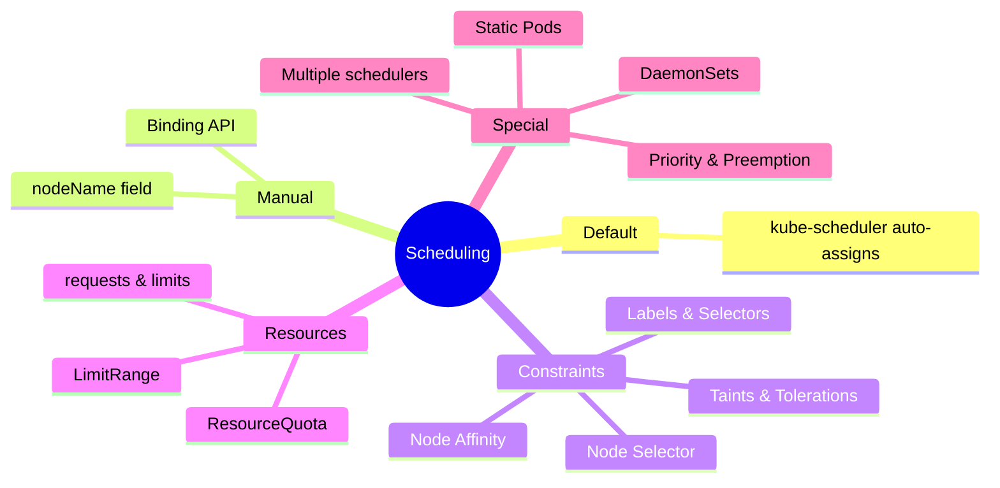
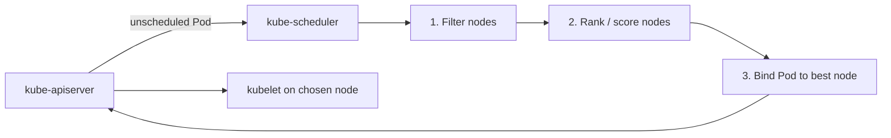
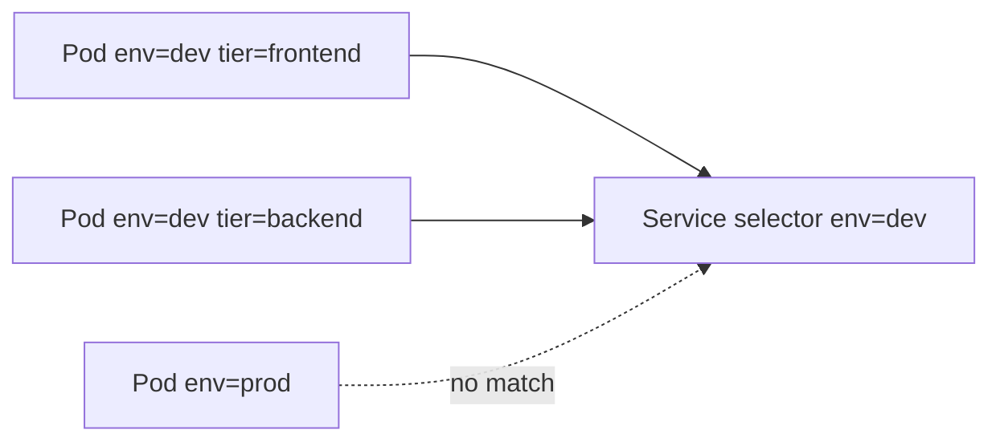
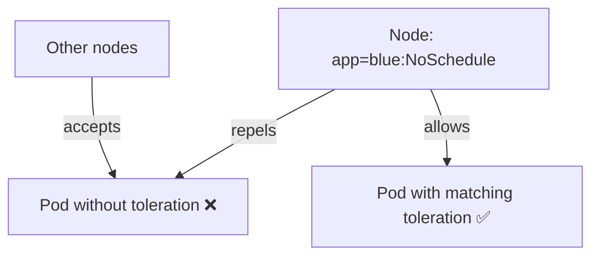
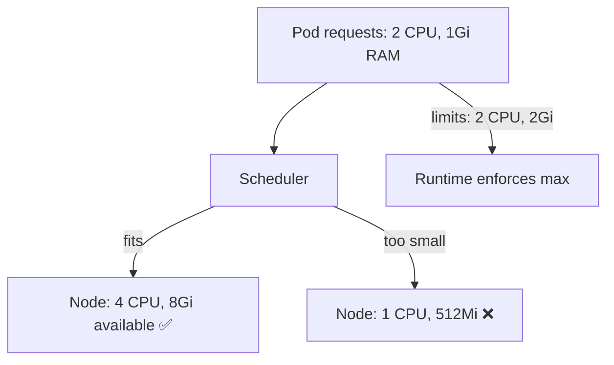
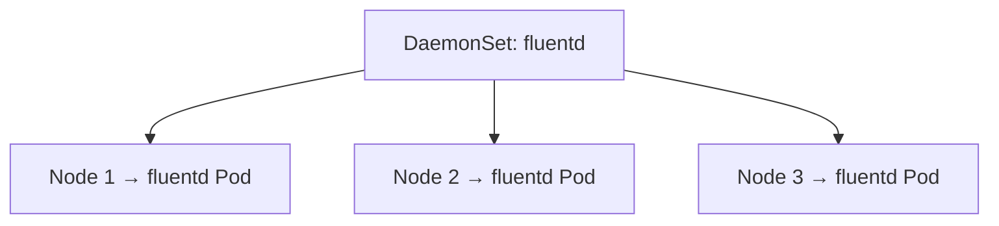
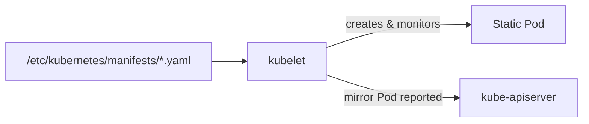
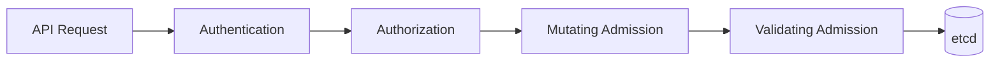

# CKA Study — Scheduling (Enhanced)

> **Goal:** Advanced Pod scheduling — manual placement, affinity, taints, resources, DaemonSets, static Pods, priority, custom schedulers, and admission control.

**Related YAML in this repo:**

| Path | Resource |
|------|----------|
| [daemonset.yaml](./daemonset.yaml) | DaemonSet |
| [pod_intro.yaml](./pod_intro.yaml) | Pod (manual scheduling) |

---

## Table of Contents

1. [Scheduling Overview](#1-scheduling-overview)
2. [Manual Scheduling](#2-manual-scheduling)
3. [Labels & Selectors](#3-labels--selectors)
4. [Taints & Tolerations](#4-taints--tolerations)
5. [Node Selectors & Node Affinity](#5-node-selectors--node-affinity)
6. [Resource Requests, Limits & Quotas](#6-resource-requests-limits--quotas)
7. [DaemonSets](#7-daemonsets)
8. [Static Pods](#8-static-pods)
9. [Priority Classes & Preemption](#9-priority-classes--preemption)
10. [Multiple Schedulers & Profiles](#10-multiple-schedulers--profiles)
11. [Admission Controllers](#11-admission-controllers)
12. [Cheat Sheet & Resources](#12-cheat-sheet--resources)

---

## 1. Scheduling Overview

Scheduling determines **which node** runs each Pod.





---

## 2. Manual Scheduling

By default `nodeName` is empty and the **scheduler** assigns a node.

### Option 1 — `nodeName` in Pod spec (creation time only)

```yaml
apiVersion: v1
kind: Pod
metadata:
  name: nginx
spec:
  containers:
    - name: nginx
      image: nginx
  nodeName: node02    # Skip scheduler; force this node
```

### Option 2 — Binding API (at runtime)

```yaml
apiVersion: v1
kind: Binding
metadata:
  name: nginx
target:
  apiVersion: v1
  kind: Node
  name: node02
```

```bash
curl --header "Content-Type: application/json" \
  --request POST \
  --data '{"apiVersion":"v1","kind":"Binding","metadata":{"name":"nginx"},"target":{"apiVersion":"v1","kind":"Node","name":"node02"}}' \
  https://$SERVER/api/v1/namespaces/default/pods/nginx/binding \
  --key /path/to/admin.key --cert /path/to/admin.crt
```

---

## 3. Labels & Selectors

**Labels** are key-value pairs on objects. **Selectors** filter by label.



Used by: Services, ReplicaSets, Deployments, NetworkPolicies, affinity rules.

```bash
kubectl get pods --selector env=dev
kubectl get pods -l env=dev,tier=frontend
kubectl label pods mypod status=active
kubectl label pods mypod status-
kubectl get nodes --show-labels
```

---

## 4. Taints & Tolerations

**Taints** repel Pods from nodes. **Tolerations** allow Pods onto tainted nodes.



> **Key insight:** Taints restrict which Pods *may* run on a node. They do **not** force a Pod onto that node — use **Node Affinity** for attraction.

### Taint effects

| Effect | Behavior |
|--------|----------|
| `NoSchedule` | Pod will **not** be scheduled (unless tolerates) |
| `PreferNoSchedule` | Scheduler **tries** to avoid the node |
| `NoExecute` | Not scheduled; **existing** Pods without toleration are **evicted** |

```bash
kubectl taint nodes node1 app=blue:NoSchedule
kubectl describe node kubemaster | grep -i taint
kubectl taint nodes controlplane node-role.kubernetes.io/control-plane:NoSchedule-
```

```yaml
tolerations:
  - key: app
    operator: Equal
    value: blue
    effect: NoSchedule
  - key: node-role.kubernetes.io/control-plane
    operator: Exists
    effect: NoSchedule
```

---

## 5. Node Selectors & Node Affinity

### Node Selector (simple)

Equality-based only:

```yaml
spec:
  nodeSelector:
    size: Large
```

```bash
kubectl label nodes node01 size=Large
```

**Limitation:** Cannot express OR/NOT — use **Node Affinity**.

### Node Affinity (advanced)

| Operator | Meaning |
|----------|---------|
| `In` | Value in list |
| `NotIn` | Value not in list |
| `Exists` | Key exists |
| `Gt` / `Lt` | Numeric comparison |

| Affinity type | Scheduling | If label changes after scheduling |
|---------------|------------|-----------------------------------|
| `requiredDuringSchedulingIgnoredDuringExecution` | **Required** | Pod stays |
| `requiredDuringSchedulingRequiredDuringExecution` | **Required** | Pod evicted if no longer matches |
| `preferredDuringSchedulingIgnoredDuringExecution` | **Preferred** (soft) | Pod stays |

```yaml
apiVersion: v1
kind: Pod
metadata:
  name: nginx
spec:
  affinity:
    nodeAffinity:
      requiredDuringSchedulingIgnoredDuringExecution:
        nodeSelectorTerms:
          - matchExpressions:
              - key: size
                operator: In
                values:
                  - Large
                  - Medium
      preferredDuringSchedulingIgnoredDuringExecution:
        - weight: 1
          preference:
            matchExpressions:
              - key: disktype
                operator: In
                values:
                  - ssd
  containers:
    - name: nginx
      image: nginx
```

### Pod Affinity / Anti-Affinity

Co-locate or spread Pods relative to other Pods:

```yaml
affinity:
  podAntiAffinity:
    requiredDuringSchedulingIgnoredDuringExecution:
      - labelSelector:
          matchExpressions:
            - key: app
              operator: In
              values:
                - web
        topologyKey: kubernetes.io/hostname
```

---

## 6. Resource Requests, Limits & Quotas

Scheduler uses **requests**; runtime enforces **limits**.



| Resource | Unit | Notes |
|----------|------|-------|
| CPU | `1` = 1 core | `500m` = 0.5 core |
| Memory (decimal) | `1G`, `1M` | 1000-based |
| Memory (binary) | `1Gi`, `1Mi` | 1024-based |

### Pod resources

```yaml
spec:
  containers:
    - name: nginx
      image: nginx
      resources:
        requests:
          memory: "1Gi"
          cpu: "2"
        limits:
          memory: "2Gi"
          cpu: "2"
```

### QoS classes

| Class | Condition |
|-------|-----------|
| **Guaranteed** | limits = requests for all containers |
| **Burstable** | requests set, limits differ |
| **BestEffort** | no requests/limits |

### LimitRange

```yaml
apiVersion: v1
kind: LimitRange
metadata:
  name: cpu-resource-constraint
spec:
  limits:
    - default:
        cpu: 500m
        memory: 1Gi
      defaultRequest:
        cpu: 500m
        memory: 1Gi
      max:
        cpu: "1"
        memory: 1Gi
      min:
        cpu: 100m
        memory: 500Mi
      type: Container
```

### ResourceQuota

```yaml
apiVersion: v1
kind: ResourceQuota
metadata:
  name: cpu-resource-quota
spec:
  hard:
    requests.cpu: "4"
    requests.memory: 4Gi
    limits.cpu: "10"
    limits.memory: 10Gi
    pods: "10"
```

---

## 7. DaemonSets

Ensures **one Pod per matching node**.



| Use case | Example |
|----------|---------|
| Log collection | fluentd, Filebeat |
| Monitoring | node-exporter |
| Networking | kube-proxy |
| Storage agents | Ceph, GlusterFS |

```yaml
apiVersion: apps/v1
kind: DaemonSet
metadata:
  name: elasticsearch
  namespace: kube-system
spec:
  selector:
    matchLabels:
      app: elasticsearch
  template:
    metadata:
      labels:
        app: elasticsearch
    spec:
      tolerations:
        - key: node-role.kubernetes.io/control-plane
          operator: Exists
          effect: NoSchedule
      containers:
        - name: fluentd-elasticsearch
          image: registry.k8s.io/fluentd-elasticsearch:1.20
```

```bash
kubectl apply -f daemonset.yaml
kubectl get daemonset
kubectl get pods -n kube-system -l app=elasticsearch
```

---

## 8. Static Pods

Managed by **kubelet** directly — not apiserver/scheduler/controllers.



| Feature | Detail |
|---------|--------|
| Config | `--pod-manifest-path` or `staticPodPath: /var/lib/kubelet/config.yaml` |
| Restart | kubelet restarts if Pod dies |
| API visibility | Mirror Pods with suffix `-nodeName` |

Control-plane components are static Pods with kubeadm.

---

## 9. Priority Classes & Preemption

Range: **-2,147,483,648** to **1,000,000,000**. Default Pod priority: **0**.

```yaml
apiVersion: scheduling.k8s.io/v1
kind: PriorityClass
metadata:
  name: high-priority
value: 1000000000
globalDefault: false
description: "Mission-critical pods"
preemptionPolicy: PreemptLowerPriority   # or Never
```

Link to Pod:

```yaml
spec:
  priorityClassName: high-priority
```

| Policy | Behavior |
|--------|----------|
| `PreemptLowerPriority` | Evict lower-priority Pods to make room |
| `Never` | Never preempt other Pods |

```bash
kubectl get priorityclasses
kubectl get pc
```

---

## 10. Multiple Schedulers & Profiles

### Custom scheduler configuration

```yaml
apiVersion: kubescheduler.config.k8s.io/v1
kind: KubeSchedulerConfiguration
profiles:
  - schedulerName: my-scheduler
    plugins:
      score:
        enabled:
          - name: NodeResourcesFit
        disabled:
          - name: ImageLocality
leaderElection:
  leaderElect: true
  resourceNamespace: kube-system
  resourceName: lock-object-my-scheduler
```

### Deploy as Pod

```yaml
apiVersion: v1
kind: Pod
metadata:
  name: my-custom-scheduler
  namespace: kube-system
spec:
  containers:
    - name: kube-scheduler
      image: registry.k8s.io/kube-scheduler:v1.29.0
      command:
        - kube-scheduler
        - --kubeconfig=/etc/kubernetes/scheduler.conf
        - --config=/etc/kubernetes/my-scheduler-config.yaml
```

### Assign Pod to custom scheduler

```yaml
spec:
  schedulerName: my-scheduler
  containers:
    - name: nginx
      image: nginx
```

### Scheduling framework phases

| Phase | Example plugins |
|-------|-----------------|
| Queue sort | PrioritySort |
| PreFilter / Filter | NodeResourceFit, NodeName, TaintToleration |
| PreScore / Score | NodeResourceFit, ImageLocality |
| Bind | DefaultBinder |

Custom plugins register at **Extension Points**.

---

## 11. Admission Controllers

Intercept requests after auth, before etcd persistence.



| Controller | Purpose |
|------------|---------|
| `NamespaceLifecycle` | Block ops in terminating namespaces |
| `LimitRanger` | Default/min/max from LimitRange |
| `ResourceQuota` | Enforce namespace quotas |
| `PodSecurity` | Pod Security Standards |
| `MutatingAdmissionWebhook` | External mutation |
| `ValidatingAdmissionWebhook` | External validation |

Configure on kube-apiserver:

```yaml
--enable-admission-plugins=NodeRestriction,ResourceQuota,LimitRanger
--disable-admission-plugins=...
```

---

## 12. Cheat Sheet & Resources

```bash
kubectl get nodes --show-labels
kubectl describe node <name>
kubectl taint nodes <node> key=value:NoSchedule
kubectl taint nodes <node> key=value:NoSchedule-
kubectl label nodes <node> size=Large
kubectl cordon node-1
kubectl drain node-1 --ignore-daemonsets
kubectl uncordon node-1
kubectl top nodes
kubectl top pods
kubectl get priorityclasses
kubectl explain pod.spec.affinity --recursive
```

- [Scheduling](https://kubernetes.io/docs/concepts/scheduling-eviction/)
- [Taints and Tolerations](https://kubernetes.io/docs/concepts/scheduling-eviction/taint-and-toleration/)
- [Assign Pods to Nodes](https://kubernetes.io/docs/concepts/scheduling-eviction/assign-pod-node/)
- [Resource Management](https://kubernetes.io/docs/concepts/configuration/manage-resources-containers/)
- [Priority and Preemption](https://kubernetes.io/docs/concepts/scheduling-eviction/pod-priority-preemption/)

---

## Kubernetes Docs — YAML Example Locations

| Topic / Resource | Kubernetes docs (YAML examples) |
|------------------|----------------------------------|
| **Manual scheduling (`nodeName`)** | [Assign Pods to Nodes](https://kubernetes.io/docs/tasks/configure-pod-container/assign-pods-nodes/) |
| **Binding API** | [Assign Pods to Nodes](https://kubernetes.io/docs/tasks/configure-pod-container/assign-pods-nodes/) |
| **Labels & selectors** | [Labels and Selectors](https://kubernetes.io/docs/concepts/overview/working-with-objects/labels/) |
| **Taints & tolerations** | [Taints and Tolerations](https://kubernetes.io/docs/concepts/scheduling-eviction/taint-and-toleration/) |
| **Node selector** | [Assign Pods to Nodes](https://kubernetes.io/docs/tasks/configure-pod-container/assign-pods-nodes/) |
| **Node affinity** | [Assign Pods using Node Affinity](https://kubernetes.io/docs/tasks/configure-pod-container/assign-pods-nodes-using-node-affinity/) |
| **Pod affinity / anti-affinity** | [Inter-Pod Affinity and Anti-Affinity](https://kubernetes.io/docs/tasks/configure-pod-container/assign-pods-nodes-using-inter-pod-affinity-and-anti-affinity/) |
| **Resource requests & limits** | [Assign CPU](https://kubernetes.io/docs/tasks/configure-pod-container/assign-cpu-resource/) · [Assign Memory](https://kubernetes.io/docs/tasks/configure-pod-container/assign-memory-resource/) |
| **LimitRange** | [Limit Ranges](https://kubernetes.io/docs/concepts/policy/limit-range/) |
| **ResourceQuota** | [Resource Quotas](https://kubernetes.io/docs/concepts/policy/resource-quotas/) |
| **DaemonSet** | [DaemonSet](https://kubernetes.io/docs/concepts/workloads/controllers/daemonset/) |
| **Static Pod** | [Create static Pods](https://kubernetes.io/docs/tasks/configure-pod-container/static-pod/) |
| **PriorityClass** | [Pod Priority and Preemption](https://kubernetes.io/docs/concepts/scheduling-eviction/pod-priority-preemption/) |
| **Custom scheduler** | [Configure Multiple Schedulers](https://kubernetes.io/docs/tasks/administer-cluster/configure-multiple-schedulers/) |
| **KubeSchedulerConfiguration** | [Configure Multiple Schedulers](https://kubernetes.io/docs/tasks/administer-cluster/configure-multiple-schedulers/) |
| **Admission controllers** | [Admission Controllers](https://kubernetes.io/docs/reference/access-authn-authz/admission-controllers/) |
| **Node maintenance (cordon/drain)** | [Safely Drain a Node](https://kubernetes.io/docs/tasks/administer-cluster/safely-drain-node/) |
