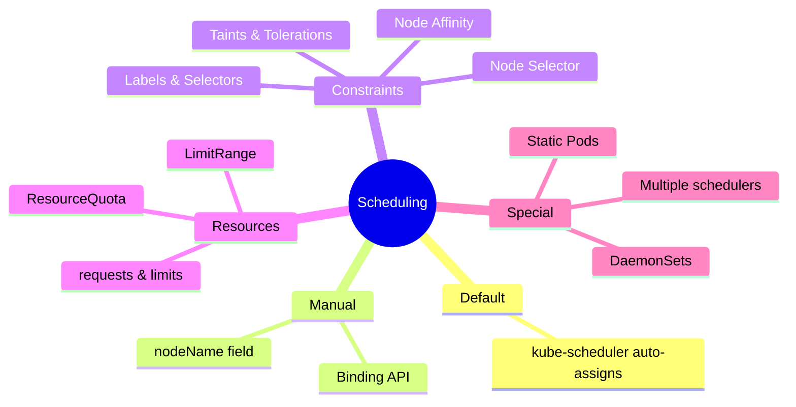
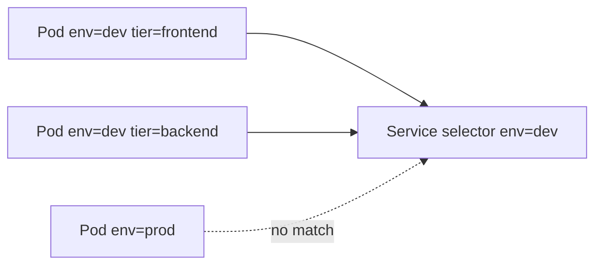
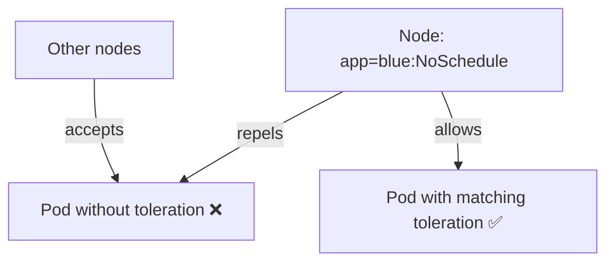
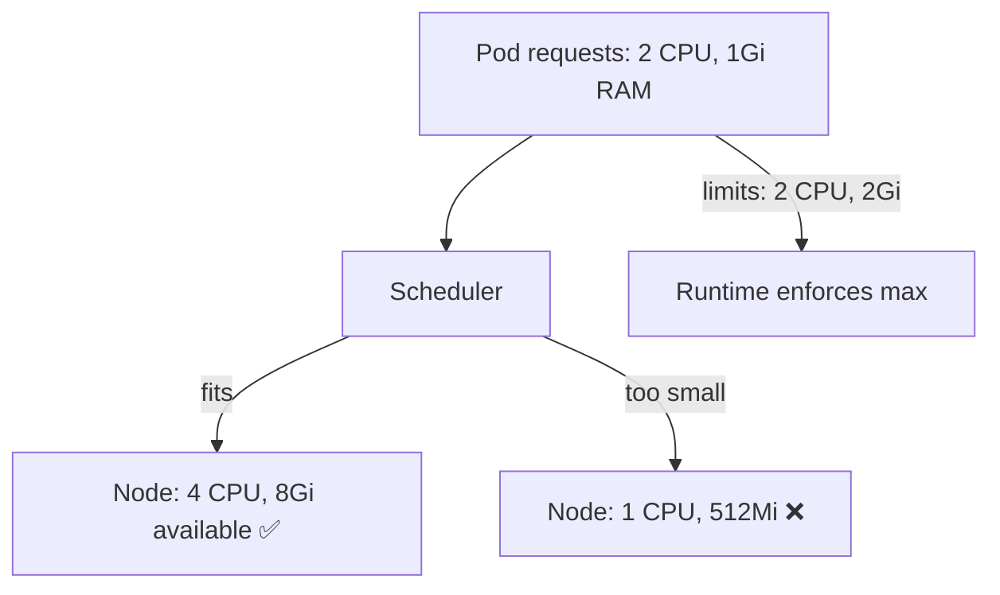
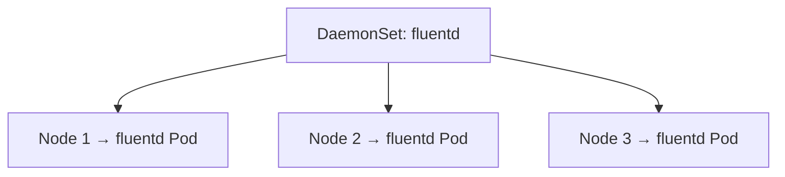
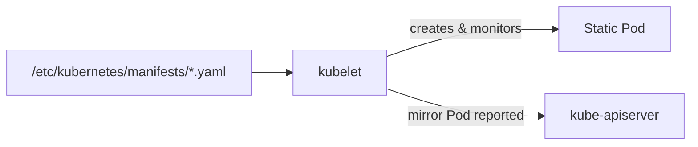

# CKA Study Notes — Kubernetes Core Concepts & Scheduling

> **Goal:** Notes for the Certified Kubernetes Administrator (CKA) exam — cluster architecture, workloads, namespaces, kubectl workflows, and advanced scheduling.

**YAML examples in this repo:**

| Path | Resource |
|------|----------|
| [pod_intro.yaml](./pod_intro.yaml) | Pod |
| [pod.yaml](./pod.yaml) | Multi-container Pod |
| [replicasey-difination.yaml](./replicasey-difination.yaml) | ReplicaSet |
| [rc-defenation.yaml](./rc-defenation.yaml) | ReplicationController |
| [daemonset.yaml](./daemonset.yaml) | DaemonSet |
| [practice/deployment/deployment.yaml](./practice/deployment/deployment.yaml) | Deployment |
| [practice/service/service-definition.yaml](./practice/service/service-definition.yaml) | NodePort Service |
| [practice/voting-app/](./practice/voting-app/) | Multi-service microservices app |
| [practice/python_app/](./practice/python_app/) | Master/slave Python app |
| [practice/exams/](./practice/exams/) | **10 hands-on practice exams** (master + node01–03) |

---

## Table of Contents

### Part II — Scheduling

16. [Scheduling Overview](#16-scheduling-overview)
17. [Manual Scheduling](#17-manual-scheduling)
18. [Labels & Selectors](#18-labels--selectors)
19. [Taints & Tolerations](#19-taints--tolerations)
20. [Node Selectors & Node Affinity](#20-node-selectors--node-affinity)
21. [Resource Requests, Limits & Quotas](#21-resource-requests-limits--quotas)
22. [DaemonSets](#22-daemonsets)
23. [Static Pods](#23-static-pods)

### Reference
24. [Useful Commands Cheat Sheet](#24-useful-commands-cheat-sheet)
25. [Docs & Resources](#25-docs--resources)

---

## 1. Scheduling Overview

Scheduling determines **which node** runs each Pod.



Topics covered in this document: manual scheduling, labels, taints/tolerations, node selectors/affinity, resource limits, DaemonSets, static Pods.

---

## 17. Manual Scheduling

By default, `nodeName` is empty and the **scheduler** assigns a node. You can bypass the scheduler in two ways:

### Option 1 — `nodeName` in Pod spec (creation time only)

```yaml
apiVersion: v1
kind: Pod
metadata:
  name: nginx
spec:
  containers:
    - name: nginx
      image: nginx
  nodeName: node02    # Skip scheduler; force this node
```

### Option 2 — Binding API (at runtime)

Create a Binding object and POST it to the apiserver:

```yaml
apiVersion: v1
kind: Binding
metadata:
  name: nginx
target:
  apiVersion: v1
  kind: Node
  name: node02
```

```bash
curl --header "Content-Type: application/json" \
  --request POST \
  --data '{"apiVersion":"v1","kind":"Binding","metadata":{"name":"nginx"},"target":{"apiVersion":"v1","kind":"Node","name":"node02"}}' \
  https://$SERVER/api/v1/namespaces/default/pods/nginx/binding \
  --key /path/to/admin.key --cert /path/to/admin.crt
```

```bash
kubectl get pods --namespace kube-system    # Check system component Pods
```

---

## 18. Labels & Selectors

**Labels** are key-value pairs attached to objects. **Selectors** filter objects by label.



Used by: Services, ReplicaSets, Deployments, NetworkPolicies, and more.

```bash
kubectl get pods --selector env=dev
kubectl get pods -l env=dev,tier=frontend
kubectl label pods mypod status=active       # Add label
kubectl label pods mypod status-             # Remove label
```

---

## 19. Taints & Tolerations

**Taints** repel Pods from nodes. **Tolerations** allow Pods to schedule onto tainted nodes.



> **Key insight:** Taints restrict which Pods *may* run on a node. They do **not** force a Pod onto that node — use **Node Affinity** for that.

### Taint effects

| Effect | Behavior |
|--------|----------|
| `NoSchedule` | Pod will **not** be scheduled on the node (unless it tolerates the taint) |
| `PreferNoSchedule` | Scheduler **tries** to avoid the node, but may place Pods there |
| `NoExecute` | Pod will not be scheduled; **existing** Pods without toleration are **evicted** |

### Commands

```bash
# Add taint
kubectl taint nodes node1 app=blue:NoSchedule

# View taints
kubectl describe node kubemaster | grep -i taint

# Remove taint (append - to the key)
kubectl taint nodes controlplane node-role.kubernetes.io/control-plane:NoSchedule-
```

### Pod toleration example

```yaml
apiVersion: v1
kind: Pod
metadata:
  name: myapp-pod
spec:
  containers:
    - name: nginx
      image: nginx
  tolerations:
    - key: app
      operator: Equal
      value: blue
      effect: NoSchedule
```

---

## 20. Node Selectors & Node Affinity

### Node Selector (simple)

Equality-based only — assign Pods to nodes with a specific label:

```yaml
spec:
  nodeSelector:
    size: Large
```

```bash
kubectl label nodes node01 size=Large
kubectl get nodes --show-labels
```

**Limitation:** Cannot express "Large OR Medium" or "NOT Small" — use **Node Affinity** instead.

### Node Affinity (advanced)

| Operator | Meaning |
|----------|---------|
| `In` | Label value is in the list |
| `NotIn` | Label value is not in the list |
| `Exists` | Label key exists (any value) |
| `Gt` / `Lt` | Greater/less than (numeric) |

| Affinity type | Scheduling | If node label changes after scheduling |
|---------------|------------|----------------------------------------|
| `requiredDuringSchedulingIgnoredDuringExecution` | **Required** | Pod stays (ignored during execution) |
| `requiredDuringSchedulingRequiredDuringExecution` | **Required** | Pod evicted if node no longer matches |
| `preferredDuringSchedulingIgnoredDuringExecution` | **Preferred** (soft) | Pod stays |

```yaml
apiVersion: v1
kind: Pod
metadata:
  name: nginx
spec:
  affinity:
    nodeAffinity:
      requiredDuringSchedulingIgnoredDuringExecution:
        nodeSelectorTerms:
          - matchExpressions:
              - key: size
                operator: In
                values:
                  - Large
  containers:
    - name: nginx
      image: nginx
```

---

## 21. Resource Requests, Limits & Quotas

The scheduler uses **requests** to decide which node fits a Pod. **Limits** cap maximum usage.



### CPU & memory units

| Resource | Unit | Notes |
|----------|------|-------|
| CPU | `1` = 1 core = 1 vCPU | `500m` = 0.5 core (millicores) |
| Memory (decimal) | `1G`, `1M`, `1K` | 1000-based (GB, MB, KB) |
| Memory (binary) | `1Gi`, `1Mi`, `1Ki` | 1024-based (gibibyte, etc.) |

### Pod with requests and limits

```yaml
spec:
  containers:
    - name: nginx
      image: nginx
      resources:
        requests:
          memory: "1Gi"
          cpu: "2"
        limits:
          memory: "2Gi"
          cpu: "2"
```

| Default behavior | Recommendation |
|------------------|----------------|
| No requests/limits set | Set **requests** at minimum; limits optional |
| Best practice | Requests + no limits (or limits = requests for guaranteed QoS) |

### LimitRange (namespace defaults)

Sets default/min/max resources for containers in a namespace:

```yaml
apiVersion: v1
kind: LimitRange
metadata:
  name: cpu-resource-constraint
spec:
  limits:
    - default:
        cpu: 500m
        memory: 1Gi
      defaultRequest:
        cpu: 500m
        memory: 1Gi
      max:
        cpu: "1"
        memory: 1Gi
      min:
        cpu: 100m
        memory: 500Mi
      type: Container
```

### ResourceQuota (namespace totals)

See [Section 13](#13-namespaces--resource-quotas) — caps total CPU/memory across all Pods in a namespace.

---

## 22. DaemonSets

A **DaemonSet** ensures **one copy of a Pod runs on every (matching) node** — or a subset of nodes via nodeSelector/affinity.



| Use case | Example |
|----------|---------|
| Log collection | fluentd, Filebeat |
| Monitoring | node-exporter, Datadog agent |
| Networking | **kube-proxy** runs as a DaemonSet |
| Storage | Ceph, GlusterFS agents |

Example: [daemonset.yaml](./daemonset.yaml)

```yaml
apiVersion: apps/v1
kind: DaemonSet
metadata:
  name: elasticsearch
  namespace: kube-system
spec:
  selector:
    matchLabels:
      app: elasticsearch
  template:
    metadata:
      labels:
        app: elasticsearch
    spec:
      containers:
        - name: fluentd-elasticsearch
          image: registry.k8s.io/fluentd-elasticsearch:1.20
```

```bash
kubectl apply -f daemonset.yaml
kubectl get daemonset          # Short: ds
kubectl get pods -n kube-system -l app=elasticsearch
```

---

## 23. Static Pods

**Static Pods** are managed directly by the **kubelet** — not by the apiserver/scheduler/controllers.



| Feature | Detail |
|---------|--------|
| Who manages | kubelet only |
| Config location | Directory watched by kubelet |
| Restart | kubelet restarts if Pod dies |
| Edit manifest | kubelet updates the Pod |
| Delete manifest | kubelet removes the Pod |
| Visible in API | Yes — as mirror Pods (name suffix `-nodeName`) |

### Configuration

**Option 1 — kubelet flag:**

```bash
--pod-manifest-path=/etc/kubernetes/manifests
```

**Option 2 — kubelet config file:**

```yaml
# kubelet-config.yaml
staticPodPath: /etc/kubernetes/manifests
```

```bash
--config=kubelet-config.yaml
```
- /`var/lib/kubelet/config.yaml`
> Control-plane components (apiserver, scheduler, controller-manager, etcd) are deployed as **static Pods** by kubeadm in `/etc/kubernetes/manifests/`.
---

## Priorities class

Range: 10000,000,000 >> -2,147,483,648

- to list priority classes
`kubectl get priorityclasses`

- to create 

```yaml
apiVersion: scheduling.k8s.io/v1
kind: PriorityClass
metadata:
  name: high-priority
value: 1000000000
description: "priority class for mission critical pods"
preemptionPlicy: PreemptLowerPriority
```
default for *preemptionPlicy*  is *PreemptLowerPriority*
we can set it to never, so this pod will not preempt other pod

preempt: to make another pod out, to enter in place

and that liked to the pod by

```yaml
apiVersion: v1
kind: Pod
metadata:
  name: mypod
  labels:
    app: myapp
spec:
  containers:
    - name: nginx-container
      image: nginx
  priorityClassName: high-priority
```
default priorityvalue is 0


### Effect of pod priority

*preemptionPlicy*  is *PreemptLowerPriority*


----

## Multiple Schedulers

- we can write our own shcduler and deploy it as the main schduler or additional one

to create a new schaduler
```yaml
    apiVersion: kubescheduler.config.k8s.io/v1
    kind: KubeSchedulerConfiguration
    profiles:
      - schedulerName: my-scheduler
    leaderElection:
      leaderelect: true
      resourceNamespace: kube-system
      resourceName: locl-object-my-scheduler
```

we can deploy the schduler as a pod:


```yaml
apiVersion: v1
kind: Pod
metadata:
  name: my-custom-scheduler
  namespcae: kube-system
spec:
  containers:
    - name: kube-scheduler
      image: k8s.grc.io/kube-scheduler-amd64:v1.xx.x
      command:
        - kube-scheduler
        - --address=127.0.0.1
        - --kubeconfig=/etc/kubernates/sheduler.conf
        - --config=/etc/kubernates/my-scheduler-config.yaml

```


Specify schedulers for pods


```yaml
apiVersion: v1
kind: Pod
metadata:
  name: nginx
spec:
  schedulerName: my-custom-scheduler
  containers:
  - name: nginx
    image: nginx
```

-----

## Configuring Scheduler Profiles

>> Scheduling Plugins

- pod waits to be scheduler in `Scheduling Queue`   >>> PrioritySort
- filer out nodes                                   >>> NodeResourceFit, NodeName, NodeUnshedulable
- score nodes                                       >>> NodeResourceFit, imageLocality
- binding                                           >>> DefaultBinding

we can write our own plugin using `Extension Points`


## Scheduler Profiles!

TODO: explain


----

## Admission Controllers


---

## ??. Useful Commands Cheat Sheet

```bash
# Context & namespace
alias k=kubectl
kubectl config set-context $(kubectl config current-context) --namespace=dev
kubectl get pods --all-namespaces

# Workloads
kubectl get pods,rs,deploy,svc
kubectl describe pod <name>
kubectl logs <pod> -c <container>
kubectl exec -it <pod> -- /bin/sh

# Scheduling & nodes
kubectl get nodes --show-labels
kubectl describe node <name>
kubectl taint nodes <node> key=value:NoSchedule
kubectl label nodes <node> size=Large

# Resources
kubectl top nodes
kubectl top pods

# Export & debug
kubectl get pod <name> -o yaml > exported.yaml
kubectl explain pod.spec --recursive
kubectl api-resources

# System
kubectl get pods -n kube-system
```

### Resource short names

| Resource | Short |
|----------|-------|
| Pod | `po` |
| ReplicaSet | `rs` |
| Deployment | `deploy` |
| Service | `svc` |
| DaemonSet | `ds` |
| Namespace | `ns` |

---

## 25. Docs & Resources

- [Kubernetes Architecture (official)](https://kubernetes.io/docs/concepts/architecture/)
- [etcd documentation](https://etcd.io/docs/)
- [Pods](https://kubernetes.io/docs/concepts/workloads/pods/)
- [Deployments](https://kubernetes.io/docs/concepts/workloads/controllers/deployment/)
- [Services](https://kubernetes.io/docs/concepts/services-networking/service/)
- [Scheduling](https://kubernetes.io/docs/concepts/scheduling-eviction/)
- [Taints and Tolerations](https://kubernetes.io/docs/concepts/scheduling-eviction/taint-and-toleration/)
- [Assign Pods to Nodes (Affinity)](https://kubernetes.io/docs/concepts/scheduling-eviction/assign-pod-node/)
- [Resource Management](https://kubernetes.io/docs/concepts/configuration/manage-resources-containers/)
- [DaemonSet](https://kubernetes.io/docs/concepts/workloads/controllers/daemonset/)
- [Static Pods](https://kubernetes.io/docs/tasks/configure-pod-container/static-pod/)
- [kubectl Cheat Sheet](https://kubernetes.io/docs/reference/kubectl/cheatsheet/)
- [KodeKloud CKA Course Notes](https://notes.kodekloud.com/docs/Certified-Kubernetes-Administrator-CKA/)
