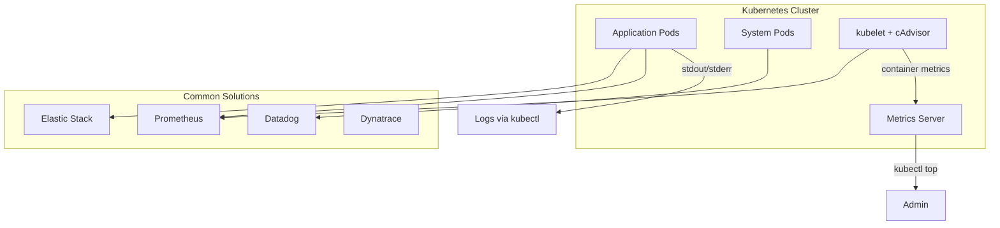
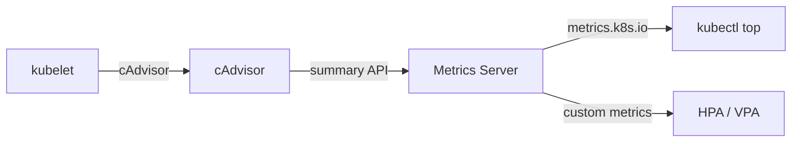
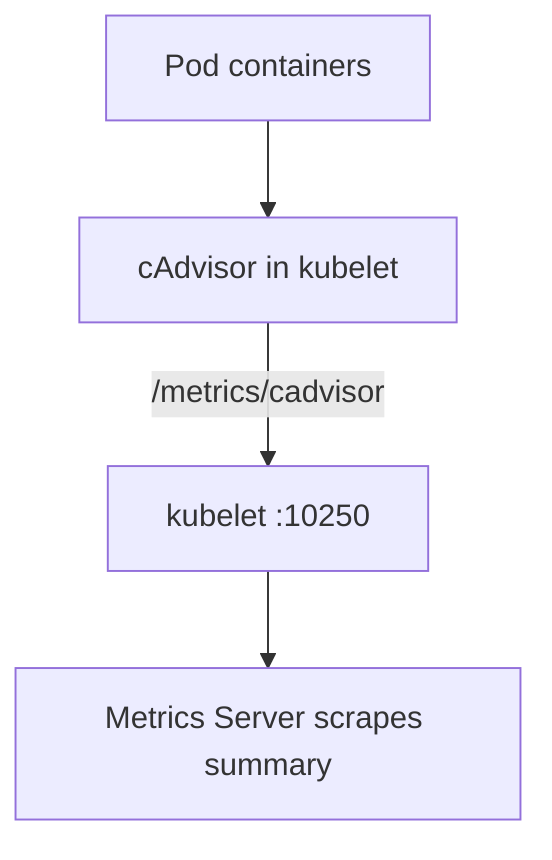
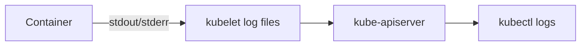
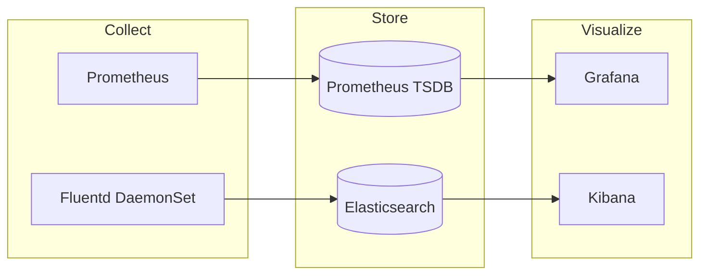

# CKA Study — Logging & Monitoring (Enhanced)

> **Goal:** Monitor cluster components and application workloads — metrics, logs, and common observability stacks for the CKA exam.

---

## Table of Contents

1. [Monitoring Overview](#1-monitoring-overview)
2. [Metrics Server](#2-metrics-server)
3. [Heapster vs Metrics Server](#3-heapster-vs-metrics-server)
4. [cAdvisor & kubelet Metrics](#4-cadvisor--kubelet-metrics)
5. [Viewing Metrics](#5-viewing-metrics)
6. [Application Logs](#6-application-logs)
7. [Cluster Component Logs](#7-cluster-component-logs)
8. [Monitoring Solutions](#8-monitoring-solutions)
9. [Cheat Sheet & Resources](#9-cheat-sheet--resources)

---

## 1. Monitoring Overview

Kubernetes **does not ship** a full monitoring solution. You add observability tools for metrics, logs, and traces.



| Layer | What to monitor |
|-------|-----------------|
| **Cluster components** | apiserver, etcd, scheduler, controller-manager, kubelet, kube-proxy |
| **Nodes** | CPU, memory, disk, network |
| **Applications** | Pod logs, resource usage, health probes |
| **Control plane** | Static Pod logs in `kube-system` |

---

## 2. Metrics Server

**Metrics Server** is the in-cluster **CPU/memory metrics** aggregator (successor to Heapster). One deployment per cluster; metrics are **in-memory** (no historical data).



### Deploy Metrics Server

```bash
kubectl apply -f https://github.com/kubernetes-sigs/metrics-server/releases/latest/download/components.yaml
```

Verify:

```bash
kubectl get pods -n kube-system | grep metrics-server
kubectl top nodes
kubectl top pods
kubectl top pods -n kube-system
kubectl top pod <pod-name> --containers
```

> **CKA tip:** If `kubectl top` fails, Metrics Server is likely missing or kubelet cannot reach it (TLS, network).

### Metrics Server manifest (minimal example)

```yaml
apiVersion: apps/v1
kind: Deployment
metadata:
  name: metrics-server
  namespace: kube-system
spec:
  selector:
    matchLabels:
      k8s-app: metrics-server
  template:
    metadata:
      labels:
        k8s-app: metrics-server
    spec:
      containers:
        - name: metrics-server
          image: registry.k8s.io/metrics-server/metrics-server:v0.7.0
          args:
            - --cert-dir=/tmp
            - --secure-port=10250
            - --kubelet-preferred-address-types=InternalIP,ExternalIP,Hostname
            - --kubelet-use-node-status-port
            - --metric-resolution=15s
```

---

## 3. Heapster vs Metrics Server

| Feature | Heapster | Metrics Server |
|---------|----------|----------------|
| Status | **Deprecated** | Current standard |
| Scope | Cluster-wide metrics | In-cluster only |
| Storage | Could forward to backends | In-memory only |
| HPA | Old versions | Required for resource-based HPA |
| Per cluster | One instance | One instance |

---

## 4. cAdvisor & kubelet Metrics

**cAdvisor** (Container Advisor) is embedded in the **kubelet**. It collects per-container CPU, memory, filesystem, and network metrics.



- kubelet exposes metrics on port **10250** (HTTPS)
- Metrics Server reads **resource usage** summaries from kubelets
- For deep monitoring, scrape kubelet/cAdvisor with **Prometheus**

```bash
# On a node (debugging)
curl -k https://localhost:10250/metrics/cadvisor
crictl stats
```

---

## 5. Viewing Metrics

```bash
# Node resource usage
kubectl top node
kubectl top nodes

# Pod resource usage
kubectl top pod
kubectl top pods
kubectl top pod <pod-name> -n <namespace>
kubectl top pod <pod-name> --containers
```

Requires **Metrics Server** running and RBAC allowing `metrics.k8s.io`.

---

## 6. Application Logs

Containers write to **stdout** and **stderr**. kubelet collects logs; kubectl reads them from the apiserver.



### Basic log commands

```bash
kubectl logs <pod-name>
kubectl logs -f <pod-name>              # follow / live tail
kubectl logs <pod-name> -c <container>  # multi-container Pod
kubectl logs <pod-name> --previous      # crashed container
kubectl logs -l app=nginx               # label selector
kubectl logs --since=1h <pod-name>
kubectl logs --tail=100 <pod-name>
```

### Multi-container Pod example

```yaml
apiVersion: v1
kind: Pod
metadata:
  name: multi-app
spec:
  containers:
    - name: nginx
      image: nginx
    - name: sidecar
      image: busybox
      command: ["sh", "-c", "while true; do echo sidecar; sleep 5; done"]
```

```bash
kubectl logs multi-app -c nginx
kubectl logs -f multi-app -c sidecar
```

### Log routing patterns

| Pattern | Tool |
|---------|------|
| Node-level collection | fluentd, Filebeat DaemonSet |
| Centralized search | Elasticsearch + Kibana |
| Cloud | CloudWatch, Stackdriver, Azure Monitor |

---

## 7. Cluster Component Logs

Control plane components run as **static Pods** (kubeadm) in `kube-system`.

```bash
kubectl get pods -n kube-system
kubectl logs -n kube-system kube-apiserver-<control-plane-node>
kubectl logs -n kube-system kube-controller-manager-<node>
kubectl logs -n kube-system kube-scheduler-<node>
kubectl logs -n kube-system etcd-<node>
```

On the node directly (if systemd):

```bash
journalctl -u kubelet
crictl ps -a
crictl logs <container-id>
```

| Component | Typical log location (kubeadm) |
|-----------|-------------------------------|
| kube-apiserver | `/var/log/pods/kube-system_kube-apiserver-*` |
| etcd | `/var/log/pods/kube-system_etcd-*` |
| kubelet | `journalctl -u kubelet` |

---

## 8. Monitoring Solutions

| Solution | Type | Notes |
|----------|------|-------|
| **Metrics Server** | Built-in metrics API | `kubectl top`, HPA CPU |
| **Prometheus** | Time-series metrics | De facto K8s monitoring |
| **Elastic Stack** | Logs + metrics (ELK/EFK) | EFK = Fluentd + ES + Kibana |
| **Datadog** | SaaS APM/metrics | Agent as DaemonSet |
| **Dynatrace** | SaaS/full-stack | OneAgent |
| **Grafana** | Dashboards | Often paired with Prometheus |



### Health checks (related)

```yaml
livenessProbe:
  httpGet:
    path: /healthz
    port: 8080
  initialDelaySeconds: 3
  periodSeconds: 10
readinessProbe:
  httpGet:
    path: /ready
    port: 8080
  periodSeconds: 5
```

---

## 9. Cheat Sheet & Resources

```bash
# Metrics Server
kubectl apply -f https://github.com/kubernetes-sigs/metrics-server/releases/latest/download/components.yaml
kubectl get pods -n kube-system | grep metrics-server
kubectl top nodes
kubectl top pods -A

# Application logs
kubectl logs <pod>
kubectl logs -f <pod> -c <container>
kubectl logs <pod> --previous

# System component logs
kubectl get pods -n kube-system
kubectl logs -n kube-system <component-pod>
crictl ps -a && crictl logs <id>
journalctl -u kubelet
```

- [Metrics Server](https://github.com/kubernetes-sigs/metrics-server)
- [Logging architecture](https://kubernetes.io/docs/concepts/cluster-administration/logging/)
- [Monitor cluster components](https://kubernetes.io/docs/tasks/debug/debug-cluster/)
- [Resource metrics pipeline](https://kubernetes.io/docs/tasks/debug/debug-cluster/resource-metrics-pipeline/)

---

## Kubernetes Docs — YAML Example Locations

| Topic / Resource | Kubernetes docs (YAML examples) |
|------------------|----------------------------------|
| **Metrics Server deployment** | [Resource metrics pipeline](https://kubernetes.io/docs/tasks/debug/debug-cluster/resource-metrics-pipeline/) · [Metrics Server (GitHub manifest)](https://github.com/kubernetes-sigs/metrics-server/releases/latest/download/components.yaml) |
| **Resource metrics API** | [Resource metrics for Kubernetes](https://kubernetes.io/docs/tasks/debug/debug-cluster/resource-metrics-pipeline/) |
| **Liveness probe** | [Configure Liveness Probes](https://kubernetes.io/docs/tasks/configure-pod-container/configure-liveness-readiness-startup-probes/) |
| **Readiness probe** | [Configure Readiness Probes](https://kubernetes.io/docs/tasks/configure-pod-container/configure-liveness-readiness-startup-probes/) |
| **Startup probe** | [Configure Startup Probes](https://kubernetes.io/docs/tasks/configure-pod-container/configure-liveness-readiness-startup-probes/) |
| **Container command & args** | [Define a Command and Arguments for a Container](https://kubernetes.io/docs/tasks/inject-data-application/define-command-argument-container/) |
| **Logging (architecture)** | [Logging Architecture](https://kubernetes.io/docs/concepts/cluster-administration/logging/) |
| **Fluentd / node logging agent** | [Logging at node level](https://kubernetes.io/docs/concepts/cluster-administration/logging/#logging-at-the-node-level) |
| **Debug cluster components** | [Troubleshoot Clusters](https://kubernetes.io/docs/tasks/debug/debug-cluster/) |
| **DaemonSet (log collectors)** | [DaemonSet](https://kubernetes.io/docs/concepts/workloads/controllers/daemonset/) |
