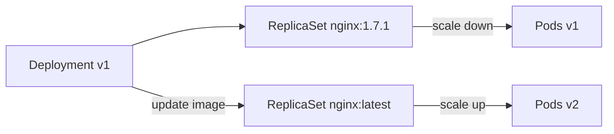
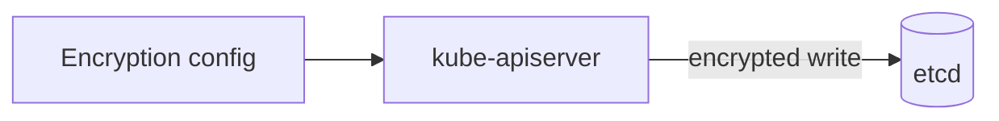
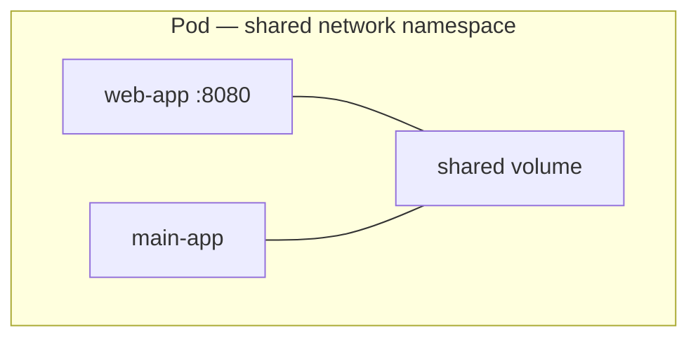
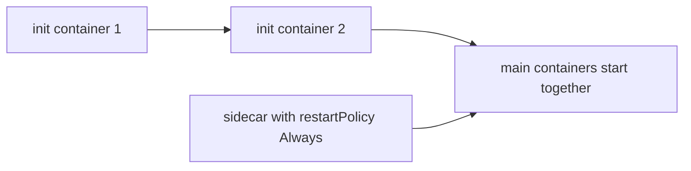
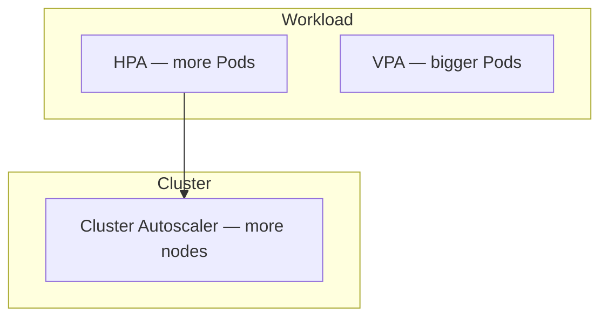

# CKA Study — Application Lifecycle Management (Enhanced)

> **Goal:** Deploy, configure, update, scale, and heal applications — rollouts, ConfigMaps, Secrets, multi-container Pods, probes, and autoscaling.

---

## Table of Contents

1. [Rolling Updates & Rollbacks](#1-rolling-updates--rollbacks)
2. [Commands & Arguments (Docker vs K8s)](#2-commands--arguments-docker-vs-k8s)
3. [Environment Variables](#3-environment-variables)
4. [ConfigMaps](#4-configmaps)
5. [Secrets](#5-secrets)
6. [Encrypting Secrets at Rest](#6-encrypting-secrets-at-rest)
7. [Multi-Container Pods](#7-multi-container-pods)
8. [Init & Sidecar Containers](#8-init--sidecar-containers)
9. [Self-Healing & Probes](#9-self-healing--probes)
10. [Scaling Applications](#10-scaling-applications)
11. [Horizontal Pod Autoscaler (HPA)](#11-horizontal-pod-autoscaler-hpa)
12. [Vertical Pod Autoscaler (VPA)](#12-vertical-pod-autoscaler-vpa)
13. [In-Place Pod Resizing](#13-in-place-pod-resizing)
14. [Cheat Sheet & Resources](#14-cheat-sheet--resources)

---

## 1. Rolling Updates & Rollbacks

A **Deployment** manages ReplicaSets and supports rolling updates and rollbacks.



### Deployment strategies

| Strategy | Behavior | Downtime |
|----------|----------|----------|
| **RollingUpdate** (default) | Replace Pods incrementally | None |
| **Recreate** | Terminate all, then create new | Yes |

```yaml
apiVersion: apps/v1
kind: Deployment
metadata:
  name: myapp-deployment
  labels:
    app: myapp
spec:
  replicas: 3
  selector:
    matchLabels:
      app: myapp
      type: front-end
  strategy:
    type: RollingUpdate
    rollingUpdate:
      maxSurge: 1
      maxUnavailable: 0
  template:
    metadata:
      labels:
        app: myapp
        type: front-end
    spec:
      containers:
        - name: nginx-container
          image: nginx:1.7.1
```

### Rollout commands

```bash
kubectl apply -f deployment-definition.yaml     # preferred — triggers rollout
kubectl set image deployment/myapp-deployment nginx=nginx:latest
kubectl rollout status deployment/myapp-deployment
kubectl rollout history deployment/myapp-deployment
kubectl rollout undo deployment/myapp-deployment
kubectl rollout undo deployment/myapp-deployment --to-revision=2
```

**Multiple containers — one rollout:**

```bash
kubectl set image deployment/myapp-deployment \
  container-1=nginx:latest container-2=busybox:latest
```

> **Note:** `kubectl set image` can drift from manifest files. Prefer `kubectl apply -f` for GitOps alignment.

---

## 2. Commands & Arguments (Docker vs K8s)

| Docker | Kubernetes Pod spec |
|--------|---------------------|
| `CMD` | `args` (overrides image CMD) |
| `ENTRYPOINT` | `command` (overrides image ENTRYPOINT) |
| `--entrypoint` | `command` in container spec |

```dockerfile
FROM ubuntu
ENTRYPOINT ["sleep"]
CMD ["5"]
```

```yaml
apiVersion: v1
kind: Pod
metadata:
  name: ubuntu-sleeper-pod
spec:
  containers:
    - name: ubuntu-sleeper
      image: ubuntu-sleeper
      command: ["sleep2.0"]   # overrides ENTRYPOINT
      args: ["10"]            # overrides CMD
```

`docker run ubuntu-sleeper 10` → sleep 10  
Pod with `args: ["10"]` and `command: ["sleep2.0"]` → sleep2.0 10

---

## 3. Environment Variables

Three ways to inject configuration:

| Method | Use case |
|--------|----------|
| Plain `env` | Simple key-value in Pod spec |
| **ConfigMap** | Non-sensitive config |
| **Secret** | Sensitive data |

```yaml
env:
  - name: APP_COLOR
    value: pink
  - name: HEADER_COLOR
    value: green
```

---

## 4. ConfigMaps

Store non-sensitive configuration data.

### Imperative

```bash
kubectl create configmap app-config \
  --from-literal=APP_COLOR=blue \
  --from-literal=APP_MODE=prod

kubectl create configmap app-config --from-file=appconfig.properties
```

### Declarative

```yaml
apiVersion: v1
kind: ConfigMap
metadata:
  name: app-config
data:
  APP_COLOR: blue
  APP_MODE: prod
  appconfig.properties: |
    key=value
```

### Use in Pod

```yaml
# All keys as env vars
envFrom:
  - configMapRef:
      name: app-config

# Single key
env:
  - name: APP_COLOR
    valueFrom:
      configMapKeyRef:
        name: app-config
        key: APP_COLOR

# As volume
volumes:
  - name: config-vol
    configMap:
      name: app-config
volumeMounts:
  - name: config-vol
    mountPath: /etc/config
```

```bash
kubectl get configmap
kubectl describe configmap app-config
```

---

## 5. Secrets

Store sensitive data (base64-encoded in etcd by default — **not encryption**).

### Create Secret

```bash
kubectl create secret generic app-secret \
  --from-literal=DB_HOST=mysql \
  --from-literal=DB_USER=root \
  --from-literal=DB_PASSWORD=password
```

```yaml
apiVersion: v1
kind: Secret
metadata:
  name: app-secret
type: Opaque
data:
  DB_HOST: bXlzcWw=      # echo -n "mysql" | base64
  DB_USER: cm9vdA==
  DB_PASSWORD: cGFzc3dvcmQ=
```

### Use in Pod

```yaml
envFrom:
  - secretRef:
      name: app-secret

env:
  - name: DB_PASSWORD
    valueFrom:
      secretKeyRef:
        name: app-secret
        key: DB_PASSWORD

volumes:
  - name: secret-vol
    secret:
      secretName: app-secret
```

```bash
kubectl get secrets
kubectl describe secret app-secret
kubectl get secret app-secret -o yaml
echo 'cGFzc3dvcmQ=' | base64 --decode
```

---

## 6. Encrypting Secrets at Rest

By default Secrets in etcd are **base64**, not encrypted. Enable **encryption at rest** on kube-apiserver.



1. Create `/etc/kubernetes/enc/enc.yaml`:

```yaml
apiVersion: apiserver.config.k8s.io/v1
kind: EncryptionConfiguration
resources:
  - resources:
      - secrets
    providers:
      - aescbc:
          keys:
            - name: key1
              secret: <32-byte-base64-key>
      - identity: {}
```

2. Add to static Pod manifest `/etc/kubernetes/manifests/kube-apiserver.yaml`:

```yaml
command:
  - --encryption-provider-config=/etc/kubernetes/enc/enc.yaml
volumeMounts:
  - name: enc
    mountPath: /etc/kubernetes/enc
    readOnly: true
volumes:
  - name: enc
    hostPath:
      path: /etc/kubernetes/enc
      type: DirectoryOrCreate
```

3. Re-encrypt existing Secrets:

```bash
kubectl get secrets --all-namespaces -o json | kubectl replace -f -
```

Verify with etcdctl (encrypted values not readable in plaintext).

---

## 7. Multi-Container Pods

Pods share network namespace (localhost) and can share volumes.



```yaml
apiVersion: v1
kind: Pod
metadata:
  name: simple-webapp
spec:
  containers:
    - name: web-app
      image: nginx
      ports:
        - containerPort: 8080
    - name: log-collector
      image: busybox
      command: ["sh", "-c", "tail -f /var/log/app.log"]
      volumeMounts:
        - name: logs
          mountPath: /var/log
  volumes:
    - name: logs
      emptyDir: {}
```

**Restart behavior:** If any main container exits and `restartPolicy` is Always/OnFailure, **entire Pod** restarts — not individual containers.

---

## 8. Init & Sidecar Containers



| Pattern | Description |
|---------|-------------|
| **Co-located containers** | All under `containers`; start/stop together |
| **Init containers** | Run sequentially; must exit 0 before main containers |
| **Sidecar (native)** | Init container with `restartPolicy: Always` — runs alongside main app |

### Init container example

```yaml
apiVersion: v1
kind: Pod
metadata:
  name: myapp-pod
spec:
  initContainers:
    - name: init-myservice
      image: busybox:1.31
      command: ['sh', '-c', 'until nslookup myservice; do sleep 2; done']
    - name: init-mydb
      image: busybox:1.31
      command: ['sh', '-c', 'until nslookup mydb; do sleep 2; done']
  containers:
    - name: myapp-container
      image: busybox:1.28
      command: ['sh', '-c', 'echo Running! && sleep 3600']
```

> If any init container fails, Pod restarts and **all init containers rerun**.

### Native sidecar (K8s 1.28+)

```yaml
initContainers:
  - name: sidecar-logger
    image: busybox:1.31
    restartPolicy: Always
    command: ['sh', '-c', 'while true; do echo logging; sleep 10; done']
containers:
  - name: main-app
    image: busybox:1.31
    command: ['sh', '-c', 'sleep 60']
```

---

## 9. Self-Healing & Probes

ReplicaSets/Deployments recreate failed Pods. **Probes** check application health.

```yaml
livenessProbe:
  httpGet:
    path: /healthz
    port: 8080
  initialDelaySeconds: 15
  periodSeconds: 10
readinessProbe:
  httpGet:
    path: /ready
    port: 8080
  periodSeconds: 5
startupProbe:
  httpGet:
    path: /startup
    port: 8080
  failureThreshold: 30
  periodSeconds: 10
```

| Probe | Action on failure |
|-------|-------------------|
| **Liveness** | Restart container |
| **Readiness** | Remove from Service endpoints |
| **Startup** | Disable other probes until success |

---

## 10. Scaling Applications



| Type | Method |
|------|--------|
| **Horizontal (workload)** | More Pod replicas (HPA) |
| **Vertical (workload)** | More CPU/memory per Pod (VPA) |
| **Horizontal (cluster)** | More nodes (Cluster Autoscaler) |
| **Vertical (cluster)** | Bigger nodes |

---

## 11. Horizontal Pod Autoscaler (HPA)

Scales Pod **count** based on metrics (CPU default; custom/external with adapters).

```yaml
apiVersion: autoscaling/v2
kind: HorizontalPodAutoscaler
metadata:
  name: my-app-hpa
spec:
  scaleTargetRef:
    apiVersion: apps/v1
    kind: Deployment
    name: my-app
  minReplicas: 1
  maxReplicas: 10
  metrics:
    - type: Resource
      resource:
        name: cpu
        target:
          type: Utilization
          averageUtilization: 50
```

```bash
kubectl autoscale deployment my-app --cpu-percent=50 --min=1 --max=10
kubectl get hpa
kubectl describe hpa my-app-hpa
```

**Requires Metrics Server** for resource metrics.

---

## 12. Vertical Pod Autoscaler (VPA)

Adjusts **requests/limits** for existing Pods (not installed by default).

```bash
kubectl apply -f https://github.com/kubernetes/autoscaler/releases/latest/download/vertical-pod-autoscaler.yaml
```

```yaml
apiVersion: autoscaling.k8s.io/v1
kind: VerticalPodAutoscaler
metadata:
  name: my-app-vpa
spec:
  targetRef:
    apiVersion: apps/v1
    kind: Deployment
    name: my-app
  updatePolicy:
    updateMode: "Auto"
  resourcePolicy:
    containerPolicies:
      - containerName: nginx
        minAllowed:
          cpu: 250m
        maxAllowed:
          cpu: "2"
        controlledResources: ["cpu"]
```

| VPA mode | Behavior |
|----------|----------|
| `Off` | Recommendations only |
| `Initial` | Apply only at Pod creation |
| `Recreate` | Evict and recreate when out of range |
| `Auto` | Prefer in-place when supported |

| | VPA | HPA |
|--|-----|-----|
| Scales | CPU/memory per Pod | Pod count |
| Best for | Stateful, memory-heavy | Stateless web/API |
| Traffic spikes | Restarts Pods | Adds Pods |

---

## 13. In-Place Pod Resizing

Feature gate: `InPlacePodVerticalScaling=true`

```yaml
spec:
  containers:
    - name: nginx
      image: nginx
      resizePolicy:
        - resourceName: cpu
          restartPolicy: NotRequired
        - resourceName: memory
          restartPolicy: RestartContainer
      resources:
        requests:
          cpu: "1"
          memory: 256Mi
        limits:
          cpu: "2"
          memory: 512Mi
```

Limitations: CPU/memory only; cannot change QoS class; Windows not supported.

---

## 14. Cheat Sheet & Resources

```bash
# Rollouts
kubectl rollout status/history/undo deployment/<name>
kubectl set image deployment/<name> c=image:tag

# ConfigMap / Secret
kubectl create configmap/secret generic ...
kubectl get cm,secret

# Logs & debug
kubectl logs -f <pod> -c <container> --previous
kubectl exec -it <pod> -- sh

# Autoscaling
kubectl autoscale deployment ... --cpu-percent=50 --min=1 --max=10
kubectl get hpa,vpa
```

- [Deployments](https://kubernetes.io/docs/concepts/workloads/controllers/deployment/)
- [ConfigMaps](https://kubernetes.io/docs/concepts/configuration/configmap/)
- [Secrets](https://kubernetes.io/docs/concepts/configuration/secret/)
- [Configure Pods and Containers](https://kubernetes.io/docs/tasks/configure-pod-container/)
- [HPA](https://kubernetes.io/docs/tasks/run-application/horizontal-pod-autoscale/)

---

## Kubernetes Docs — YAML Example Locations

| Topic / Resource | Kubernetes docs (YAML examples) |
|------------------|----------------------------------|
| **Deployment (rolling update)** | [Deployment](https://kubernetes.io/docs/concepts/workloads/controllers/deployment/) · [Run a Stateless Application](https://kubernetes.io/docs/tasks/run-application/run-stateless-application-deployment/) |
| **Recreate strategy** | [Deployment — strategy](https://kubernetes.io/docs/concepts/workloads/controllers/deployment/#strategy) |
| **Command & args in Pod** | [Define Command and Arguments](https://kubernetes.io/docs/tasks/inject-data-application/define-command-argument-container/) |
| **Environment variables** | [Define Environment Variables](https://kubernetes.io/docs/tasks/inject-data-application/define-environment-variable-container/) |
| **ConfigMap** | [ConfigMaps](https://kubernetes.io/docs/concepts/configuration/configmap/) · [Configure Pod with ConfigMap](https://kubernetes.io/docs/tasks/configure-pod-container/configure-pod-configmap/) |
| **Secret** | [Secrets](https://kubernetes.io/docs/concepts/configuration/secret/) · [Distribute Credentials with Secrets](https://kubernetes.io/docs/tasks/inject-data-application/distribute-credentials-secure/) |
| **Encrypt secrets at rest** | [Encrypting Secret Data at Rest](https://kubernetes.io/docs/tasks/administer-cluster/encrypt-data/) |
| **Multi-container Pod** | [Configure Pod Initialization](https://kubernetes.io/docs/tasks/configure-pod-container/configure-pod-initialization/) |
| **Init containers** | [Init Containers](https://kubernetes.io/docs/concepts/workloads/pods/init-containers/) |
| **Sidecar containers** | [Sidecar Containers](https://kubernetes.io/docs/concepts/workloads/pods/sidecar-containers/) |
| **Liveness / Readiness probes** | [Configure Probes](https://kubernetes.io/docs/tasks/configure-pod-container/configure-liveness-readiness-startup-probes/) |
| **HorizontalPodAutoscaler (HPA)** | [Horizontal Pod Autoscaling](https://kubernetes.io/docs/tasks/run-application/horizontal-pod-autoscale/) · [HPA walkthrough](https://kubernetes.io/docs/tasks/run-application/horizontal-pod-autoscale-walkthrough/) |
| **VerticalPodAutoscaler (VPA)** | [Vertical Pod Autoscaler (SIG)](https://github.com/kubernetes/autoscaler/tree/master/vertical-pod-autoscaler) |
| **In-place Pod resize** | [Resize CPU and Memory Resources assigned to Containers](https://kubernetes.io/docs/tasks/configure-pod-container/resize-container-resources/) |
| **Resource requests & limits** | [Assign CPU](https://kubernetes.io/docs/tasks/configure-pod-container/assign-cpu-resource/) · [Assign Memory](https://kubernetes.io/docs/tasks/configure-pod-container/assign-memory-resource/) |
