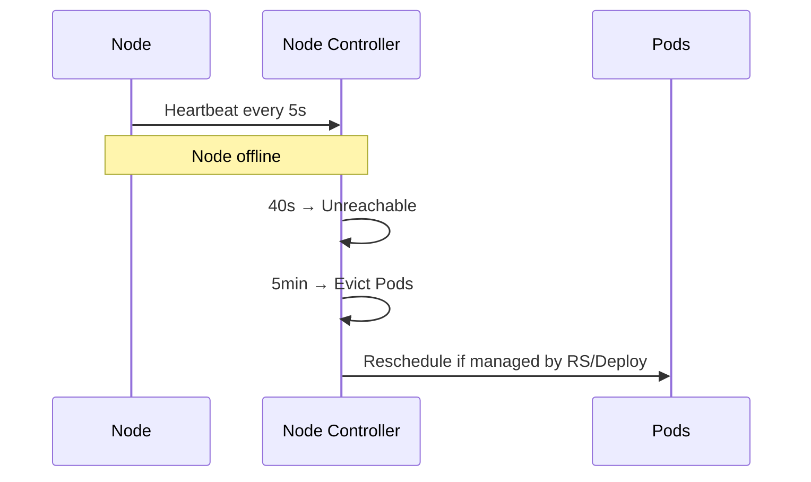
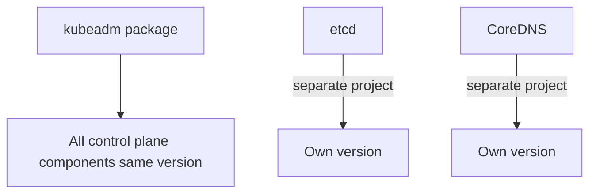
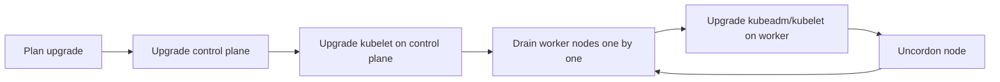
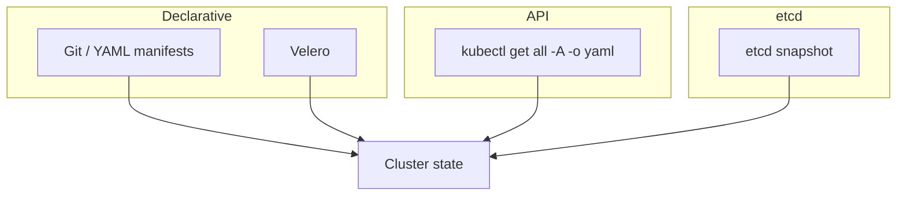

# CKA Study — Cluster Maintenance (Enhanced)

> **Goal:** Upgrade Kubernetes clusters safely, manage node maintenance, and backup/restore etcd and cluster state.

---

## Table of Contents

1. [OS & Node Maintenance](#1-os--node-maintenance)
2. [Kubernetes Versioning & Support](#2-kubernetes-versioning--support)
3. [Cluster Upgrade Process](#3-cluster-upgrade-process)
4. [Kubeadm Upgrade Walkthrough](#4-kubeadm-upgrade-walkthrough)
5. [Backup & Restore Methods](#5-backup--restore-methods)
6. [etcd Backup & Restore](#6-etcd-backup--restore)
7. [Cheat Sheet & Resources](#7-cheat-sheet--resources)

---

## 1. OS & Node Maintenance

When a node goes offline, the control plane waits before marking it dead and evicting Pods.



| Setting | Default | Meaning |
|---------|---------|---------|
| Node monitor grace period | **40s** | Mark Unreachable |
| Pod eviction timeout | **5 min** | Evict Pods from failed node |
| `tolerationSeconds` | 300 (3600 for system) | Delay before evicting tolerated Pods |

### Maintenance commands

```bash
# Prevent new Pods; evict existing (safe maintenance)
kubectl drain node-1 --ignore-daemonsets --delete-emptydir-data

# Mark unschedulable WITHOUT evicting
kubectl cordon node-2

# Re-enable scheduling after maintenance
kubectl uncordon node-1
```

| Command | Schedules new Pods? | Evicts existing? |
|---------|---------------------|------------------|
| **cordon** | No | No |
| **drain** | No (cordons) | Yes |
| **uncordon** | Yes | — |

> If node reboots within 5 minutes and Pods are managed by a Deployment, they may come back automatically when the node returns.

---

## 2. Kubernetes Versioning & Support



### Version skew policy (critical for CKA)

| Component | Allowed skew vs kube-apiserver |
|-----------|-------------------------------|
| **kube-apiserver** | Highest version in cluster |
| **kube-controller-manager, kube-scheduler** | Up to **1 minor version lower** |
| **kubelet, kube-proxy** | Up to **2 minor versions lower** |
| **kubectl** | Up to **1 version higher or lower** |

Other rules:

- Kubernetes supports the **latest 3 minor versions**
- Upgrade **one minor version at a time** (e.g. 1.28 → 1.29, not 1.28 → 1.30)
- **No component may be newer than kube-apiserver**

---

## 3. Cluster Upgrade Process

Three approaches:

| Method | Description |
|--------|-------------|
| **Managed cloud** | GKE, EKS, AKS — provider handles upgrades |
| **kubeadm** | `kubeadm upgrade plan` / `kubeadm upgrade apply` |
| **Manual** | Upgrade each component individually |



> **kubeadm does NOT upgrade kubelet** — you must upgrade kubelet on each node separately.

---

## 4. Kubeadm Upgrade Walkthrough

Example: upgrade from **v1.28 → v1.29**

### Step 1 — Control plane node

```bash
# Check available versions
apt-cache madison kubeadm

# Upgrade kubeadm binary
apt-get update && apt-get install -y kubeadm=1.29.x-00

# Preview upgrade
kubeadm upgrade plan

# Apply to control plane (updates static Pod manifests)
kubeadm upgrade apply v1.29.x
```

### Step 2 — Upgrade kubelet & kubectl on control plane

```bash
apt-get install -y kubelet=1.29.x-00 kubectl=1.29.x-00
systemctl daemon-reload
systemctl restart kubelet
```

`kubectl get nodes` — control plane shows v1.29; workers still v1.28.

### Step 3 — Worker nodes (one at a time)

```bash
# On control plane — drain worker
kubectl drain node01 --ignore-daemonsets --delete-emptydir-data

# On worker node
apt-get install -y kubeadm=1.29.x-00
kubeadm upgrade node
apt-get install -y kubelet=1.29.x-00
systemctl daemon-reload && systemctl restart kubelet

# On control plane — bring node back
kubectl uncordon node01
```

Repeat for node02, node03, etc.

---

## 5. Backup & Restore Methods



| Method | Scope | Notes |
|--------|-------|-------|
| **Git / declarative YAML** | Workloads you defined | Best practice for apps |
| **kubectl get -o yaml** | API objects | Quick export; not etcd-native |
| **Velero** | Cluster + PV backups | Uses API + object storage |
| **etcd snapshot** | Full cluster state | **Required for control plane disaster recovery** |

```bash
kubectl get all --all-namespaces -o yaml > cluster-backup.yaml
```

---

## 6. etcd Backup & Restore

etcd is the **source of truth**. Backup before upgrades and major changes.

### Snapshot with etcdctl (live cluster)

```bash
ETCDCTL_API=3 etcdctl snapshot save /opt/snapshot.db \
  --endpoints=https://127.0.0.1:2379 \
  --cacert=/etc/kubernetes/pki/etcd/ca.crt \
  --cert=/etc/kubernetes/pki/etcd/server.crt \
  --key=/etc/kubernetes/pki/etcd/server.key
```

Check snapshot:

```bash
ETCDCTL_API=3 etcdctl snapshot status /opt/snapshot.db --write-out=table
```

### Restore snapshot (disaster recovery)

```bash
# 1. Stop kube-apiserver
systemctl stop kubelet
# Or move apiserver static Pod manifest temporarily

# 2. Restore etcd data to new directory
ETCDCTL_API=3 etcdctl snapshot restore /opt/snapshot.db \
  --data-dir=/var/lib/etcd-from-backup \
  --initial-cluster-token=etcd-cluster-1 \
  --initial-advertise-peer-urls=https://127.0.0.1:2380 \
  --name=master \
  --initial-cluster=master=https://127.0.0.1:2380

# 3. Update etcd static Pod to use new data-dir; restart etcd
systemctl daemon-reload && systemctl restart etcd

# 4. Start kube-apiserver / kubelet
systemctl start kubelet
```

### File-level backup with etcdutl (offline)

```bash
etcdutl snapshot save /backup/etcd-snapshot.db \
  --endpoints=https://127.0.0.1:2379 \
  --cacert=... --cert=... --key=...

etcdutl snapshot restore /backup/etcd-snapshot.db \
  --data-dir=/var/lib/etcd-restored
```

| Tool | Use |
|------|-----|
| `etcdctl snapshot save` | Live .db snapshot |
| `etcdctl snapshot status` | Verify snapshot metadata |
| `etcdutl snapshot restore` | Restore .db to data directory |
| `etcdutl backup` | Raw copy of data + WAL files |

### etcd ports

| Port | Purpose |
|------|---------|
| **2379** | Client requests |
| **2380** | Peer communication |

Always use `ETCDCTL_API=3` on the exam.

---

## 7. Cheat Sheet & Resources

```bash
# Node maintenance
kubectl cordon/drain/uncordon <node>
kubectl drain <node> --ignore-daemonsets --delete-emptydir-data

# Upgrade
kubeadm upgrade plan
kubeadm upgrade apply v1.29.x
kubeadm upgrade node

# etcd backup
ETCDCTL_API=3 etcdctl snapshot save /path/snap.db \
  --endpoints=https://127.0.0.1:2379 \
  --cacert=/etc/kubernetes/pki/etcd/ca.crt \
  --cert=/etc/kubernetes/pki/etcd/server.crt \
  --key=/etc/kubernetes/pki/etcd/server.key

ETCDCTL_API=3 etcdctl snapshot status /path/snap.db --write-out=table
```

- [Upgrading kubeadm clusters](https://kubernetes.io/docs/tasks/administer-cluster/kubeadm/kubeadm-upgrade/)
- [etcd backup and restore](https://kubernetes.io/docs/tasks/administer-cluster/configure-upgrade-etcd/)
- [Version skew policy](https://kubernetes.io/releases/version-skew-policy/)

---

## Kubernetes Docs — YAML Example Locations

| Topic / Resource | Kubernetes docs (YAML examples) |
|------------------|----------------------------------|
| **Cordon / drain / uncordon** | [Safely Drain a Node](https://kubernetes.io/docs/tasks/administer-cluster/safely-drain-node/) |
| **PodDisruptionBudget** | [Disruptions](https://kubernetes.io/docs/concepts/workloads/pods/disruptions/) |
| **kubeadm upgrade (control plane)** | [Upgrading kubeadm clusters](https://kubernetes.io/docs/tasks/administer-cluster/kubeadm/kubeadm-upgrade/) |
| **kube-apiserver static Pod manifest** | [Manual kubeadm setup](https://kubernetes.io/docs/setup/production-environment/tools/kubeadm/setup-kubeadm/) |
| **etcd static Pod manifest** | [Operating etcd](https://kubernetes.io/docs/tasks/administer-cluster/configure-upgrade-etcd/) |
| **Cluster backup (declarative)** | [Backup a cluster](https://kubernetes.io/docs/tasks/administer-cluster/backup-restore/backup-cluster/) |
| **etcd snapshot backup / restore** | [Operating etcd clusters](https://kubernetes.io/docs/tasks/administer-cluster/configure-upgrade-etcd/) |
| **Version skew policy** | [Version Skew Policy](https://kubernetes.io/releases/version-skew-policy/) |
| **Velero (third-party backup)** | [Velero documentation](https://velero.io/docs/) |
