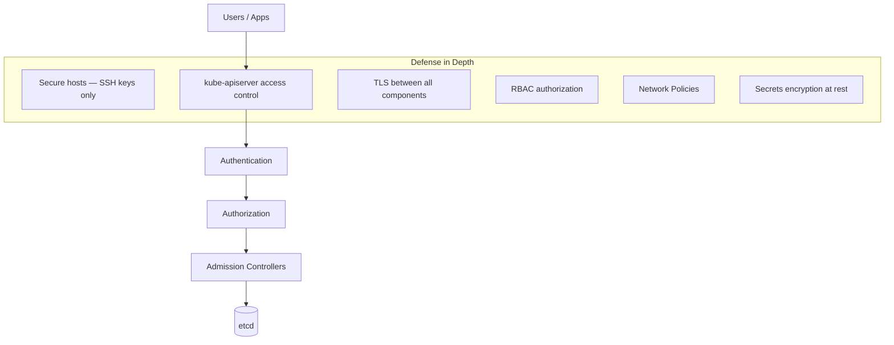
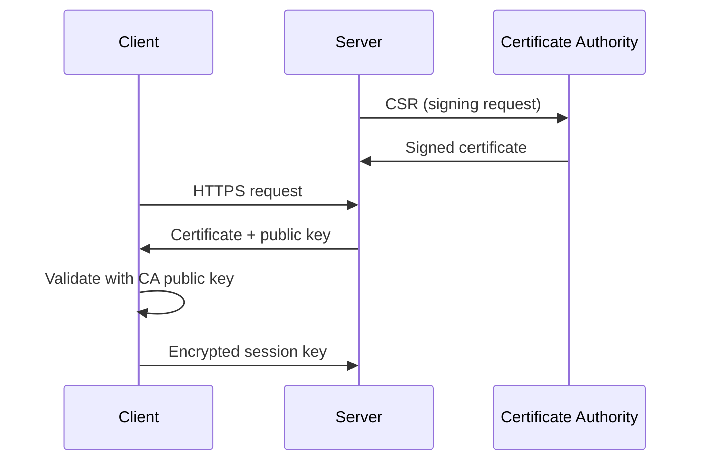
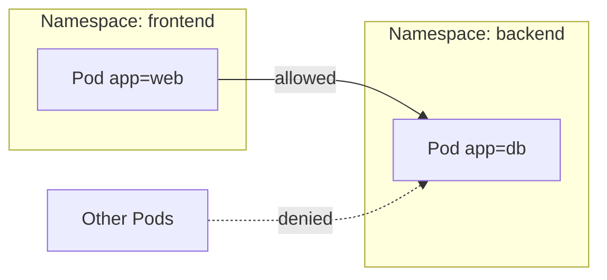

# CKA Study — Security (Enhanced)

> **Goal:** Secure Kubernetes clusters — authentication, authorization, TLS, RBAC, service accounts, image security, security contexts, and network policies.

---

## Table of Contents

1. [Security Primitives Overview](#1-security-primitives-overview)
2. [Authentication](#2-authentication)
3. [TLS Certificates](#3-tls-certificates)
4. [Certificate Signing Requests (CSR)](#4-certificate-signing-requests-csr)
5. [Kubeconfig](#5-kubeconfig)
6. [API Groups](#6-api-groups)
7. [Authorization](#7-authorization)
8. [RBAC — Roles & Bindings](#8-rbac--roles--bindings)
9. [ClusterRoles & ClusterRoleBindings](#9-clusterroles--clusterrolebindings)
10. [Service Accounts](#10-service-accounts)
11. [Image Security](#11-image-security)
12. [Security Contexts](#12-security-contexts)
13. [Network Policies](#13-network-policies)
14. [Cheat Sheet & Resources](#14-cheat-sheet--resources)

---

## 1. Security Primitives Overview



| Layer | Mechanism |
|-------|-----------|
| **Who can access?** | Certificates, tokens, OIDC/LDAP, ServiceAccounts |
| **What can they do?** | RBAC, Node, Webhook authorization |
| **Transport security** | TLS certificates on all components |
| **Pod isolation** | Network Policies, Security Contexts, Pod Security Standards |

---

## 2. Authentication

Kubernetes does **not** manage human users as API objects — admins create certificates or use external IdP.

| Identity type | Managed by |
|---------------|------------|
| **Admin / developer** | External (certs, OIDC, LDAP) |
| **Service account** | Kubernetes API (`ServiceAccount` object) |
| **Bots / workloads** | ServiceAccount tokens |

kube-apiserver authenticates **every request** before processing.

### Authentication methods

| Method | Description |
|--------|-------------|
| **Client certificates** | X.509 certs signed by cluster CA |
| **Static token file** | `--token-auth-file` (legacy) |
| **ServiceAccount tokens** | Mounted in Pods |
| **OIDC / LDAP / Webhook** | External identity providers |

---

## 3. TLS Certificates

TLS guarantees trust between parties using **asymmetric encryption** (public/private key pairs).



### Certificate types in Kubernetes

| Role | Files |
|------|-------|
| **Cluster CA** | `ca.crt`, `ca.key` |
| **kube-apiserver** | `apiserver.crt`, `apiserver.key` |
| **etcd server** | `etcd/server.crt`, `etcd/server.key` |
| **kubelet server** | `kubelet-server.crt`, `kubelet-server.key` |
| **Admin client** | `admin.crt`, `admin.key` |
| **Controller-manager** | `controller-manager.crt`, `.key` |
| **Scheduler** | `scheduler.crt`, `scheduler.key` |
| **kube-proxy** | `kube-proxy.crt`, `kube-proxy.key` |

### Generate certificates (OpenSSL)

**1. CA:**

```bash
openssl genrsa -out ca.key 2048
openssl req -new -key ca.key -subj "/CN=KUBERNETES-CA" -out ca.csr
openssl x509 -req -in ca.csr -signkey ca.key -out ca.crt
```

**2. Admin user:**

```bash
openssl genrsa -out admin.key 2048
openssl req -new -key admin.key \
  -subj "/CN=kube-admin/O=system:masters" -out admin.csr
openssl x509 -req -in admin.csr -CA ca.crt -CAkey ca.key -out admin.crt
```

**3. kube-apiserver** (requires SANs in openssl.cnf):

```ini
[ v3_req ]
subjectAltName = @alt_names
[ alt_names ]
DNS.1 = kubernetes
DNS.2 = kubernetes.default
DNS.3 = kubernetes.default.svc
DNS.4 = kubernetes.default.svc.cluster.local
IP.1 = 10.96.0.1
IP.2 = 172.17.0.87
```

```bash
openssl genrsa -out apiserver.key 2048
openssl req -new -key apiserver.key -subj "/CN=kube-apiserver" \
  -out apiserver.csr -config openssl.cnf
openssl x509 -req -in apiserver.csr -CA ca.crt -CAkey ca.key \
  -out apiserver.crt -extensions v3_req -extfile openssl.cnf
```

### View certificates

Static Pod manifest paths: `/etc/kubernetes/manifests/kube-apiserver.yaml`

```bash
openssl x509 -in /etc/kubernetes/pki/apiserver.crt -text -noout
# Subject, SANs, Not After (expiry), Issuer
```

If kubectl fails, debug with:

```bash
crictl ps -a
crictl logs <container-id>
```

| Port | Service |
|------|---------|
| **6443** | kube-apiserver |
| **2379** | etcd client |
| **2380** | etcd peer |
| **10250** | kubelet |

---

## 4. Certificate Signing Requests (CSR)

Users generate keys and CSRs; admins approve via Kubernetes API.

```bash
openssl genrsa -out jane.key 2048
openssl req -new -key jane.key -subj "/CN=jane" -out jane.csr
cat jane.csr | base64 | tr -d '\n'
```

```yaml
apiVersion: certificates.k8s.io/v1
kind: CertificateSigningRequest
metadata:
  name: jane-csr
spec:
  signerName: kubernetes.io/kube-apiserver-client
  expirationSeconds: 86400
  usages:
    - client auth
  request: <BASE64_ENCODED_CSR>
```

```bash
kubectl get csr
kubectl certificate approve jane-csr
kubectl get csr jane-csr -o yaml
# Decode certificate from status.certificate
```

Controller-manager runs **CSR approving** and **CSR signing** controllers with cluster CA:

```yaml
--cluster-signing-cert-file=/etc/kubernetes/pki/ca.crt
--cluster-signing-key-file=/etc/kubernetes/pki/ca.key
```

---

## 5. Kubeconfig

Consolidates cluster access credentials.

```yaml
apiVersion: v1
kind: Config
current-context: dev-user@my-cluster
clusters:
  - name: my-cluster
    cluster:
      certificate-authority: ca.crt
      server: https://my-cluster:6443
contexts:
  - name: dev-user@my-cluster
    context:
      cluster: my-cluster
      user: dev-user
      namespace: finance
users:
  - name: dev-user
    user:
      client-certificate: admin.crt
      client-key: admin.key
```

```bash
kubectl config view
kubectl config use-context prod-user@production
kubectl config set-context --current --namespace=dev
kubectl config get-contexts
```

Default location: `~/.kube/config` — **not** applied via `kubectl apply`.

---

## 6. API Groups

| Path | Group | Examples |
|------|-------|----------|
| `/api/v1` | **Core** | pods, services, nodes, pv, pvc, secrets, configmaps |
| `/apis/apps/v1` | apps | deployments, replicasets, statefulsets |
| `/apis/networking.k8s.io/v1` | networking | networkpolicies, ingress |
| `/apis/rbac.authorization.k8s.io/v1` | rbac | roles, rolebindings, clusterroles |
| `/apis/certificates.k8s.io/v1` | certificates | certificatesigningrequests |
| `/apis/storage.k8s.io/v1` | storage | storageclasses |

```bash
kubectl api-resources
kubectl proxy   # access API on localhost without certs (from machine running proxy)
```

---

## 7. Authorization

After authentication, kube-apiserver checks authorization.

| Mode | Description |
|------|-------------|
| **RBAC** | Role-based (standard) |
| **Node** | kubelet access to its own resources |
| **Webhook** | External policy (OPA, etc.) |
| **ABAC** | Legacy attribute-based |
| **AlwaysAllow / AlwaysDeny** | Testing only |

Set via `--authorization-mode=Node,RBAC` on kube-apiserver.

---

## 8. RBAC — Roles & Bindings

**Role** = permissions in a **namespace**. **RoleBinding** = grant role to user/group/ServiceAccount.

```yaml
apiVersion: rbac.authorization.k8s.io/v1
kind: Role
metadata:
  name: developer
  namespace: default
rules:
  - apiGroups: [""]
    resources: ["pods"]
    verbs: ["list", "get", "create", "update", "delete"]
  - apiGroups: [""]
    resources: ["configmaps"]
    verbs: ["create"]
```

```yaml
apiVersion: rbac.authorization.k8s.io/v1
kind: RoleBinding
metadata:
  name: devuser-developer-binding
  namespace: default
subjects:
  - kind: User
    name: dev-user
    apiGroup: rbac.authorization.k8s.io
roleRef:
  kind: Role
  name: developer
  apiGroup: rbac.authorization.k8s.io
```

```bash
kubectl apply -f developer-role.yaml
kubectl get roles,rolebindings
kubectl describe role developer
kubectl auth can-i create pods
kubectl auth can-i create pods --as dev-user --namespace dololo
```

---

## 9. ClusterRoles & ClusterRoleBindings

For **cluster-scoped** resources (nodes, PVs, namespaces, etc.).

| Namespaced | Cluster-scoped |
|------------|----------------|
| pods, deployments, services, secrets, configmaps, roles, rolebindings, pvc | nodes, pv, namespaces, clusterroles, clusterrolebindings, csr |

```yaml
apiVersion: rbac.authorization.k8s.io/v1
kind: ClusterRole
metadata:
  name: storage-admin
rules:
  - apiGroups: [""]
    resources: ["persistentvolumes", "storageclasses"]
    verbs: ["*"]
```

```bash
kubectl create clusterrole storage-admin \
  --resource=persistentvolumes,storageclasses --verb=*

kubectl create clusterrolebinding michelle-storage-admin \
  --clusterrole=storage-admin --user=michelle
```

---

## 10. Service Accounts

For **in-cluster** applications (Prometheus, Jenkins, etc.) — not humans.

```bash
kubectl get serviceaccounts
kubectl create serviceaccount dashboard-sa
kubectl create token dashboard-sa --duration 2h
```

```yaml
apiVersion: v1
kind: ServiceAccount
metadata:
  name: dashboard-sa
  namespace: default
---
apiVersion: v1
kind: Pod
metadata:
  name: my-pod
spec:
  serviceAccountName: dashboard-sa
  containers:
    - name: app
      image: my-app
```

- Default ServiceAccount auto-mounted unless `automountServiceAccountToken: false`
- Token mounted at `/var/run/secrets/kubernetes.io/serviceaccount/`
- Bind SA to Role via **RoleBinding** with `kind: ServiceAccount`

---

## 11. Image Security

Default public registry: `docker.io/library/<image>`

### Private registry

```bash
kubectl create secret docker-registry regcred \
  --docker-server=private-registry.io \
  --docker-username=user \
  --docker-password=pass \
  --docker-email=user@org.com
```

```yaml
apiVersion: v1
kind: Pod
metadata:
  name: nginx
spec:
  containers:
    - name: nginx
      image: private-registry.io/apps/internal-app
  imagePullSecrets:
    - name: regcred
```

Best practices: scan images, use minimal base images, pin digests, admission policies.

---

## 12. Security Contexts

Control privileges and access settings for Pods/containers.

```yaml
apiVersion: v1
kind: Pod
metadata:
  name: multi-pod
spec:
  securityContext:           # Pod-level
    runAsUser: 1001
    fsGroup: 2000
  containers:
    - name: web
      image: ubuntu
      command: ["sleep", "5000"]
      securityContext:       # Container-level (overrides Pod)
        runAsUser: 1002
        capabilities:
          add: ["SYS_TIME"]
        allowPrivilegeEscalation: false
        readOnlyRootFilesystem: true
```

| Field | Purpose |
|-------|---------|
| `runAsUser` | UID to run process |
| `runAsNonRoot` | Fail if root |
| `capabilities` | Add/drop Linux capabilities |
| `seccompProfile` | Seccomp profile |
| `readOnlyRootFilesystem` | Immutable root FS |

**Pod Security Standards:** `privileged`, `baseline`, `restricted` — enforced via admission (Pod Security admission).

---

## 13. Network Policies

Control **ingress** and **egress** traffic between Pods (requires CNI that supports NetworkPolicy, e.g. Calico).



Default: **all Pods can talk to all Pods** in cluster.

```yaml
apiVersion: networking.k8s.io/v1
kind: NetworkPolicy
metadata:
  name: db-policy
  namespace: default
spec:
  podSelector:
    matchLabels:
      role: db
  policyTypes:
    - Ingress
    - Egress
  ingress:
    - from:
        - podSelector:
            matchLabels:
              role: api
      ports:
        - protocol: TCP
          port: 5432
  egress:
    - to:
        - podSelector:
            matchLabels:
              role: dns
      ports:
        - protocol: UDP
          port: 53
```

| Concept | Meaning |
|---------|---------|
| **podSelector** | Which Pods this policy applies to |
| **ingress** | Incoming allowed sources |
| **egress** | Outgoing allowed destinations |
| Empty `podSelector: {}` | All Pods in namespace |

---

## 14. Cheat Sheet & Resources

```bash
# TLS / certs
openssl x509 -in cert.crt -text -noout
kubectl get csr
kubectl certificate approve <name>

# RBAC
kubectl auth can-i <verb> <resource> --as <user> -n <ns>
kubectl create role/clusterrole ...
kubectl create rolebinding/clusterrolebinding ...

# ServiceAccount
kubectl create sa <name>
kubectl create token <sa> --duration 1h

# NetworkPolicy
kubectl get networkpolicy
kubectl explain networkpolicy.spec --recursive
```

- [Security overview](https://kubernetes.io/docs/concepts/security/)
- [RBAC](https://kubernetes.io/docs/reference/access-authn-authz/rbac/)
- [TLS bootstrapping](https://kubernetes.io/docs/reference/access-authn-authz/kubelet-tls-bootstrapping/)
- [Network Policies](https://kubernetes.io/docs/concepts/services-networking/network-policies/)
- [Pod Security Standards](https://kubernetes.io/docs/concepts/security/pod-security-standards/)

---

## Kubernetes Docs — YAML Example Locations

| Topic / Resource | Kubernetes docs (YAML examples) |
|------------------|----------------------------------|
| **CertificateSigningRequest (CSR)** | [Certificate Signing Requests](https://kubernetes.io/docs/reference/access-authn-authz/certificate-signing-requests/) |
| **Kubeconfig** | [Organizing Cluster Access using kubeconfig](https://kubernetes.io/docs/concepts/configuration/organize-cluster-access-kubeconfig/) |
| **Role** | [Using RBAC Authorization — Role example](https://kubernetes.io/docs/reference/access-authn-authz/rbac/#role-and-clusterrole) |
| **RoleBinding** | [Using RBAC Authorization — RoleBinding example](https://kubernetes.io/docs/reference/access-authn-authz/rbac/#rolebinding-and-clusterrolebinding) |
| **ClusterRole** | [Using RBAC Authorization — ClusterRole example](https://kubernetes.io/docs/reference/access-authn-authz/rbac/#role-and-clusterrole) |
| **ClusterRoleBinding** | [Using RBAC Authorization — ClusterRoleBinding example](https://kubernetes.io/docs/reference/access-authn-authz/rbac/#rolebinding-and-clusterrolebinding) |
| **ServiceAccount** | [Configure Service Accounts for Pods](https://kubernetes.io/docs/tasks/configure-pod-container/configure-service-account/) |
| **Pod with ServiceAccount** | [Configure Service Accounts for Pods](https://kubernetes.io/docs/tasks/configure-pod-container/configure-service-account/) |
| **imagePullSecrets** | [Pull an Image from a Private Registry](https://kubernetes.io/docs/tasks/configure-pod-container/pull-image-private-registry/) |
| **SecurityContext (Pod / container)** | [Configure a Security Context for a Pod or Container](https://kubernetes.io/docs/tasks/configure-pod-container/security-context/) |
| **Pod Security Standards / admission** | [Pod Security Standards](https://kubernetes.io/docs/concepts/security/pod-security-standards/) · [Enforce PSS](https://kubernetes.io/docs/tasks/configure-pod-container/enforce-standards-namespace-labels/) |
| **NetworkPolicy** | [Network Policies](https://kubernetes.io/docs/concepts/services-networking/network-policies/) · [Declare Network Policy](https://kubernetes.io/docs/tasks/administer-cluster/declare-network-policy/) |
| **Encrypt secrets at rest** | [Encrypting Secret Data at Rest](https://kubernetes.io/docs/tasks/administer-cluster/encrypt-data/) |
| **kube-apiserver TLS / static Pod** | [Manual kubeadm setup](https://kubernetes.io/docs/setup/production-environment/tools/kubeadm/setup-kubeadm/) |
| **Admission controllers** | [Admission Controllers](https://kubernetes.io/docs/reference/access-authn-authz/admission-controllers/) |
