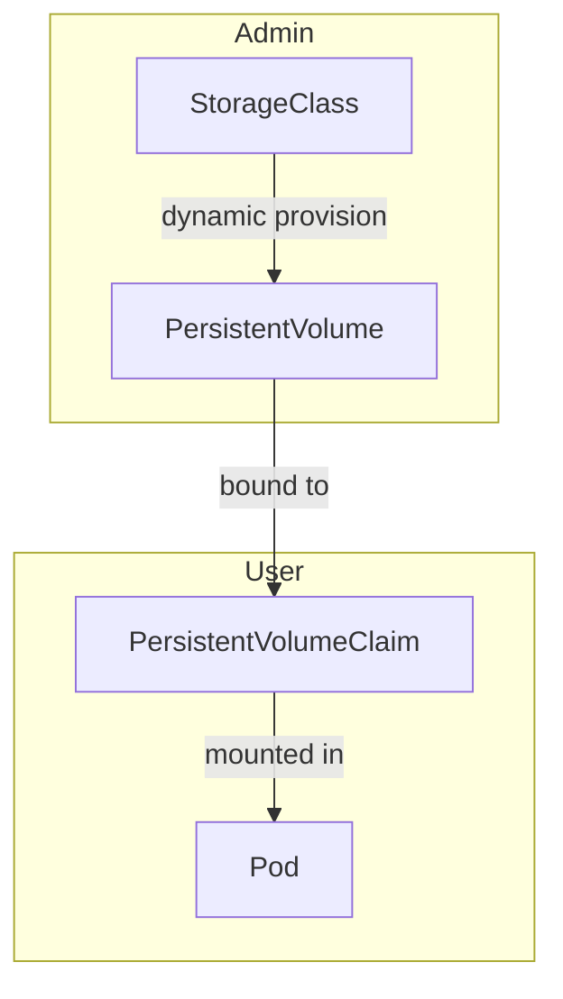
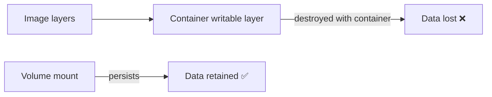
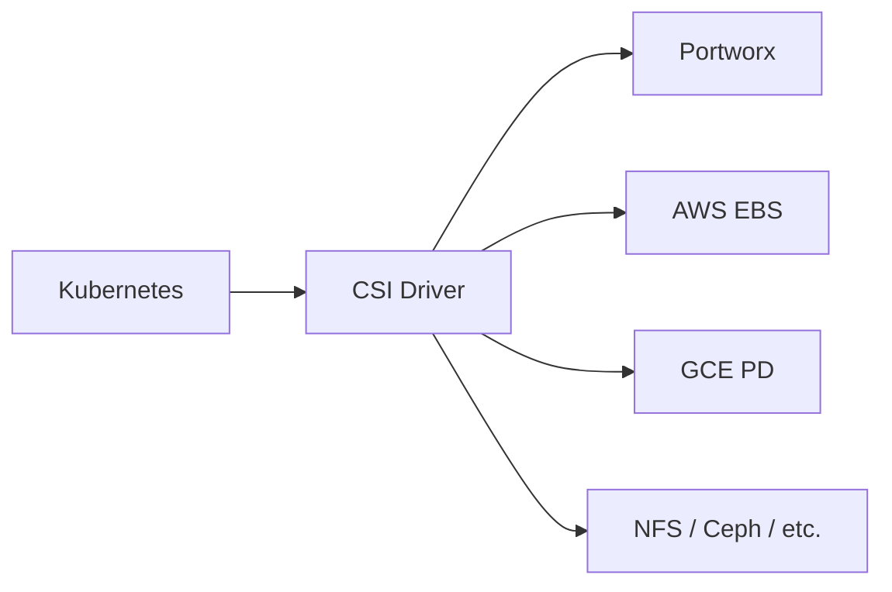
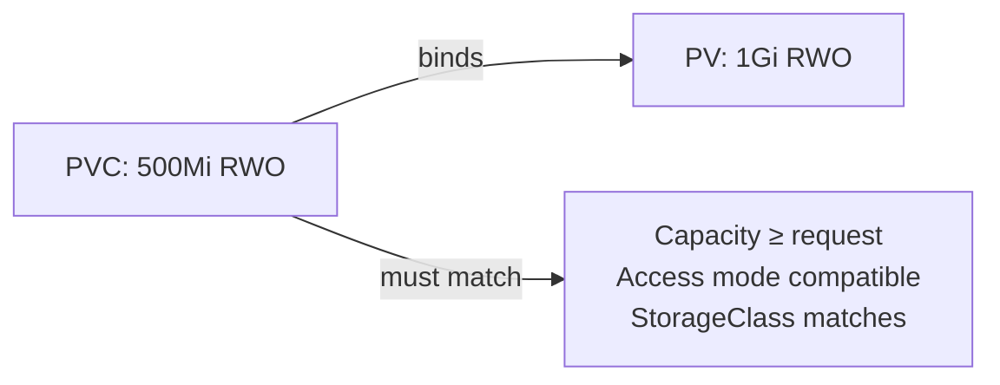
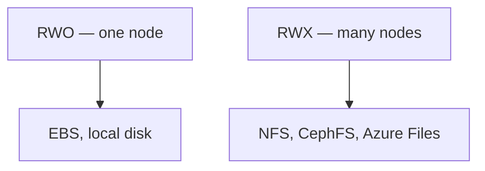
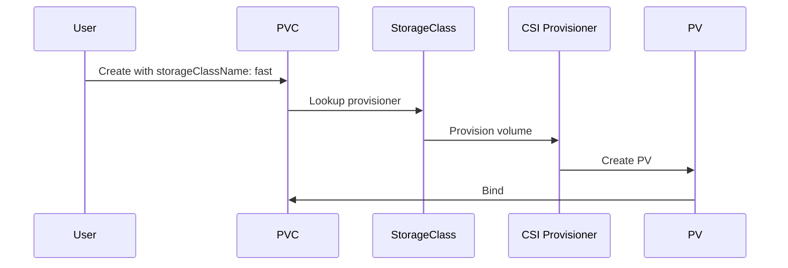

# CKA Study — Storage (Enhanced)

> **Goal:** Persistent storage in Kubernetes — volumes, PersistentVolumes, PersistentVolumeClaims, StorageClasses, access modes, and the Container Storage Interface (CSI).

---

## Table of Contents

1. [Storage Overview](#1-storage-overview)
2. [Docker & Ephemeral Storage](#2-docker--ephemeral-storage)
3. [Container Storage Interface (CSI)](#3-container-storage-interface-csi)
4. [PersistentVolumes (PV)](#4-persistentvolumes-pv)
5. [PersistentVolumeClaims (PVC)](#5-persistentvolumeclaims-pvc)
6. [Using PVCs in Pods](#6-using-pvcs-in-pods)
7. [Access Modes & Reclaim Policies](#7-access-modes--reclaim-policies)
8. [StorageClasses & Dynamic Provisioning](#8-storageclasses--dynamic-provisioning)
9. [Volume Types Reference](#9-volume-types-reference)
10. [Cheat Sheet & Resources](#10-cheat-sheet--resources)

---

## 1. Storage Overview



| Concept | Description |
|---------|-------------|
| **Volume** | Directory accessible to containers in a Pod |
| **PersistentVolume (PV)** | Cluster-wide storage resource (admin-provisioned) |
| **PersistentVolumeClaim (PVC)** | User request for storage |
| **StorageClass** | Dynamic provisioning template |
| **CSI** | Standard interface for external storage providers |

---

## 2. Docker & Ephemeral Storage

Containers are ephemeral — data inside the container filesystem is lost when the container is removed.



**Kubernetes volumes** outlive container restarts within a Pod. **PVs** outlive Pods for persistent data shared across the cluster.

---

## 3. Container Storage Interface (CSI)

Universal standard for block and file storage across orchestrators.



CSI RPC operations:

- CreateVolume / DeleteVolume
- ControllerPublishVolume / ControllerUnpublishVolume
- NodeStageVolume / NodePublishVolume

Legacy in-tree plugins (awsElasticBlockStore, gcePersistentDisk) are deprecated in favor of CSI drivers.

---

## 4. PersistentVolumes (PV)

Cluster-wide pool of storage configured by administrators.

```yaml
apiVersion: v1
kind: PersistentVolume
metadata:
  name: pv-vol1
spec:
  capacity:
    storage: 1Gi
  accessModes:
    - ReadWriteOnce
  persistentVolumeReclaimPolicy: Retain
  storageClassName: manual
  hostPath:
    path: /tmp/data    # Node-local — dev/test only
```

### Cloud provider example (AWS EBS via in-tree — prefer CSI in production)

```yaml
apiVersion: v1
kind: PersistentVolume
metadata:
  name: pv-aws
spec:
  capacity:
    storage: 10Gi
  accessModes:
    - ReadWriteOnce
  awsElasticBlockStore:
    volumeID: vol-xxxxxxxx
    fsType: ext4
```

```bash
kubectl apply -f pv-definition.yaml
kubectl get persistentvolume
kubectl describe pv pv-vol1
```

---

## 5. PersistentVolumeClaims (PVC)

Users request storage; Kubernetes binds PVC to a matching PV.



```yaml
apiVersion: v1
kind: PersistentVolumeClaim
metadata:
  name: myclaim
spec:
  accessModes:
    - ReadWriteOnce
  resources:
    requests:
      storage: 500Mi
  storageClassName: manual
  selector:
    matchLabels:
      type: local
```

Binding rules:

- PV capacity ≥ PVC request (PVC can bind to larger PV)
- Access modes must be compatible
- `storageClassName` must match (or empty for static binding)
- Optional **selectors** match PV labels

```bash
kubectl apply -f pvc-definition.yaml
kubectl get persistentvolumeclaims
kubectl get pvc
kubectl delete pvc myclaim
```

---

## 6. Using PVCs in Pods

Mount PVC as a volume in Pod, Deployment, or StatefulSet template:

```yaml
apiVersion: v1
kind: Pod
metadata:
  name: mypod
spec:
  containers:
    - name: myfrontend
      image: nginx
      volumeMounts:
        - mountPath: /var/www/html
          name: mypd
  volumes:
    - name: mypd
      persistentVolumeClaim:
        claimName: myclaim
```

Deployment example:

```yaml
apiVersion: apps/v1
kind: Deployment
metadata:
  name: web
spec:
  replicas: 2
  selector:
    matchLabels:
      app: web
  template:
    metadata:
      labels:
        app: web
    spec:
      containers:
        - name: nginx
          image: nginx
          volumeMounts:
            - mountPath: /usr/share/nginx/html
              name: web-storage
      volumes:
        - name: web-storage
          persistentVolumeClaim:
            claimName: myclaim
```

> **ReadWriteOnce** volumes attach to **one node** at a time — Pods using the same PVC must schedule on the same node (or use ReadWriteMany / StatefulSet with per-Pod PVCs).

---

## 7. Access Modes & Reclaim Policies

### Access modes

| Mode | Abbrev | Meaning |
|------|--------|---------|
| **ReadWriteOnce** | RWO | Single node read-write |
| **ReadOnlyMany** | ROX | Many nodes read-only |
| **ReadWriteMany** | RWX | Many nodes read-write |
| **ReadWriteOncePod** | RWOP | Single Pod read-write (1.22+) |



### Reclaim policies (when PVC deleted)

| Policy | Behavior |
|--------|----------|
| **Retain** | Keep PV and data; manual cleanup |
| **Delete** | Delete PV and underlying volume (dynamic provisioning default) |
| **Recycle** | Deprecated — scrub data (don't use) |

---

## 8. StorageClasses & Dynamic Provisioning

Admin creates **StorageClass** → user creates **PVC** with `storageClassName` → provisioner creates PV automatically.



```yaml
apiVersion: storage.k8s.io/v1
kind: StorageClass
metadata:
  name: fast
provisioner: kubernetes.io/gce-pd    # or ebs.csi.aws.com, etc.
parameters:
  type: pd-ssd
  replication-type: none
reclaimPolicy: Delete
allowVolumeExpansion: true
volumeBindingMode: WaitForFirstConsumer   # delay binding until Pod scheduled
```

```yaml
apiVersion: v1
kind: PersistentVolumeClaim
metadata:
  name: dynamic-claim
spec:
  accessModes:
    - ReadWriteOnce
  resources:
    requests:
      storage: 20Gi
  storageClassName: fast
```

```bash
kubectl get storageclass
kubectl describe sc fast
```

| Provisioning | Description |
|--------------|-------------|
| **Static** | Admin creates PV; user creates matching PVC |
| **Dynamic** | StorageClass + PVC → automatic PV creation |

---

## 9. Volume Types Reference

| Volume type | Use case |
|-------------|----------|
| **emptyDir** | Scratch space; shared between containers in Pod |
| **hostPath** | Node filesystem (dev/test; DaemonSets) |
| **configMap / secret** | Inject config data |
| **nfs** | Shared ReadWriteMany storage |
| **persistentVolumeClaim** | Persistent app data |
| **projected** | SA tokens, configmaps, secrets, downwardAPI |
| **csi** | Generic CSI driver volumes |

### emptyDir example

```yaml
volumes:
  - name: cache
    emptyDir: {}
```

### ConfigMap as volume

```yaml
volumes:
  - name: config
    configMap:
      name: app-config
```

---

## 10. Cheat Sheet & Resources

```bash
# PV / PVC
kubectl get pv,pvc,sc
kubectl describe pv <name>
kubectl describe pvc <name>
kubectl delete pvc <name>

# Debug mounting
kubectl describe pod <name>
kubectl get events --sort-by='.lastTimestamp'
```

| Check | Command |
|-------|---------|
| PV status | `Available`, `Bound`, `Released`, `Failed` |
| PVC status | `Pending`, `Bound`, `Lost` |
| Default SC | Annotation `storageclass.kubernetes.io/is-default-class: "true"` |

- [Persistent Volumes](https://kubernetes.io/docs/concepts/storage/persistent-volumes/)
- [Storage Classes](https://kubernetes.io/docs/concepts/storage/storage-classes/)
- [Configure a Pod to Use a PVC](https://kubernetes.io/docs/tasks/configure-pod-container/configure-persistent-volume-storage/)
- [CSI Drivers](https://kubernetes-csi.github.io/docs/drivers.html)

---

## Kubernetes Docs — YAML Example Locations

| Topic / Resource | Kubernetes docs (YAML examples) |
|------------------|----------------------------------|
| **PersistentVolume (PV)** | [Persistent Volumes](https://kubernetes.io/docs/concepts/storage/persistent-volumes/) |
| **PersistentVolumeClaim (PVC)** | [Persistent Volumes — Claims](https://kubernetes.io/docs/concepts/storage/persistent-volumes/#persistentvolumeclaims) |
| **Pod with PVC** | [Configure a Pod to Use a PVC](https://kubernetes.io/docs/tasks/configure-pod-container/configure-persistent-volume-storage/) |
| **Deployment with PVC** | [Configure a Pod to Use a PVC](https://kubernetes.io/docs/tasks/configure-pod-container/configure-persistent-volume-storage/) |
| **StorageClass** | [Storage Classes](https://kubernetes.io/docs/concepts/storage/storage-classes/) |
| **Dynamic provisioning** | [Dynamic Volume Provisioning](https://kubernetes.io/docs/concepts/storage/dynamic-provisioning/) |
| **hostPath volume** | [Configure a Pod to Use a Volume for Storage](https://kubernetes.io/docs/tasks/configure-pod-container/configure-volume-storage/) |
| **emptyDir volume** | [Configure a Pod to Use a Volume for Storage](https://kubernetes.io/docs/tasks/configure-pod-container/configure-volume-storage/) |
| **ConfigMap as volume** | [Configure Pod with ConfigMap](https://kubernetes.io/docs/tasks/configure-pod-container/configure-pod-configmap/) |
| **Secret as volume** | [Distribute Credentials with Secrets](https://kubernetes.io/docs/tasks/inject-data-application/distribute-credentials-secure/) |
| **CSI volume** | [CSI Volumes](https://kubernetes.io/docs/concepts/storage/volumes/#csi) |
| **StatefulSet + volumeClaimTemplates** | [StatefulSets](https://kubernetes.io/docs/concepts/workloads/controllers/statefulset/) |
| **Access modes & reclaim policy** | [Persistent Volumes — Access Modes](https://kubernetes.io/docs/concepts/storage/persistent-volumes/#access-modes) · [Reclaim Policy](https://kubernetes.io/docs/concepts/storage/persistent-volumes/#reclaim-policy) |
