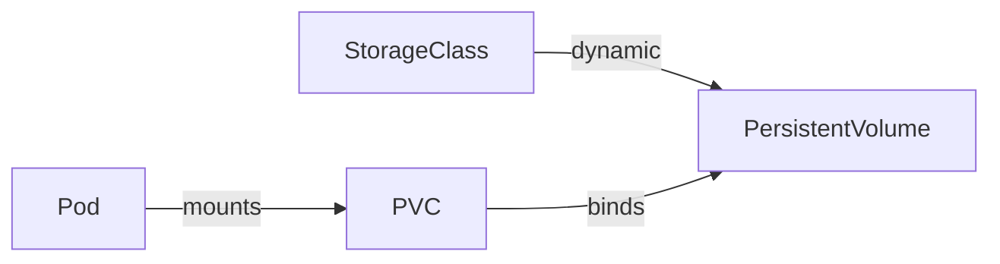

# Storage — Pref Revision (CKA)

Quick exam revision. See [enhanced_readme.md](./enhanced_readme.md) for full detail.

---

## Core objects



| Object | Who creates | Purpose |
|--------|-------------|---------|
| **PV** | Admin or dynamic provisioner | Cluster storage pool |
| **PVC** | User | Storage request |
| **StorageClass** | Admin | Dynamic provisioning template |

---

## Access modes

| Mode | Meaning |
|------|---------|
| **RWO** | ReadWriteOnce — one node |
| **ROX** | ReadOnlyMany — many nodes read |
| **RWX** | ReadWriteMany — many nodes read-write |
| **RWOP** | Single Pod (1.22+) |

PVC request must be **compatible** with PV mode; PV capacity ≥ PVC request.

---

## Reclaim policy (PVC deleted)

| Policy | Result |
|--------|--------|
| **Retain** | Keep PV + data (manual cleanup) |
| **Delete** | Remove PV + cloud volume |
| **Recycle** | Deprecated |

---

## Static vs dynamic

| | Static | Dynamic |
|--|--------|---------|
| Flow | Create PV → create matching PVC | StorageClass + PVC → auto PV |
| `storageClassName` | Must match | Set on SC |

---

## Pod mount pattern

```yaml
volumes:
  - name: data
    persistentVolumeClaim:
      claimName: myclaim
volumeMounts:
  - mountPath: /data
    name: data
```

Same pattern in Deployment/StatefulSet **template**.

---

## RWO caveat

ReadWriteOnce = **one node at a time** — replicas sharing one PVC must land on same node (usually wrong pattern). Use **StatefulSet** with **volumeClaimTemplates** for per-Pod disks.

---

## StorageClass highlights

```yaml
provisioner: ebs.csi.aws.com
reclaimPolicy: Delete
allowVolumeExpansion: true
volumeBindingMode: WaitForFirstConsumer
```

```bash
kubectl get sc
```

---

## Volume types (quick)

| Type | Use |
|------|-----|
| emptyDir | Temp/shared in Pod |
| hostPath | Node path (dev/DaemonSet) |
| configMap/secret | Config injection |
| pvc | Persistent data |
| csi | External storage driver |

---

## CSI

Standard plugin interface — replaces in-tree cloud providers. Operations: Create/Delete/Publish/Unpublish volume.

---

## Commands

```bash
kubectl get pv,pvc,sc
kubectl describe pvc myclaim
kubectl delete pvc myclaim
```

PV phases: **Available → Bound → Released**

---

## Exam tips

1. PVC `Pending` = no matching PV or provisioner issue
2. `storageClassName: ""` disables dynamic provisioning
3. hostPath OK for CKA labs; not production
4. Bind PVC to PV with matching size, mode, class, labels
5. StatefulSet + volumeClaimTemplates for stable storage per Pod

---

## Kubernetes Docs — YAML Example Locations

| Topic | Official docs (YAML examples) |
|-------|-------------------------------|
| PersistentVolume | [Persistent Volumes](https://kubernetes.io/docs/concepts/storage/persistent-volumes/) |
| PersistentVolumeClaim | [PV — Claims section](https://kubernetes.io/docs/concepts/storage/persistent-volumes/#persistentvolumeclaims) |
| Pod / Deployment + PVC | [Configure a Pod to Use a PVC](https://kubernetes.io/docs/tasks/configure-pod-container/configure-persistent-volume-storage/) |
| StorageClass | [Storage Classes](https://kubernetes.io/docs/concepts/storage/storage-classes/) |
| emptyDir / hostPath | [Configure Volume Storage](https://kubernetes.io/docs/tasks/configure-pod-container/configure-volume-storage/) |
| StatefulSet + PVC templates | [StatefulSets](https://kubernetes.io/docs/concepts/workloads/controllers/statefulset/) |
| Access modes / reclaim | [Access Modes](https://kubernetes.io/docs/concepts/storage/persistent-volumes/#access-modes) · [Reclaim Policy](https://kubernetes.io/docs/concepts/storage/persistent-volumes/#reclaim-policy) |
