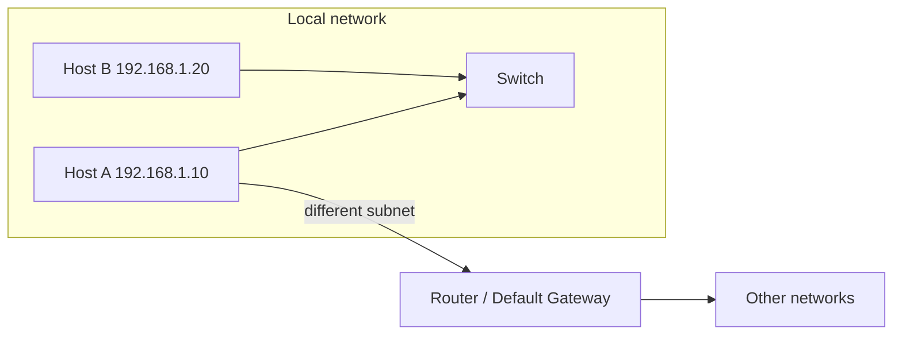
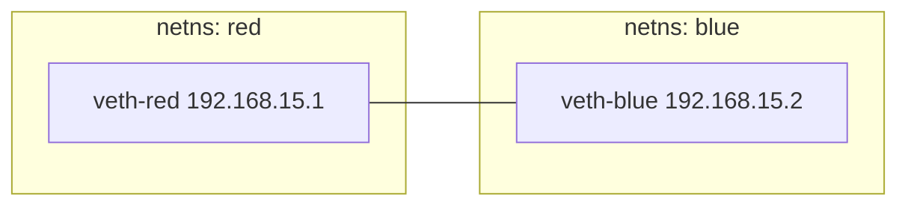
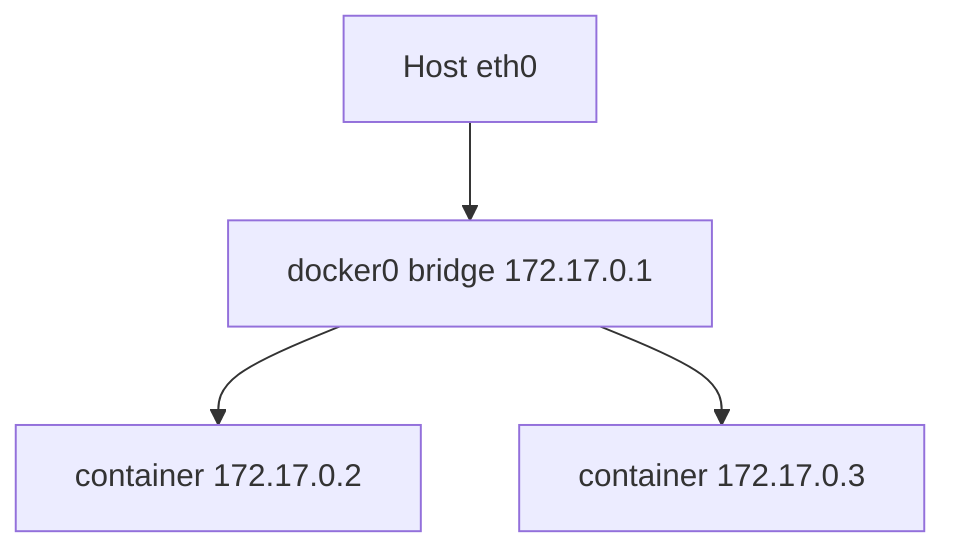
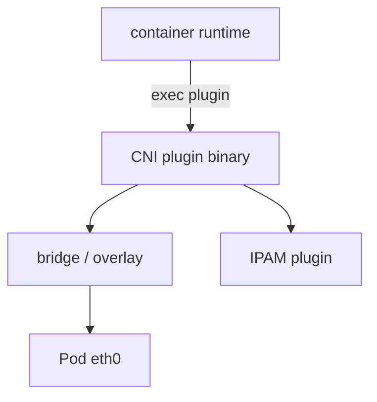
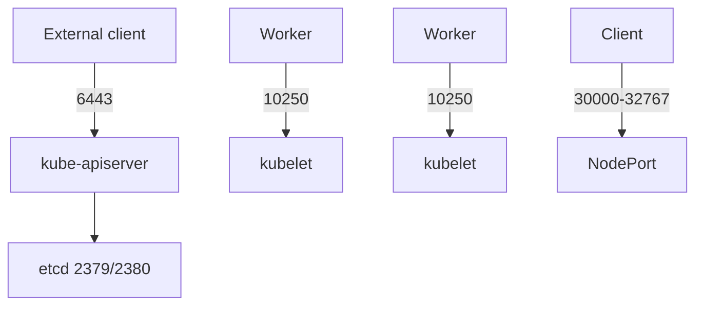
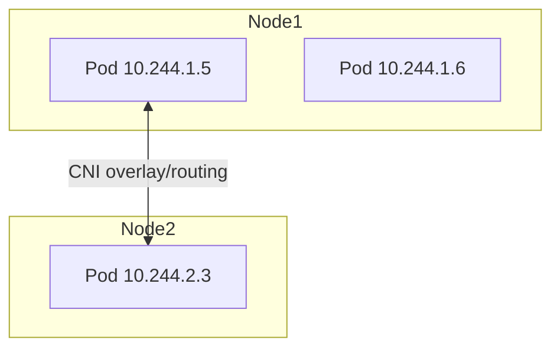
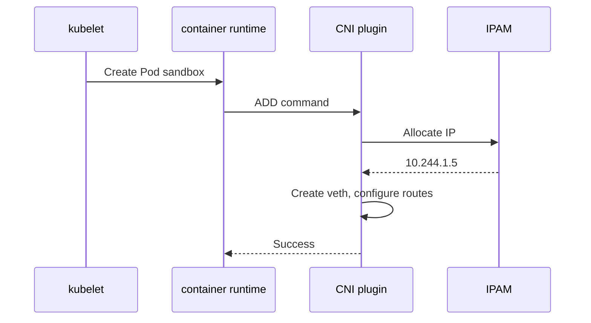
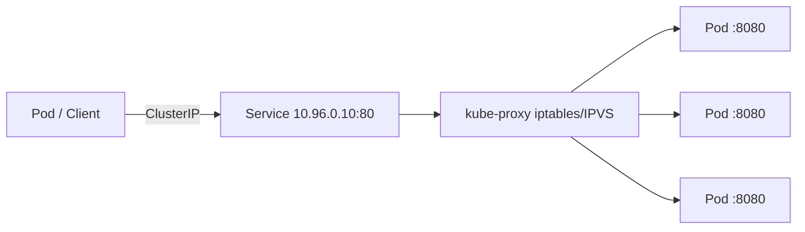
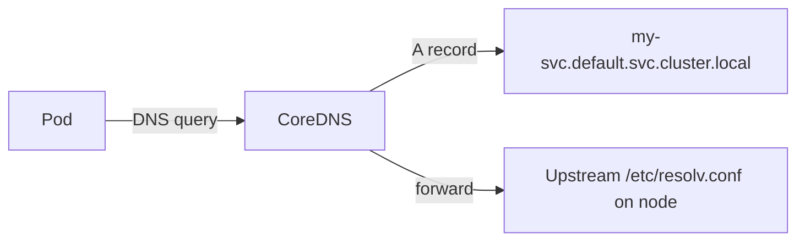

# CKA Study — Networking (Enhanced)

> **Goal:** Kubernetes cluster networking — Linux networking fundamentals, CNI, Pod networking, Services, DNS, and required ports for CKA.

---

## Table of Contents

1. [Prerequisites: Switching, Routing & DNS](#1-prerequisites-switching-routing--dns)
2. [Network Namespaces](#2-network-namespaces)
3. [Linux Bridge](#3-linux-bridge)
4. [Docker Networking](#4-docker-networking)
5. [CNI — Container Networking Interface](#5-cni--container-networking-interface)
6. [Cluster Networking Requirements](#6-cluster-networking-requirements)
7. [Pod Networking](#7-pod-networking)
8. [CNI in Kubernetes](#8-cni-in-kubernetes)
9. [IPAM](#9-ipam)
10. [Service Networking](#10-service-networking)
11. [CoreDNS & DNS Resolution](#11-coredns--dns-resolution)
12. [Linux Networking Commands](#12-linux-networking-commands)
13. [Cheat Sheet & Resources](#13-cheat-sheet--resources)

---

## 1. Prerequisites: Switching, Routing & DNS



| Concept | Description |
|---------|-------------|
| **Switching** | Forward frames within same L2 network |
| **Routing** | Forward packets between networks via routing table |
| **Default gateway** | Next hop for traffic outside local subnet |
| **ARP** | Resolve IP → MAC address on local segment |

### DNS essentials

| Item | Detail |
|------|--------|
| Default port | **53** (UDP/TCP) |
| Record types | **A** (IPv4), **AAAA** (IPv6), **CNAME** (alias) |
| Linux config | `/etc/resolv.conf`, `/etc/hosts` |
| Tools | `nslookup`, `dig` |
| In Kubernetes | **CoreDNS** in `kube-system` |

---

## 2. Network Namespaces

Isolate network stack (interfaces, routes, iptables) per process/container — same idea as Pod network isolation.

```bash
ip netns add red
ip netns add blue
ip netns list
ip netns exec red ip link
ip -n red link
```

### Connect two namespaces with veth pair

```bash
ip link add veth-red type veth peer name veth-blue
ip link set veth-red netns red
ip link set veth-blue netns blue
ip -n red addr add 192.168.15.1/24 dev veth-red
ip -n blue addr add 192.168.15.2/24 dev veth-blue
ip -n red link set veth-red up
ip -n blue link set veth-blue up
```



> CNI plugins create veth pairs between Pod network namespace and host bridge.

---

## 3. Linux Bridge

Software switch connecting multiple interfaces on one host.

```bash
ip link add v-net-0 type bridge
ip link set dev v-net-0 up
```

Attach namespace veth to bridge → multiple Pods/containers share L2 segment.

---

## 4. Docker Networking

| Mode | Behavior |
|------|----------|
| **none** | No external connectivity |
| **host** | Container uses host network stack directly (port conflicts possible) |
| **bridge** (default) | Private bridge network (e.g. `172.17.0.0/16`); NAT to outside |



Docker uses **CNM** (Container Network Model). Kubernetes uses **CNI**.

---

## 5. CNI — Container Networking Interface

Standard for attaching network interfaces to containers/Pods.



### CNI plugin types (spec)

| Type | Purpose |
|------|---------|
| bridge | Linux bridge |
| vlan | VLAN tagging |
| ipvlan / macvlan | L2/L3 virtual interfaces |
| host-local | IPAM — local IP allocation |
| dhcp | DHCP-based IPAM |
| flannel / calico / cilium | Full networking solutions |

### Popular Kubernetes CNI implementations

| Plugin | Model |
|--------|-------|
| **Flannel** | Simple overlay (VXLAN) |
| **Calico** | BGP or overlay; NetworkPolicy |
| **Cilium** | eBPF-based |
| **Weave** | Mesh overlay |
| **VMware NSX-T** | Enterprise SDN |

---

## 6. Cluster Networking Requirements

Every node needs:

- At least **one network interface** with an IP
- Unique **hostname** and **MAC address**
- **No NAT** between nodes for Pod-to-Pod traffic (Pods must reach each other)

> **VM clones:** ensure unique MAC, hostname, and machine-id.

### Required ports (CKA)

| Component | Port | Nodes |
|-----------|------|-------|
| kube-apiserver | **6443** | Control plane |
| kubelet API | **10250** | All nodes |
| kube-scheduler | **10259** | Control plane |
| kube-controller-manager | **10257** | Control plane |
| etcd client | **2379** | Control plane |
| etcd peer | **2380** | Control plane (HA) |
| NodePort Services | **30000–32767** | Workers |
| CoreDNS | **53** | Cluster DNS |



---

## 7. Pod Networking

**Every Pod gets its own IP.** Pods on any node can communicate (unless NetworkPolicy blocks).



CNI responsibilities:

1. Create **veth** pair
2. Attach one end to Pod, one to bridge/host
3. Assign **IP address** (via IPAM)
4. Bring interface **up**
5. Configure **routes** as needed

---

## 8. CNI in Kubernetes

### Plugin location

| Path | Contents |
|------|----------|
| `/opt/cni/bin` | CNI plugin binaries |
| `/etc/cni/net.d` | Plugin config (`.conflist`, `.conf`) |

Example: `10-flannel.conflist`, `calico.conflist`

### Configure container runtime

containerd/CRI-O reads CNI config and invokes plugins when Pod sandbox is created.

```json
{
  "cniVersion": "0.4.0",
  "name": "mynet",
  "type": "bridge",
  "ipam": {
    "type": "host-local",
    "subnet": "10.244.0.0/16"
  }
}
```

### CNI workflow



---

## 9. IPAM

**IP Address Management** — assigns IPs from a pool.

| Plugin | Description |
|--------|-------------|
| **host-local** | File-based local IP pool |
| **dhcp** | DHCP server |
| **calico-ipam** | Calico integrated IPAM |
| **aws-vpc-cni** | AWS ENI/IP allocation |

Configured inside CNI network config under `"ipam"` section.

---

## 10. Service Networking

Services provide a **stable virtual IP (ClusterIP)** and DNS name in front of Pod IPs.



| Service type | Access |
|--------------|--------|
| **ClusterIP** | Internal cluster only |
| **NodePort** | Port on every node (30000–32767) |
| **LoadBalancer** | Cloud LB → NodePort |
| **ExternalName** | CNAME to external DNS |

```yaml
apiVersion: v1
kind: Service
metadata:
  name: my-service
spec:
  type: ClusterIP
  selector:
    app: myapp
  ports:
    - port: 80
      targetPort: 8080
```

kube-proxy modes: **iptables** (default), **ipvs** (better at scale).

---

## 11. CoreDNS & DNS Resolution

Pods resolve Services as:

`<service>.<namespace>.svc.cluster.local`



```bash
kubectl get pods -n kube-system -l k8s-app=kube-dns
kubectl get svc -n kube-system kube-dns
```

Test from Pod:

```bash
kubectl run -it --rm debug --image=busybox -- nslookup kubernetes.default
```

---

## 12. Linux Networking Commands

```bash
ip link                          # interfaces
ip addr                          # IP addresses
ip addr add 192.168.1.10/24 dev eth0
ip route                         # routing table
ip route add 192.168.1.0/24 via 192.168.2.1
netstat -plant                   # listening ports
arp                              # ARP table
route                            # legacy routing
cat /proc/sys/net/ipv4/ip_forward   # IP forwarding (1 = enabled)
```

Enable IP forwarding (required for routing between networks):

```bash
echo 1 > /proc/sys/net/ipv4/ip_forward
```

---

## 13. Cheat Sheet & Resources

```bash
# Cluster DNS
kubectl get svc -n kube-system kube-dns
kubectl get endpoints -n kube-system kube-dns

# Services
kubectl get svc,endpoints
kubectl describe svc <name>

# CNI debug (on node)
ls /opt/cni/bin
ls /etc/cni/net.d
ip link | grep veth
```

- [Cluster Networking](https://kubernetes.io/docs/concepts/cluster-administration/networking/)
- [Services](https://kubernetes.io/docs/concepts/services-networking/service/)
- [DNS for Services and Pods](https://kubernetes.io/docs/concepts/services-networking/dns-pod-service/)
- [CNI specification](https://github.com/containernetworking/cni/blob/main/SPEC.md)

---

## Kubernetes Docs — YAML Example Locations

| Topic / Resource | Kubernetes docs (YAML examples) |
|------------------|----------------------------------|
| **Service (ClusterIP)** | [Service](https://kubernetes.io/docs/concepts/services-networking/service/) |
| **NodePort Service** | [Exposing an External IP](https://kubernetes.io/docs/tasks/access-application-cluster/service-access-application-cluster/) |
| **LoadBalancer Service** | [Use a LoadBalancer](https://kubernetes.io/docs/tasks/access-application-cluster/create-external-load-balancer/) |
| **Endpoints / EndpointSlice** | [EndpointSlices](https://kubernetes.io/docs/concepts/services-networking/endpoint-slices/) |
| **Ingress** | [Ingress](https://kubernetes.io/docs/concepts/services-networking/ingress/) · [Ingress resource](https://kubernetes.io/docs/concepts/services-networking/ingress/#the-ingress-resource) |
| **NetworkPolicy** | [Network Policies](https://kubernetes.io/docs/concepts/services-networking/network-policies/) |
| **CoreDNS ConfigMap** | [Customizing DNS Service](https://kubernetes.io/docs/tasks/administer-cluster/dns-custom-nameservers/) |
| **kube-proxy ConfigMap (IPVS)** | [kube-proxy](https://kubernetes.io/docs/reference/command-line-tools-reference/kube-proxy/) |
