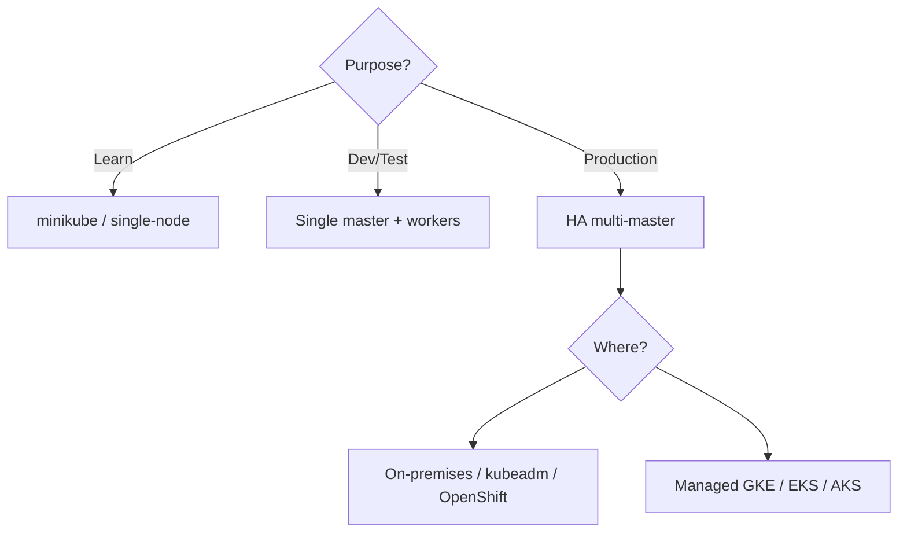
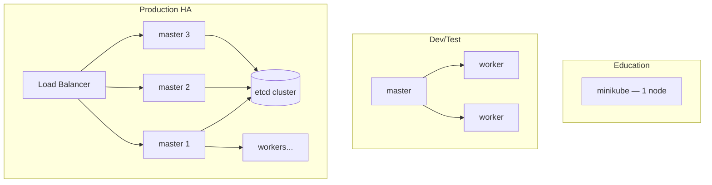
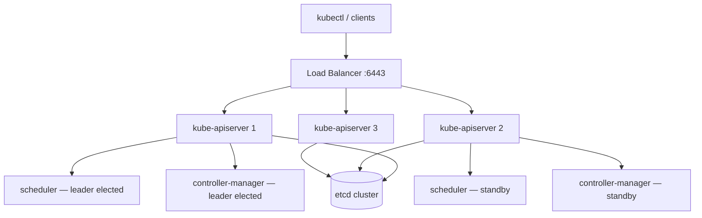
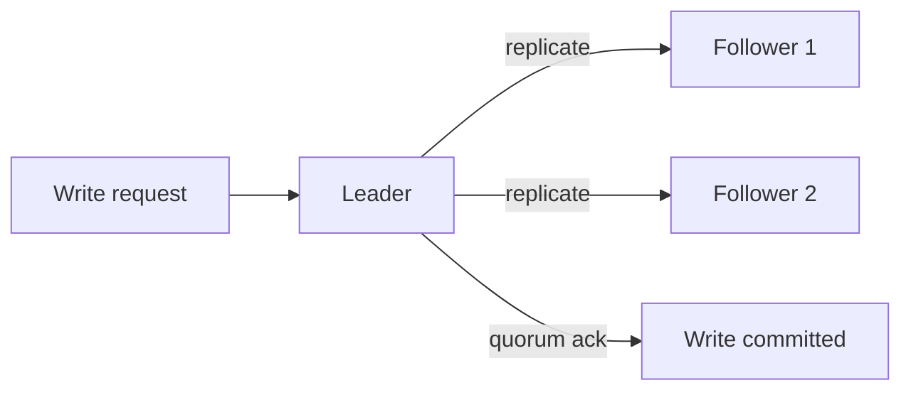
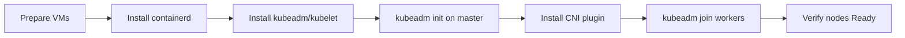

# CKA Study — Designing & Installing Kubernetes Cluster (Enhanced)

> **Goal:** Choose the right cluster topology, design for HA, understand etcd quorum, and install a cluster with kubeadm.

---

## Table of Contents

1. [Designing a Kubernetes Cluster](#1-designing-a-kubernetes-cluster)
2. [Purpose & Topology](#2-purpose--topology)
3. [Choosing Infrastructure](#3-choosing-infrastructure)
4. [High Availability Architecture](#4-high-availability-architecture)
5. [etcd in HA](#5-etcd-in-ha)
6. [Install Kubernetes with kubeadm](#6-install-kubernetes-with-kubeadm)
7. [Post-Install: CNI & Join Workers](#7-post-install-cni--join-workers)
8. [Cheat Sheet & Resources](#8-cheat-sheet--resources)

---

## 1. Designing a Kubernetes Cluster



### Design questions

| Area | Questions |
|------|-----------|
| **Purpose** | Education, dev/test, or production? |
| **Location** | Cloud vs on-premises |
| **Workloads** | How many? Web, big data, stateful? |
| **Resources** | CPU vs memory intensive? |
| **Traffic** | Steady vs bursty? |
| **Storage** | Local, NFS, cloud block storage? |

### Scale limits (reference)

| Limit | Value |
|-------|-------|
| Max nodes | ~5000 |
| Max Pods | ~150,000 |
| Max containers | ~300,000 |
| Max Pods per node | ~100 |

---

## 2. Purpose & Topology

| Purpose | Recommended setup |
|---------|-------------------|
| **Education** | minikube, kind, single-node kubeadm |
| **Development & testing** | Single control plane + multiple workers (kubeadm, GKE, AKS) |
| **Production** | HA multi-master, odd etcd count, load-balanced apiserver |



---

## 3. Choosing Infrastructure

### Deployment models

| Model | You provision VMs | You install K8s | Provider maintains |
|-------|-------------------|-----------------|-------------------|
| **Manual / kubeadm** | Yes | Yes (kubeadm) | You |
| **Turnkey** | Yes | Scripts (KOPS, etc.) | You maintain VMs |
| **Hosted / managed** | Provider | Provider | Provider |

### Tools comparison

| Tool | VMs needed | Cluster type |
|------|------------|--------------|
| **minikube** | Deploys VM/container | Single-node |
| **kubeadm** | You prepare VMs | Single or multi-node |
| **KOPS** | AWS/GCP — provisions VMs | Production on AWS |
| **GKE / EKS / AKS** | Provider | Managed |

### Turnkey examples

- OpenShift, VMware Tanzu, Rancher, KOPS, Vagrant

### Hosted examples

- **GKE** (Google), **EKS** (AWS), **AKS** (Azure), OpenShift Online

---

## 4. High Availability Architecture

Redundancy across all control plane components.



### kube-apiserver HA

- Multiple apiserver instances behind **load balancer** on port **6443**
- All apiservers point to same **etcd** cluster

### Scheduler & controller-manager HA

Only **one active leader** at a time via leader election:

```yaml
--leader-elect=true
--leader-elect-lease-duration=15s
--leader-elect-renew-deadline=10s
--leader-elect-retry-period=2s
```

### etcd topologies

| Topology | Description |
|----------|-------------|
| **Stacked** | etcd runs on control plane nodes (common with kubeadm) |
| **External** | etcd on separate dedicated nodes (better isolation) |

apiserver must reference all etcd endpoints:

```bash
--etcd-servers=https://10.240.0.10:2379,https://10.240.0.11:2379,https://10.240.0.12:2379
```

---

## 5. etcd in HA

etcd uses **Raft consensus** — one leader, followers replicate.



| Concept | Formula / rule |
|---------|----------------|
| **Quorum** | Majority = `N/2 + 1` |
| **Fault tolerance** | Lose `(N-1)/2` nodes |
| **Recommendation** | **Odd** number of nodes (5 better than 6) |

| etcd nodes | Quorum | Tolerate failures |
|------------|--------|-------------------|
| 1 | 1 | 0 |
| 3 | 2 | 1 |
| 5 | 3 | 2 |

Write completes only when **majority** of nodes acknowledge.

---

## 6. Install Kubernetes with kubeadm

### Prerequisites (all nodes)

```bash
# Disable swap
swapoff -a
sed -i '/ swap / s/^/#/' /etc/fstab

# Load kernel modules
cat <<EOF | tee /etc/modules-load.d/k8s.conf
overlay
br_netfilter
EOF
modprobe overlay && modprobe br_netfilter

# sysctl
cat <<EOF | tee /etc/sysctl.d/k8s.conf
net.bridge.bridge-nf-call-iptables  = 1
net.bridge.bridge-nf-call-ip6tables = 1
net.ipv4.ip_forward                 = 1
EOF
sysctl --system

# Install containerd
apt-get install -y containerd
mkdir -p /etc/containerd
containerd config default | tee /etc/containerd/config.toml
systemctl restart containerd

# Install kubeadm, kubelet, kubectl
apt-get install -y kubelet kubeadm kubectl
apt-mark hold kubelet kubeadm kubectl
```

### Initialize control plane (master)

```bash
kubeadm init --pod-network-cidr=10.244.0.0/16

# Regular user kubeconfig
mkdir -p $HOME/.kube
cp -i /etc/kubernetes/admin.conf $HOME/.kube/config
chown $(id -u):$(id -g) $HOME/.kube/config
```

kubeadm installs control plane as **static Pods** in `/etc/kubernetes/manifests/`.

### What kubeadm installs on master

| Component | Type |
|-----------|------|
| kube-apiserver | Static Pod |
| kube-controller-manager | Static Pod |
| kube-scheduler | Static Pod |
| etcd | Static Pod (unless external) |
| kubelet | systemd service |

> kubeadm does **not** install kubelet as a Pod — kubelet runs as systemd on every node.

---

## 7. Post-Install: CNI & Join Workers

### Install Pod network (required)

Pods stay Pending until CNI is installed:

```bash
# Example: Flannel
kubectl apply -f https://github.com/flannel-io/flannel/releases/latest/download/kube-flannel.yml

# Example: Calico
kubectl apply -f https://docs.projectcalico.org/manifests/calico.yaml
```

### Join worker nodes

After `kubeadm init`, copy the join command:

```bash
kubeadm join <control-plane-host>:6443 \
  --token <token> \
  --discovery-token-ca-cert-hash sha256:<hash>
```

Generate new token if expired:

```bash
kubeadm token create --print-join-command
```

### Verify cluster

```bash
kubectl get nodes
kubectl get pods -n kube-system
```



---

## 8. Cheat Sheet & Resources

```bash
# Cluster status
kubectl get nodes -o wide
kubectl get pods -n kube-system
kubeadm token list
kubeadm certs check-expiration

# Reset node (destructive)
kubeadm reset
```

- [Creating a cluster with kubeadm](https://kubernetes.io/docs/setup/production-environment/tools/kubeadm/create-cluster-kubeadm/)
- [HA topology](https://kubernetes.io/docs/setup/production-environment/tools/kubeadm/ha-topology/)
- [etcd HA](https://kubernetes.io/docs/setup/production-environment/tools/kubeadm/setup-ha-etcd-with-kubeadm/)
- [Cluster large](https://kubernetes.io/docs/setup/best-practices/cluster-large/)

---

## Kubernetes Docs — YAML Example Locations

| Topic / Resource | Kubernetes docs (YAML examples) |
|------------------|----------------------------------|
| **kubeadm cluster init** | [Creating a cluster with kubeadm](https://kubernetes.io/docs/setup/production-environment/tools/kubeadm/create-cluster-kubeadm/) |
| **HA topology (stacked / external etcd)** | [HA topology](https://kubernetes.io/docs/setup/production-environment/tools/kubeadm/ha-topology/) |
| **External etcd with kubeadm** | [Set up HA etcd cluster](https://kubernetes.io/docs/setup/production-environment/tools/kubeadm/setup-ha-etcd-with-kubeadm/) |
| **Control plane static Pod manifests** | [Manual kubeadm setup](https://kubernetes.io/docs/setup/production-environment/tools/kubeadm/setup-kubeadm/) |
| **Flannel CNI manifest** | [Flannel](https://github.com/flannel-io/flannel) |
| **Calico CNI manifest** | [Calico install](https://docs.tigera.io/calico/latest/getting-started/kubernetes/) |
| **kube-apiserver etcd flags** | [kube-apiserver reference](https://kubernetes.io/docs/reference/command-line-tools-reference/kube-apiserver/) |
