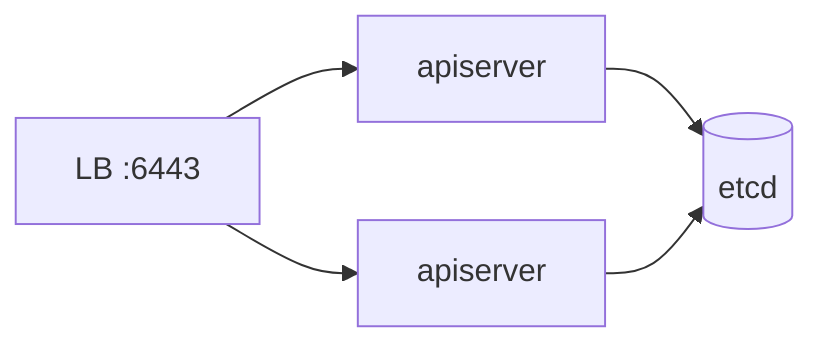

# Designing & Install Cluster — Pref Revision (CKA)

Quick exam revision. See [enhanced_readme.md](./enhanced_readme.md) for full detail.

---

## Purpose → topology

| Purpose | Setup |
|---------|-------|
| Education | minikube, single-node |
| Dev/test | 1 master + N workers |
| Production | HA multi-master + odd etcd |

---

## Infrastructure models

| Model | Examples |
|-------|----------|
| DIY / kubeadm | You manage everything |
| Turnkey | KOPS, OpenShift, Rancher |
| Managed | GKE, EKS, AKS |

---

## HA control plane



- **Load balancer** in front of apiservers (6443)
- **Scheduler & controller-manager** — leader election (only 1 active)
- **etcd** — stacked (on masters) or external (dedicated nodes)

apiserver flag: `--etcd-servers=https://ip1:2379,https://ip2:2379,...`

---

## etcd quorum

| Nodes | Quorum (N/2+1) | Failures tolerated |
|-------|----------------|-------------------|
| 3 | 2 | 1 |
| 5 | 3 | 2 |

**Use odd number** of etcd members. Raft protocol.

---

## kubeadm install steps

1. Prepare VMs (unique hostname/MAC)
2. Install **containerd** on all nodes
3. Install **kubeadm, kubelet, kubectl** on all nodes
4. `kubeadm init` on master
5. Install **CNI** (Flannel/Calico) — Pods stay Pending without it
6. `kubeadm join` on workers

---

## What kubeadm does / doesn't do

| Does | Doesn't |
|------|---------|
| Installs control plane static Pods | Install kubelet as Pod |
| Generates certs & kubeconfig | Upgrade kubelet automatically |
| Prints join command | Install CNI (you add it) |

---

## Prerequisites checklist

- Swap off
- `br_netfilter`, `overlay` modules
- `net.ipv4.ip_forward = 1`
- containerd + CRI configured

---

## Key commands

```bash
kubeadm init --pod-network-cidr=10.244.0.0/16
kubectl apply -f <cni-manifest>
kubeadm join <host>:6443 --token ... --discovery-token-ca-cert-hash ...
kubeadm token create --print-join-command
kubectl get nodes
```

---

## Exam tips

1. CNI required after kubeadm init
2. etcd quorum = majority (odd nodes)
3. Stacked vs external etcd topology
4. Leader election for scheduler/controller-manager
5. Static Pods in `/etc/kubernetes/manifests/`

---

## Kubernetes Docs — YAML Example Locations

| Topic | Official docs (YAML examples) |
|-------|-------------------------------|
| kubeadm install | [Create cluster with kubeadm](https://kubernetes.io/docs/setup/production-environment/tools/kubeadm/create-cluster-kubeadm/) |
| HA topology | [HA topology](https://kubernetes.io/docs/setup/production-environment/tools/kubeadm/ha-topology/) |
| External etcd | [HA etcd with kubeadm](https://kubernetes.io/docs/setup/production-environment/tools/kubeadm/setup-ha-etcd-with-kubeadm/) |
| Static Pod manifests | [kubeadm setup](https://kubernetes.io/docs/setup/production-environment/tools/kubeadm/setup-kubeadm/) |
