# CKA Study Notes — Kubernetes Core Concepts & Scheduling

> **Goal:** Notes for the Certified Kubernetes Administrator (CKA) exam — cluster architecture, workloads, namespaces, kubectl workflows, and advanced scheduling.

**YAML examples in this repo:**

| Path | Resource |
|------|----------|
| [pod_intro.yaml](./pod_intro.yaml) | Pod |
| [pod.yaml](./pod.yaml) | Multi-container Pod |
| [replicasey-difination.yaml](./replicasey-difination.yaml) | ReplicaSet |
| [rc-defenation.yaml](./rc-defenation.yaml) | ReplicationController |
| [daemonset.yaml](./daemonset.yaml) | DaemonSet |
| [practice/deployment/deployment.yaml](./practice/deployment/deployment.yaml) | Deployment |
| [practice/service/service-definition.yaml](./practice/service/service-definition.yaml) | NodePort Service |
| [practice/voting-app/](./practice/voting-app/) | Multi-service microservices app |
| [practice/python_app/](./practice/python_app/) | Master/slave Python app |

---

## Table of Contents

### Part I — Architecture & Runtime
1. [Cluster Architecture](#1-cluster-architecture)
2. [Docker vs containerd & CRI](#2-docker-vs-containerd--cri)
3. [etcd](#3-etcd)
4. [kube-apiserver — Request Flow](#4-kube-apiserver--request-flow)
5. [kube-controller-manager](#5-kube-controller-manager)
6. [kube-scheduler](#6-kube-scheduler)
7. [kubelet](#7-kubelet)
8. [kube-proxy & Pod Networking](#8-kube-proxy--pod-networking)

### Part II — Workloads
9. [Pods](#9-pods)
10. [ReplicaSet & ReplicationController](#10-replicaset--replicationcontroller)
11. [Deployments](#11-deployments)
12. [Services](#12-services)

### Part III — Namespaces & kubectl
13. [Namespaces & Resource Quotas](#13-namespaces--resource-quotas)
14. [Imperative vs Declarative](#14-imperative-vs-declarative)
15. [How `kubectl apply` Works](#15-how-kubectl-apply-works)

### Part IV — Scheduling
16. [Scheduling Overview](#16-scheduling-overview)
17. [Manual Scheduling](#17-manual-scheduling)
18. [Labels & Selectors](#18-labels--selectors)
19. [Taints & Tolerations](#19-taints--tolerations)
20. [Node Selectors & Node Affinity](#20-node-selectors--node-affinity)
21. [Resource Requests, Limits & Quotas](#21-resource-requests-limits--quotas)
22. [DaemonSets](#22-daemonsets)
23. [Static Pods](#23-static-pods)

### Reference
24. [Useful Commands Cheat Sheet](#24-useful-commands-cheat-sheet)
25. [Docs & Resources](#25-docs--resources)

---

## 1. Cluster Architecture

Kubernetes runs on a **cluster** of machines. One or more **control plane** nodes manage the cluster; **worker nodes** run your application workloads.


*Source: [kubernetes.io — Cluster Architecture](https://kubernetes.io/docs/concepts/architecture/)*

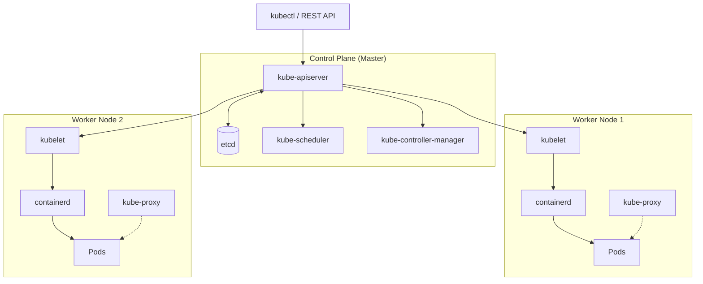

### Control Plane (Master Node)

| Component | Role |
|-----------|------|
| **etcd cluster** | Distributed key-value store — the cluster's source of truth |
| **kube-apiserver** | Front door; authenticates, validates, reads/writes etcd |
| **kube-scheduler** | Assigns unscheduled Pods to nodes |
| **kube-controller-manager** | Runs controllers that reconcile desired vs actual state |
| **Container runtime** | Runs containers (containerd, CRI-O) — not on control plane in all setups, but conceptually part of the stack |

> **Note:** ReplicationController is a *workload controller*, not a control-plane component. It runs inside the controller-manager as one of many controllers.

### Worker Node

| Component | Role |
|-----------|------|
| **kubelet** | Registers the node; creates/destroys Pods; reports status to apiserver |
| **kube-proxy** | Maintains network rules so Services can reach Pods |
| **Container runtime** | Actually runs containers (containerd, CRI-O, etc.) |


---

## 2. Docker vs containerd & CRI

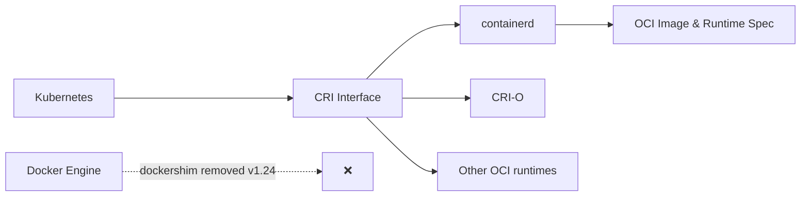

| Era | What happened |
|-----|---------------|
| Early K8s | Supported Docker directly |
| CRI introduced | Standard interface for any OCI-compliant runtime (rkt, containerd, etc.) |
| Docker + dockershim | Kubernetes kept Docker support via **dockershim** — a bridge outside CRI |
| **v1.24+** | **dockershim removed.** Docker Engine is no longer supported as a runtime. Use containerd or CRI-O |

**OCI (Open Container Initiative)** defines image and runtime specs. Any runtime following OCI can plug into Kubernetes via **CRI (Container Runtime Interface)**.

### containerd CLI tools

| Tool | Purpose | Notes |
|------|---------|-------|
| **ctr** | Built-in containerd CLI | Low-level; debugging only |
| **nerdctl** | Docker-like CLI for containerd | Supports compose, lazy pulling, image signing, namespaces |
| **crictl** | CRI debugging CLI | Works with any CRI runtime; maintained by Kubernetes community |

```bash
# crictl examples
crictl pull busybox
crictl images
crictl ps -a
crictl logs <container_id>
crictl pods
```

---

## 3. etcd

**etcd** is a distributed, reliable **key-value store** — simple, secure, and fast. It is the **only** datastore for Kubernetes cluster state.

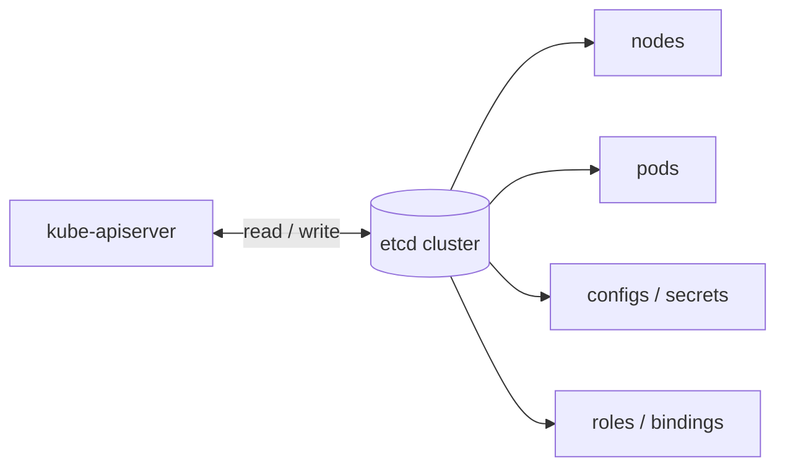

### Key-value store vs other databases

| Type | Example | Data model |
|------|---------|------------|
| Relational | PostgreSQL, MySQL | Tables, rows, SQL |
| Document | MongoDB | JSON documents |
| **Key-value** | **etcd, Redis** | Key → value pairs |

### What etcd stores

- Nodes, Pods, Deployments, Services
- ConfigMaps, Secrets
- ServiceAccounts, Roles, RoleBindings
- All cluster configuration and desired state

### Getting started with etcd

```bash
# Download binary, extract, run
etcd

# CLI tool: etcdctl (use API v3)
export ETCDCTL_API=3
etcdctl put key value
etcdctl get key
etcdctl member list
```

> **CKA tip:** Know `ETCDCTL_API=3` — v2 and v3 have different command sets. v3 is the default in modern exams.

---

## 4. kube-apiserver — Request Flow

Every `kubectl` command and internal cluster communication goes through the **kube-apiserver**.

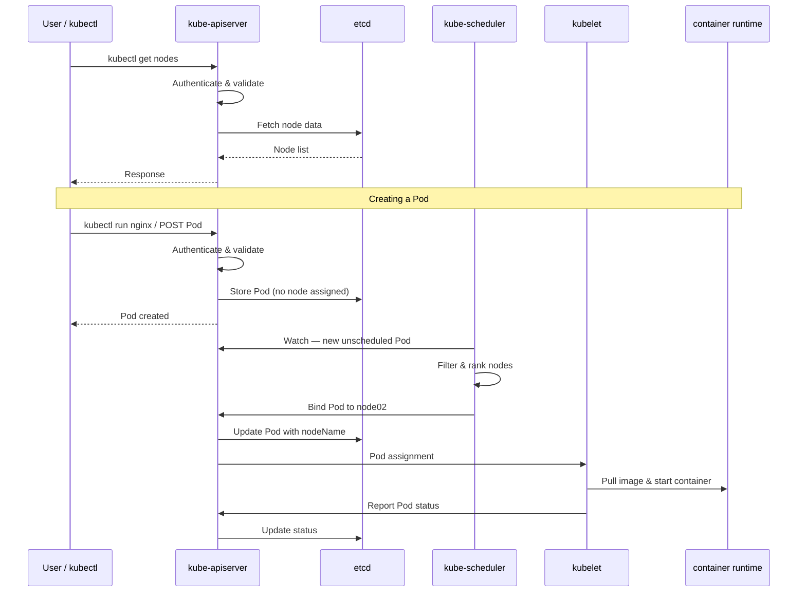

### Responsibilities

- Authenticate users (certificates, tokens, RBAC)
- Validate requests against API schema
- Read/write cluster state in etcd
- Coordinate scheduler and kubelet

### Installation modes

With **kubeadm**, control-plane components run as **static Pods** in `/etc/kubernetes/manifests/`:

| Component | Static Pod manifest |
|-----------|---------------------|
| kube-apiserver | `/etc/kubernetes/manifests/kube-apiserver.yaml` |
| kube-controller-manager | `/etc/kubernetes/manifests/kube-controller-manager.yaml` |
| kube-scheduler | `/etc/kubernetes/manifests/kube-scheduler.yaml` |
| etcd | `/etc/kubernetes/manifests/etcd.yaml` |

Without kubeadm, the same components may run as **systemd services** (e.g. `/etc/systemd/system/kube-apiserver.service`).

---

## 5. kube-controller-manager

The controller-manager runs **controllers** — control loops that watch cluster state and take remedial action.

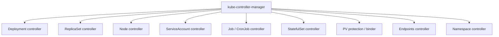

### Node controller behavior

| Event | Action |
|-------|--------|
| Checks node health | Every **5 seconds** |
| Missed heartbeats | After **40s** → node marked **Unreachable** |
| Node still down | After **5 min** → Pods evicted; rescheduled if part of a ReplicaSet/Deployment |
| Pod dies | ReplicaSet controller creates a replacement |

> All controllers ship in one binary: **kube-controller-manager**. kubeadm deploys it as a static Pod.

---

## 6. kube-scheduler

The **scheduler** decides **which node** each new Pod runs on. It does **not** run containers — it only assigns Pods to nodes.

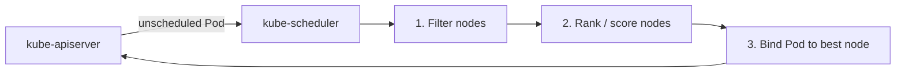

### How the scheduler decides

1. **Filtering** — remove nodes that don't meet Pod requirements (resources, taints, nodeSelector, etc.)
2. **Scoring** — rank remaining nodes with priority functions (spread, affinity, image locality, etc.)
3. **Binding** — assign the Pod to the highest-scoring node

### Installation

Same as other control-plane components — static Pod at `/etc/kubernetes/manifests/kube-scheduler.yaml` (kubeadm) or systemd service.

---

## 7. kubelet

The **kubelet** is an agent that runs on **every node** (including control-plane nodes in some setups).

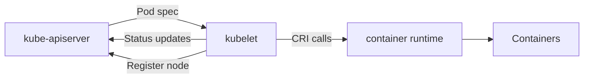

### Responsibilities

- **Register** the node with the cluster on startup
- Receive Pod assignments from the apiserver
- Ask the container runtime to pull images and start containers
- **Monitor** Pod/container health and report status periodically

> **Important:** kubelet must be installed **manually on every node** — kubeadm does not install it as a Pod.

---

## 8. kube-proxy & Pod Networking

In every cluster, **every Pod gets its own IP** and can reach other Pods (within network policy rules). This is enabled by the **CNI plugin** (Calico, Flannel, Weave, etc.).

**kube-proxy** runs on each node and maintains network rules so **Services** can load-balance traffic to backend Pods.

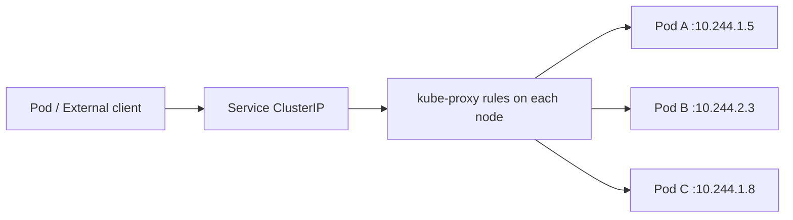

| Layer | Component | Purpose |
|-------|-----------|---------|
| Pod network | CNI plugin | Assigns IP per Pod; routes traffic |
| Service discovery | CoreDNS | Resolves `my-svc.namespace.svc.cluster.local` |
| Service routing | kube-proxy | iptables or IPVS rules → forward to Pod IPs |

> We create a **Service** to expose an app with a **stable IP/DNS name** inside (or outside) the cluster.

---

## 9. Pods

A **Pod** is the smallest deployable unit — one or more containers sharing network namespace and storage volumes.

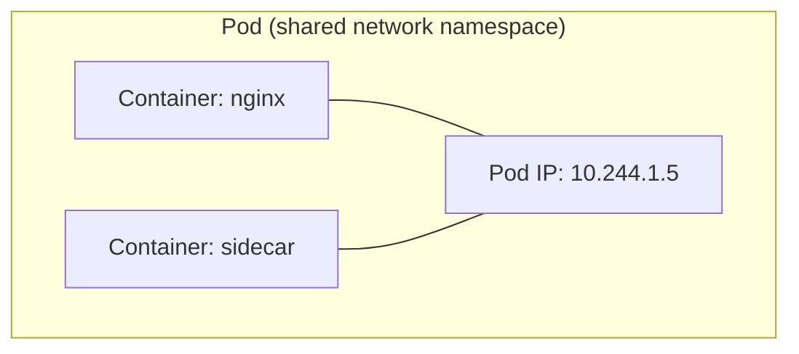

| Concept | Detail |
|---------|--------|
| Typical use | 1 Pod = 1 app instance |
| Multi-container | Sidecar pattern — see [pod.yaml](./pod.yaml) |
| Lifecycle | Ephemeral — if a node dies, the Pod is gone (controllers recreate it) |

### Commands

```bash
kubectl run nginx --image=nginx          # Imperative
kubectl apply -f pod_intro.yaml          # Declarative (preferred)
kubectl get pods                         # Short: po
kubectl describe pod nginx
kubectl delete pod nginx
kubectl get pod webapp -o yaml > my-new-pod.yaml   # Export definition
```

### YAML skeleton

```yaml
apiVersion: v1
kind: Pod
metadata:
  name: mypod
  labels:
    app: myapp
spec:
  containers:
    - name: nginx-container
      image: nginx
```

---

## 10. ReplicaSet & ReplicationController

Both ensure a specified number of Pod replicas are always running.

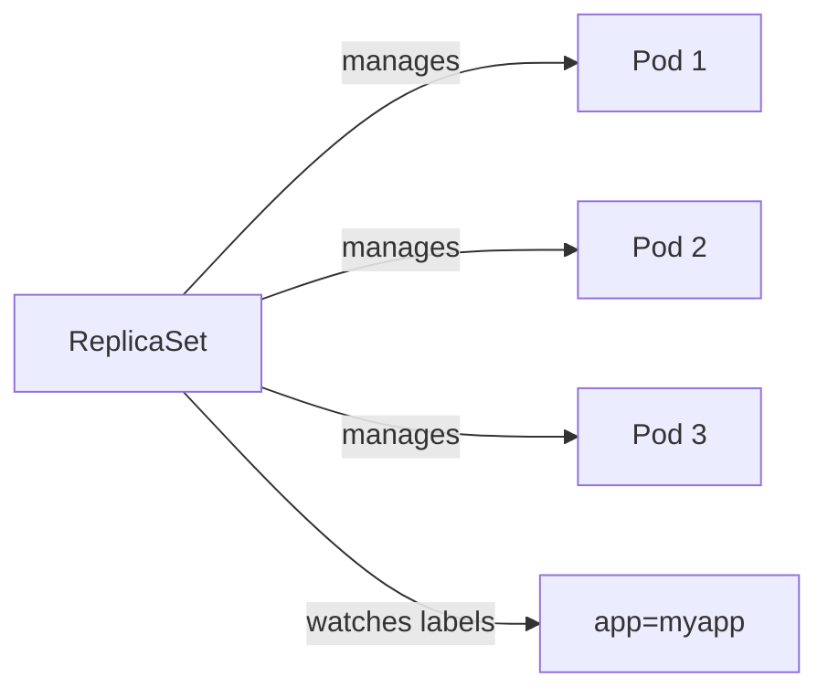

| Feature | ReplicationController (legacy) | ReplicaSet (current) |
|---------|-------------------------------|---------------------|
| Selector | Equality only | `matchLabels` + `matchExpressions` |
| Status | Deprecated | Standard |
| Example | [rc-defenation.yaml](./rc-defenation.yaml) | [replicasey-difination.yaml](./replicasey-difination.yaml) |

ReplicaSets use **labels** on Pods and **matchLabels** in the spec to identify which Pods to manage.

```bash
kubectl apply -f replicasey-difination.yaml
kubectl get replicaset              # Short: rs
kubectl scale --replicas=6 replicaset myapp-replicaset
kubectl describe replicaset myapp-replicaset
```

---

## 11. Deployments

A **Deployment** manages ReplicaSets and provides rolling updates, rollbacks, and scaling.

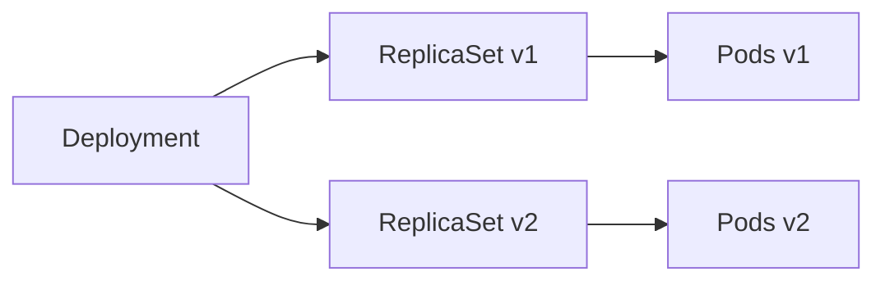

**Hierarchy:** `Deployment → ReplicaSet → Pod(s)`

| Feature | Description |
|---------|-------------|
| Self-healing | Replaces crashed Pods |
| Scaling | `kubectl scale deployment nginx --replicas=5` |
| Rolling update | Updates Pods one-by-one (zero downtime) |
| Rollback | `kubectl rollout undo deployment myapp-deployment` |

### Deployment strategies

| Strategy | Behavior | Downtime |
|----------|----------|----------|
| **RollingUpdate** (default) | Replace Pods incrementally | None |
| **Recreate** | Kill all old Pods, then start new | Yes |

```bash
kubectl apply -f practice/deployment/deployment.yaml
kubectl get deployments                    # Short: deploy
kubectl rollout status deployment/myapp-deployment
kubectl rollout history deployment/myapp-deployment
kubectl set image deployment/myapp-deployment nginx=nginx:1.9.1
kubectl rollout undo deployment/myapp-deployment
```

---

## 12. Services

A **Service** exposes Pods as a stable network endpoint. Services select Pods by **labels**.

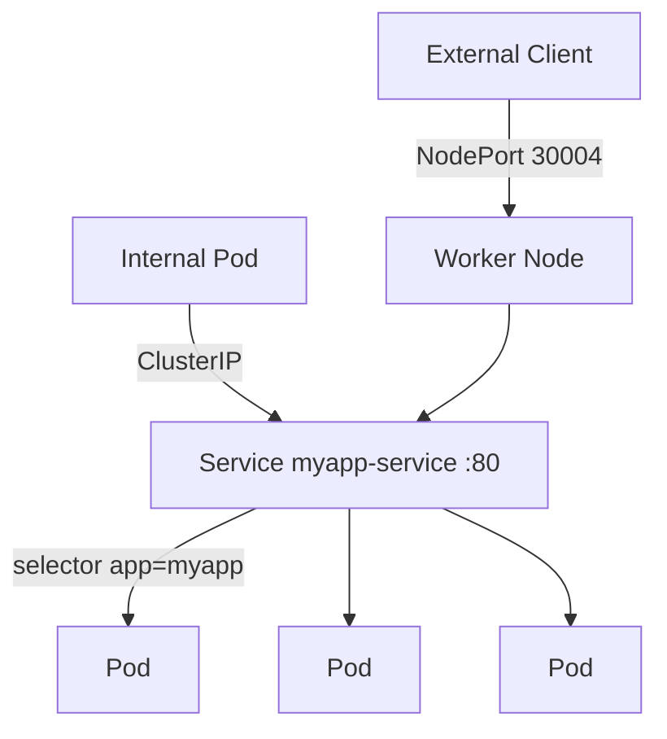

| Type | Scope | Use case |
|------|-------|----------|
| **ClusterIP** (default) | Internal only | Pod-to-Pod communication |
| **NodePort** | Port 30000–32767 on every node | Dev/test external access |
| **LoadBalancer** | Cloud LB + NodePort | Production external access |

### NodePort fields

| Field | Meaning |
|-------|---------|
| `targetPort` | Port on the Pod/container |
| `port` | Port on the Service (cluster-internal) |
| `nodePort` | Port on the node (30000–32767) |

Example: [practice/service/service-definition.yaml](./practice/service/service-definition.yaml)

```bash
kubectl get svc
kubectl describe svc myapp-service
kubectl expose deployment nginx --port 80    # Imperative service creation
```

**Practice project:** [practice/voting-app/](./practice/voting-app/) — vote, result, worker, redis, and db each have their own Deployment + Service.

---

## 13. Namespaces & Resource Quotas

Namespaces provide **logical isolation** within a cluster — separate environments, teams, or applications.

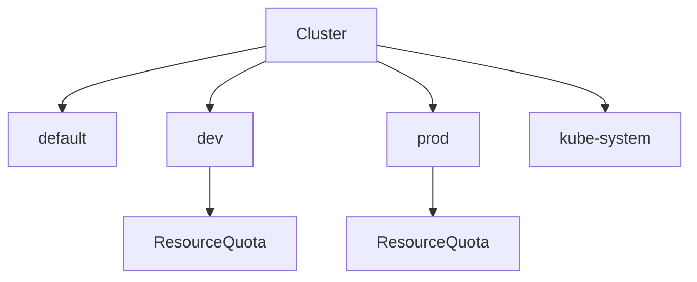

### Built-in namespaces

| Namespace | Purpose |
|-----------|---------|
| `default` | Where resources go if no namespace is specified |
| `kube-system` | Kubernetes system components (kube-proxy, CoreDNS, etc.) |
| `kube-public` | Publicly readable resources |
| `kube-node-lease` | Node heartbeat leases |

### Commands

```bash
kubectl get pods --namespace=dev
kubectl get pods --all-namespaces          # All namespaces
kubectl create namespace dev

# Switch default namespace for current context
kubectl config set-context $(kubectl config current-context) --namespace=dev
```

### Create namespace via YAML

```yaml
apiVersion: v1
kind: Namespace          # Note: capital S in Kind for CKA
metadata:
  name: dev
```

```bash
kubectl apply -f namespace-dev.yaml
```

### ResourceQuota (namespace level)

Limits total resources consumed in a namespace:

```yaml
apiVersion: v1
kind: ResourceQuota
metadata:
  name: cpu-resource-quota
spec:
  hard:
    requests.cpu: "4"
    requests.memory: 4Gi
    limits.cpu: "10"
    limits.memory: 10Gi
```

---

## 14. Imperative vs Declarative

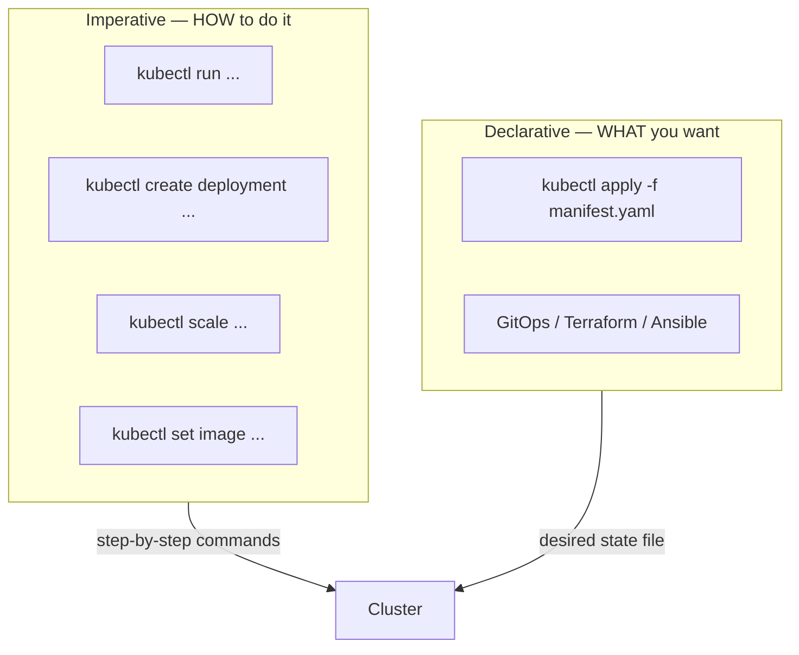

### Imperative commands

```bash
kubectl run --image=nginx nginx                              # Create Pod
kubectl create deployment --image=nginx nginx                # Create Deployment
kubectl expose deployment nginx --port 80                    # Create Service
kubectl edit deployment nginx                                # Edit live resource
kubectl scale deployment nginx --replicas=5
kubectl set image deployment nginx nginx=nginx:1.18

kubectl create -f nginx.yaml                                 # Create (fails if exists)
kubectl replace -f nginx.yaml                                # Replace entire object
kubectl delete -f nginx.yaml

kubectl api-resources                                        # List all API resources
kubectl explain pod                                          # Field documentation
kubectl explain pod.spec.containers --recursive
```

### Declarative approach

```bash
kubectl apply -f nginx.yaml    # Create or update — idempotent
```

Also used by Terraform, Ansible, Puppet, and GitOps tools (Argo CD, Flux).

| Command | Idempotent? | Stores last-applied config? |
|---------|-------------|----------------------------|
| `kubectl create -f` | No — errors if exists | No |
| `kubectl replace -f` | No — requires full object | No |
| `kubectl apply -f` | **Yes** | **Yes** (in annotations) |

---

## 15. How `kubectl apply` Works

`kubectl apply` uses a **three-way merge**:

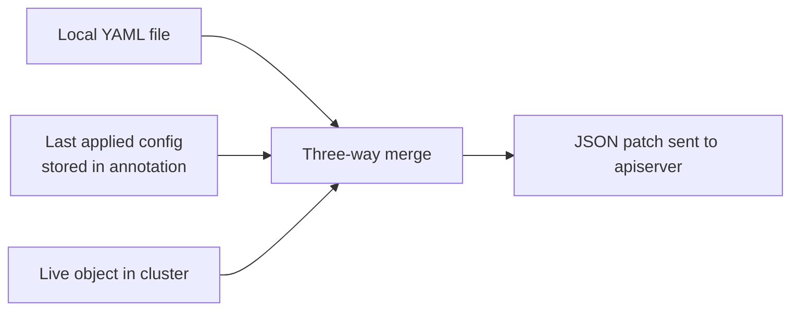

| Scenario | Result |
|----------|--------|
| Object does not exist | Created |
| Object exists, fields changed | Patched |
| Field removed from local file | Removed from live object |
| First time using `create` | No last-applied annotation stored |

The **last applied configuration** is stored in the annotation `kubectl.kubernetes.io/last-applied-configuration` — **only when using `apply`**, not `create`.

---

## 16. Scheduling Overview

Scheduling determines **which node** runs each Pod.

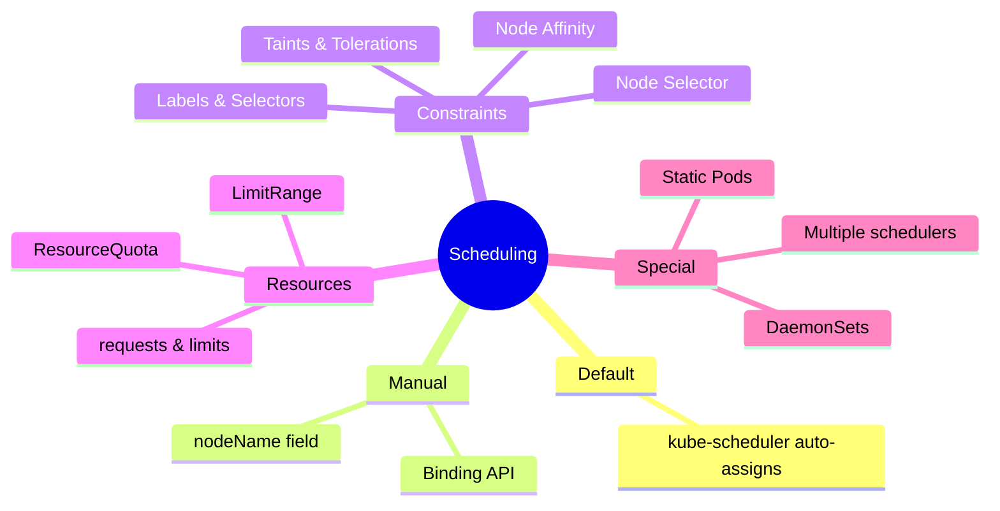

Topics covered in this document: manual scheduling, labels, taints/tolerations, node selectors/affinity, resource limits, DaemonSets, static Pods.

---

## 17. Manual Scheduling

By default, `nodeName` is empty and the **scheduler** assigns a node. You can bypass the scheduler in two ways:

### Option 1 — `nodeName` in Pod spec (creation time only)

```yaml
apiVersion: v1
kind: Pod
metadata:
  name: nginx
spec:
  containers:
    - name: nginx
      image: nginx
  nodeName: node02    # Skip scheduler; force this node
```

### Option 2 — Binding API (at runtime)

Create a Binding object and POST it to the apiserver:

```yaml
apiVersion: v1
kind: Binding
metadata:
  name: nginx
target:
  apiVersion: v1
  kind: Node
  name: node02
```

```bash
curl --header "Content-Type: application/json" \
  --request POST \
  --data '{"apiVersion":"v1","kind":"Binding","metadata":{"name":"nginx"},"target":{"apiVersion":"v1","kind":"Node","name":"node02"}}' \
  https://$SERVER/api/v1/namespaces/default/pods/nginx/binding \
  --key /path/to/admin.key --cert /path/to/admin.crt
```

```bash
kubectl get pods --namespace kube-system    # Check system component Pods
```

---

## 18. Labels & Selectors

**Labels** are key-value pairs attached to objects. **Selectors** filter objects by label.

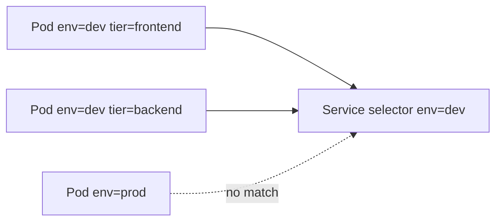

Used by: Services, ReplicaSets, Deployments, NetworkPolicies, and more.

```bash
kubectl get pods --selector env=dev
kubectl get pods -l env=dev,tier=frontend
kubectl label pods mypod status=active       # Add label
kubectl label pods mypod status-             # Remove label
```

---

## 19. Taints & Tolerations

**Taints** repel Pods from nodes. **Tolerations** allow Pods to schedule onto tainted nodes.

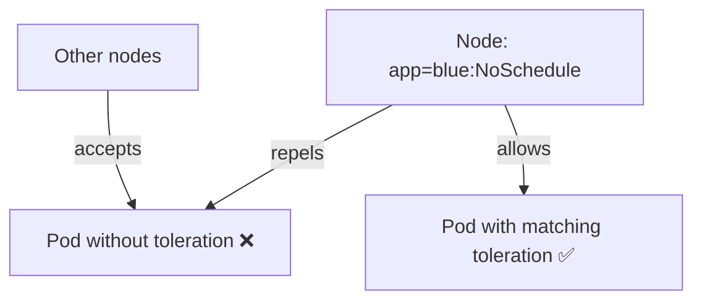

> **Key insight:** Taints restrict which Pods *may* run on a node. They do **not** force a Pod onto that node — use **Node Affinity** for that.

### Taint effects

| Effect | Behavior |
|--------|----------|
| `NoSchedule` | Pod will **not** be scheduled on the node (unless it tolerates the taint) |
| `PreferNoSchedule` | Scheduler **tries** to avoid the node, but may place Pods there |
| `NoExecute` | Pod will not be scheduled; **existing** Pods without toleration are **evicted** |

### Commands

```bash
# Add taint
kubectl taint nodes node1 app=blue:NoSchedule

# View taints
kubectl describe node kubemaster | grep -i taint

# Remove taint (append - to the key)
kubectl taint nodes controlplane node-role.kubernetes.io/control-plane:NoSchedule-
```

### Pod toleration example

```yaml
apiVersion: v1
kind: Pod
metadata:
  name: myapp-pod
spec:
  containers:
    - name: nginx
      image: nginx
  tolerations:
    - key: app
      operator: Equal
      value: blue
      effect: NoSchedule
```

---

## 20. Node Selectors & Node Affinity

### Node Selector (simple)

Equality-based only — assign Pods to nodes with a specific label:

```yaml
spec:
  nodeSelector:
    size: Large
```

```bash
kubectl label nodes node01 size=Large
kubectl get nodes --show-labels
```

**Limitation:** Cannot express "Large OR Medium" or "NOT Small" — use **Node Affinity** instead.

### Node Affinity (advanced)

| Operator | Meaning |
|----------|---------|
| `In` | Label value is in the list |
| `NotIn` | Label value is not in the list |
| `Exists` | Label key exists (any value) |
| `Gt` / `Lt` | Greater/less than (numeric) |

| Affinity type | Scheduling | If node label changes after scheduling |
|---------------|------------|----------------------------------------|
| `requiredDuringSchedulingIgnoredDuringExecution` | **Required** | Pod stays (ignored during execution) |
| `requiredDuringSchedulingRequiredDuringExecution` | **Required** | Pod evicted if node no longer matches |
| `preferredDuringSchedulingIgnoredDuringExecution` | **Preferred** (soft) | Pod stays |

```yaml
apiVersion: v1
kind: Pod
metadata:
  name: nginx
spec:
  affinity:
    nodeAffinity:
      requiredDuringSchedulingIgnoredDuringExecution:
        nodeSelectorTerms:
          - matchExpressions:
              - key: size
                operator: In
                values:
                  - Large
  containers:
    - name: nginx
      image: nginx
```

---

## 21. Resource Requests, Limits & Quotas

The scheduler uses **requests** to decide which node fits a Pod. **Limits** cap maximum usage.

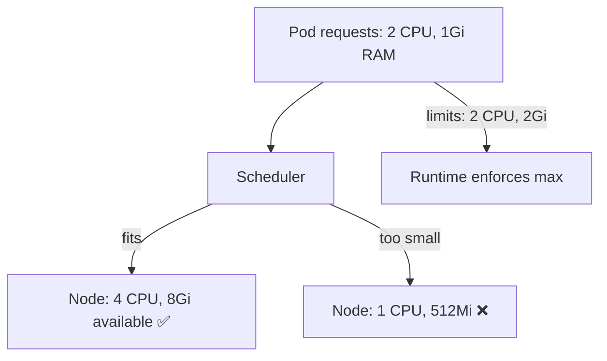

### CPU & memory units

| Resource | Unit | Notes |
|----------|------|-------|
| CPU | `1` = 1 core = 1 vCPU | `500m` = 0.5 core (millicores) |
| Memory (decimal) | `1G`, `1M`, `1K` | 1000-based (GB, MB, KB) |
| Memory (binary) | `1Gi`, `1Mi`, `1Ki` | 1024-based (gibibyte, etc.) |

### Pod with requests and limits

```yaml
spec:
  containers:
    - name: nginx
      image: nginx
      resources:
        requests:
          memory: "1Gi"
          cpu: "2"
        limits:
          memory: "2Gi"
          cpu: "2"
```

| Default behavior | Recommendation |
|------------------|----------------|
| No requests/limits set | Set **requests** at minimum; limits optional |
| Best practice | Requests + no limits (or limits = requests for guaranteed QoS) |

### LimitRange (namespace defaults)

Sets default/min/max resources for containers in a namespace:

```yaml
apiVersion: v1
kind: LimitRange
metadata:
  name: cpu-resource-constraint
spec:
  limits:
    - default:
        cpu: 500m
        memory: 1Gi
      defaultRequest:
        cpu: 500m
        memory: 1Gi
      max:
        cpu: "1"
        memory: 1Gi
      min:
        cpu: 100m
        memory: 500Mi
      type: Container
```

### ResourceQuota (namespace totals)

See [Section 13](#13-namespaces--resource-quotas) — caps total CPU/memory across all Pods in a namespace.

---

## 22. DaemonSets

A **DaemonSet** ensures **one copy of a Pod runs on every (matching) node** — or a subset of nodes via nodeSelector/affinity.

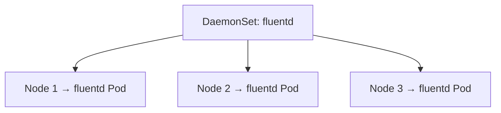

| Use case | Example |
|----------|---------|
| Log collection | fluentd, Filebeat |
| Monitoring | node-exporter, Datadog agent |
| Networking | **kube-proxy** runs as a DaemonSet |
| Storage | Ceph, GlusterFS agents |

Example: [daemonset.yaml](./daemonset.yaml)

```yaml
apiVersion: apps/v1
kind: DaemonSet
metadata:
  name: elasticsearch
  namespace: kube-system
spec:
  selector:
    matchLabels:
      app: elasticsearch
  template:
    metadata:
      labels:
        app: elasticsearch
    spec:
      containers:
        - name: fluentd-elasticsearch
          image: registry.k8s.io/fluentd-elasticsearch:1.20
```

```bash
kubectl apply -f daemonset.yaml
kubectl get daemonset          # Short: ds
kubectl get pods -n kube-system -l app=elasticsearch
```

---

## 23. Static Pods

**Static Pods** are managed directly by the **kubelet** — not by the apiserver/scheduler/controllers.

```mermaid
flowchart LR
    MANIFEST["/etc/kubernetes/manifests/*.yaml"] --> KL[kubelet]
    KL -->|creates & monitors| SP[Static Pod]
    KL -->|mirror Pod reported| API[kube-apiserver]
```

| Feature | Detail |
|---------|--------|
| Who manages | kubelet only |
| Config location | Directory watched by kubelet |
| Restart | kubelet restarts if Pod dies |
| Edit manifest | kubelet updates the Pod |
| Delete manifest | kubelet removes the Pod |
| Visible in API | Yes — as mirror Pods (name suffix `-nodeName`) |

### Configuration

**Option 1 — kubelet flag:**

```bash
--pod-manifest-path=/etc/kubernetes/manifests
```

**Option 2 — kubelet config file:**

```yaml
# kubelet-config.yaml
staticPodPath: /etc/kubernetes/manifests
```

```bash
--config=kubelet-config.yaml
```

> Control-plane components (apiserver, scheduler, controller-manager, etcd) are deployed as **static Pods** by kubeadm in `/etc/kubernetes/manifests/`.

---

## 24. Useful Commands Cheat Sheet

```bash
# Context & namespace
alias k=kubectl
kubectl config set-context $(kubectl config current-context) --namespace=dev
kubectl get pods --all-namespaces

# Workloads
kubectl get pods,rs,deploy,svc
kubectl describe pod <name>
kubectl logs <pod> -c <container>
kubectl exec -it <pod> -- /bin/sh

# Scheduling & nodes
kubectl get nodes --show-labels
kubectl describe node <name>
kubectl taint nodes <node> key=value:NoSchedule
kubectl label nodes <node> size=Large

# Resources
kubectl top nodes
kubectl top pods

# Export & debug
kubectl get pod <name> -o yaml > exported.yaml
kubectl explain pod.spec --recursive
kubectl api-resources

# System
kubectl get pods -n kube-system
```

### Resource short names

| Resource | Short |
|----------|-------|
| Pod | `po` |
| ReplicaSet | `rs` |
| Deployment | `deploy` |
| Service | `svc` |
| DaemonSet | `ds` |
| Namespace | `ns` |

---

## 25. Docs & Resources

- [Kubernetes Architecture (official)](https://kubernetes.io/docs/concepts/architecture/)
- [etcd documentation](https://etcd.io/docs/)
- [Pods](https://kubernetes.io/docs/concepts/workloads/pods/)
- [Deployments](https://kubernetes.io/docs/concepts/workloads/controllers/deployment/)
- [Services](https://kubernetes.io/docs/concepts/services-networking/service/)
- [Scheduling](https://kubernetes.io/docs/concepts/scheduling-eviction/)
- [Taints and Tolerations](https://kubernetes.io/docs/concepts/scheduling-eviction/taint-and-toleration/)
- [Assign Pods to Nodes (Affinity)](https://kubernetes.io/docs/concepts/scheduling-eviction/assign-pod-node/)
- [Resource Management](https://kubernetes.io/docs/concepts/configuration/manage-resources-containers/)
- [DaemonSet](https://kubernetes.io/docs/concepts/workloads/controllers/daemonset/)
- [Static Pods](https://kubernetes.io/docs/tasks/configure-pod-container/static-pod/)
- [kubectl Cheat Sheet](https://kubernetes.io/docs/reference/kubectl/cheatsheet/)
- [KodeKloud CKA Course Notes](https://notes.kodekloud.com/docs/Certified-Kubernetes-Administrator-CKA/)
