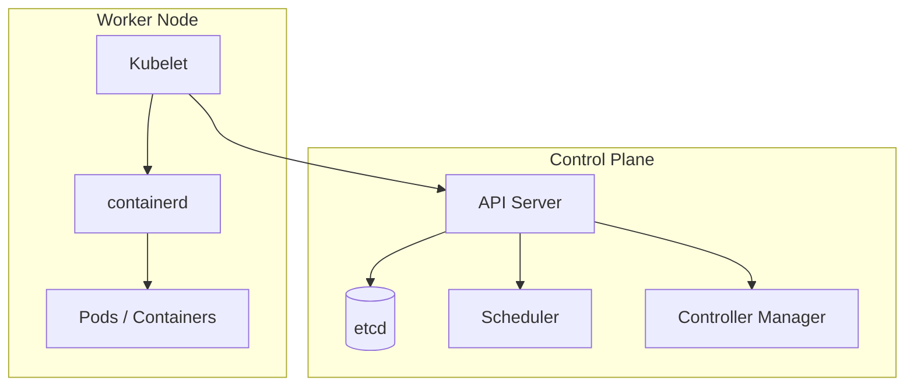
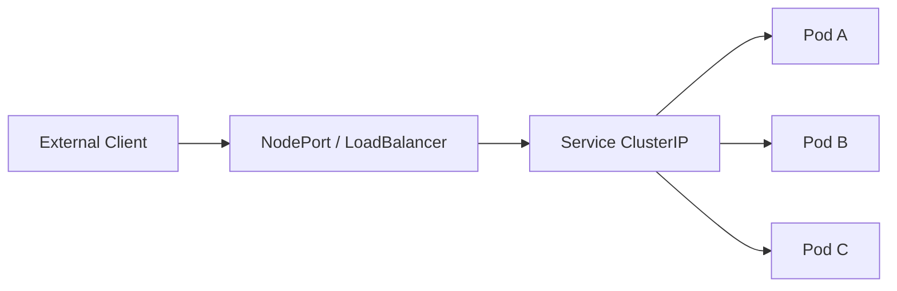

# Kubernetes (K8s) Notes

Personal study notes for Kubernetes fundamentals — architecture, workloads, networking, and common `kubectl` commands.

**Related YAML examples in this folder:**

| File | Resource |
|------|----------|
| [pod_intro.yaml](./pod_intro.yaml) | Basic Pod |
| [pod.yaml](./pod.yaml) | Multi-container Pod |
| [nginx.yaml](./nginx.yaml) | Simple nginx Pod |
| [rc-defenation.yaml](./rc-defenation.yaml) | ReplicationController |
| [replicasey-difination.yaml](./replicasey-difination.yaml) | ReplicaSet |
| [../deployment/deployment.yaml](../deployment/deployment.yaml) | Deployment |
| [../service/service-definition.yaml](../service/service-definition.yaml) | NodePort Service |

---

## Table of Contents

1. [Overview](#overview)
2. [Architecture](#kubernetes-architecture)
3. [Control Plane Components](#control-plane-components)
4. [Master vs Worker Nodes](#master-vs-worker-nodes)
5. [kubectl Basics](#kubectl-basics)
6. [Docker vs containerd](#docker-vs-containerd)
7. [CLI Tools: ctr, nerdctl, crictl](#cli-tools-ctr-nerdctl-crictl)
8. [Minikube](#what-is-minikube)
9. [Pods](#pods)
10. [Deployments](#deployments)
11. [YAML Structure](#yaml-structure)
12. [ReplicationController vs ReplicaSet](#replicationcontroller-vs-replicaset)
13. [ReplicaSet Commands](#replicaset-commands)
14. [Deployment Strategies & Rollouts](#deployment-strategies--rollouts)
15. [Quick Reference](#quick-reference)
16. [Networking](#networking-in-k8s)
17. [Services](#services)
18. [Microservices Architecture](#microservices-architecture)
19. [Docs & Resources](#docs--resources)

---

## Overview

- **Origin:** Open-sourced by Google; now maintained by the [Cloud Native Computing Foundation (CNCF)](https://www.cncf.io/).
- **Containers:** Docker popularized containers; Kubernetes orchestrates them at scale.
- **Container orchestration:** Automates deployment, scaling, networking, and recovery of containerized applications across a cluster of machines.

---

## Kubernetes Architecture

### Nodes

A **node** is a physical or virtual machine where Kubernetes runs. Worker nodes are where application containers are scheduled and launched.

### Cluster

A **cluster** is a set of nodes working together:

- Shares workload across nodes
- Provides high availability — if one node fails, workloads can run on others

### Control Plane (Master)

The **control plane** (historically called the "master") runs Kubernetes system components. It watches over nodes in the cluster and performs **orchestration** — deciding *what* runs *where* and *when*.



---

## Control Plane Components

| Component | Role |
|-----------|------|
| **API Server** | Front door to the cluster; all `kubectl` commands and internal communication go through it |
| **etcd** | Distributed key-value store; holds cluster state (nodes, configs, secrets) and prevents conflicts |
| **Scheduler** | Assigns new Pods to suitable worker nodes based on resources and constraints |
| **Controller Manager** | Runs controllers that reconcile desired vs actual state (e.g., restart failed Pods, scale ReplicaSets) |
| **Kubelet** | Agent on each worker node; ensures containers in Pods are running as expected |
| **Container Runtime** | Software that actually runs containers — **containerd** is the default in modern Kubernetes |

---

## Master vs Worker Nodes

| Node type | Key components |
|-----------|----------------|
| **Worker** | Kubelet → containerd (container runtime) → Pods |
| **Control plane** | kube-apiserver → etcd → controller-manager → scheduler |

---

## kubectl Basics

`kubectl` is the CLI for interacting with a Kubernetes cluster.

```bash
kubectl run hello-minikube --image=nginx    # Deploy an app (creates a Pod)
kubectl cluster-info                         # View cluster info
kubectl get nodes                            # List all nodes
```

### Useful alias

```bash
alias k=kubectl
```

---

## Docker vs containerd

**CRI (Container Runtime Interface)** is the standard API Kubernetes uses to talk to container runtimes. It builds on **OCI (Open Container Initiative)** specs for images and runtime behavior.

- **Docker** was historically used via **dockershim**, a bridge between Kubernetes and the Docker Engine.
- **dockershim was removed in Kubernetes v1.24.** Clusters now use CRI-compatible runtimes directly (containerd, CRI-O).
- **containerd** is the default runtime in most distributions today.

---

## CLI Tools: ctr, nerdctl, crictl

When debugging containers at the node level (not via `kubectl`):

| Tool | Purpose | Community | Works with |
|------|---------|-----------|------------|
| **ctr** | Debugging only | containerd | containerd |
| **nerdctl** | General purpose (Docker-like CLI) | containerd | containerd |
| **crictl** | Debugging only | Kubernetes (CRI) | All CRI-compatible runtimes |

### crictl examples

```bash
crictl pull busybox
crictl images
crictl ps -a
crictl exec -i -t <container_id> ls
crictl logs <container_id>
crictl pods
```

---

## What is Minikube?

**Minikube** runs a local, single-node Kubernetes cluster on your laptop for learning and development.

- Creates a VM or container with Kubernetes pre-installed
- Includes `kubectl` integration out of the box
- Supports add-ons (ingress, metrics-server, etc.)

```bash
minikube start
minikube status
minikube stop
kubectl get nodes    # Should show one node: minikube
```

---

## Pods

A **Pod** is the smallest deployable unit in Kubernetes — one or more containers that share network and storage.

- Usually one Pod = one instance of an application
- A single Pod **can** run multiple containers (sidecar pattern) — see [pod.yaml](./pod.yaml)

### Cluster (in context of Pods)

A **cluster** groups nodes so Pods can be scheduled, scaled, and recovered automatically. You rarely create Pods directly in production; higher-level controllers manage them.

### Basic Pod commands

```bash
kubectl run nginx --image=nginx    # Imperative: deploy a Pod
kubectl get pods                   # List Pods
kubectl describe pod <pod_name>    # Detailed Pod info
kubectl delete pod <pod_name>        # Delete a Pod
```

### Three ways to create a Pod

```bash
kubectl run nginx --image=nginx       # Imperative command
kubectl apply -f nginx.yaml           # Declarative (recommended)
kubectl create -f nginx.yaml          # Declarative (fails if resource already exists)
```

> **Note:** `apply` is idempotent (create or update). `create` only works if the resource does not already exist. Prefer **`kubectl apply -f`** for declarative workflows.

---

## Deployments

In production, you typically **do not create Pods manually**. Instead, create a **Deployment**, which manages ReplicaSets and Pods.

A Deployment provides:

- **Self-healing** — replaces crashed Pods
- **Scaling** — change replica count
- **Rolling updates** — update with zero downtime
- **Rollback** — revert to a previous version

**Hierarchy:** `Deployment` → `ReplicaSet` → `Pod(s)`

---

## YAML Structure

Every Kubernetes manifest has four top-level fields:

```yaml
apiVersion: <version>    # API group and version
kind: <ResourceKind>     # pod, Service, ReplicaSet, Deployment, etc.
metadata:                # name, labels, namespace, annotations
  name: my-resource
  labels:
    app: myapp
spec:                    # Desired state (varies by kind)
  ...
```

### Common `apiVersion` values

| Kind | apiVersion |
|------|------------|
| Pod, Service, ReplicationController | `v1` |
| ReplicaSet, Deployment | `apps/v1` |

### Example: Pod manifest

See [pod_intro.yaml](./pod_intro.yaml):

```yaml
apiVersion: v1
kind: Pod
metadata:
  name: mypod
  labels:
    app: myapp
spec:
  containers:
    - name: nginx-container
      image: nginx
```

---

## ReplicationController vs ReplicaSet

Both ensure a specified number of Pod replicas are always running — supporting **high availability**, **load balancing**, and **scaling**.

| Feature | ReplicationController | ReplicaSet |
|---------|----------------------|------------|
| Status | Legacy (deprecated) | Current standard |
| Selector | Equality-based only | Supports `matchLabels` + `matchExpressions` |
| Pod ownership | Manages Pods it creates | Can manage Pods created by others if labels match |

**ReplicaSet** uses **labels** on Pods and **matchLabels** (or `matchExpressions`) in the ReplicaSet spec to know which Pods to monitor.

See [replicasey-difination.yaml](./replicasey-difination.yaml) for a full example.

### Scaling a ReplicaSet

**Option 1 — Edit YAML and apply:**

```bash
# Change replicas: 3 → replicas: 6 in the file, then:
kubectl apply -f replicasey-difination.yaml
```

**Option 2 — Scale via command:**

```bash
kubectl scale --replicas=6 -f replicasey-difination.yaml
kubectl scale --replicas=6 replicaset myapp-replicaset
# General form: kubectl scale --replicas=N <type> <name>
```

---

## ReplicaSet Commands

```bash
kubectl create -f replicasey-difination.yaml     # Create ReplicaSet
kubectl get replicaset                           # List ReplicaSets (short: rs)
kubectl describe replicaset myapp-replicaset     # Details
kubectl delete replicaset <name>                 # Delete
kubectl replace -f replicasey-difination.yaml    # Replace entire spec
kubectl scale --replicas=6 -f replicasey-difination.yaml
```

---

## Deployment Strategies & Rollouts

| Strategy | Behavior | Downtime |
|----------|----------|----------|
| **Recreate** | Terminates all old Pods, then starts new ones | Yes |
| **RollingUpdate** (default) | Updates Pods one at a time (or in batches) | No |

### Trigger a rollout

```bash
kubectl apply -f deployment.yaml                              # After editing the file
kubectl set image deployment/myapp-deployment nginx=nginx:1.7.1 # Change image imperatively (does not update YAML file)
```

### Rollback

```bash
kubectl rollout undo deployment myapp-deployment
```

### Deployment commands

```bash
kubectl create -f deployment.yaml
kubectl get deployments                    # Short: deploy
kubectl apply -f deployment.yaml
kubectl set image deployment/myapp-deployment nginx=nginx:1.9.1
kubectl rollout status deployment/myapp-deployment
kubectl rollout history deployment/myapp-deployment
kubectl rollout undo deployment/myapp-deployment
```

### Three ways to update a Deployment

| Method | Command | Updates YAML file? |
|--------|---------|-------------------|
| **Edit live resource** | `kubectl edit deployment myapp-deployment` | No (opens editor) |
| **Set image** | `kubectl set image deployment/myapp-deployment <container>=<image>` | No |
| **Apply manifest** | `kubectl apply -f deployment.yaml` | Yes (best if you manage GitOps) |

---

## Quick Reference

### Resource hierarchy

```
Deployment  →  ReplicaSet  →  Pod(s)
```

### Create any resource

```bash
kubectl apply -f file.yaml    # Recommended (create or update)
kubectl create -f file.yaml   # Create only; fails if exists
```

Inside the YAML, `kind` specifies the resource: `Pod`, `ReplicaSet`, `ReplicationController`, `Deployment`, `Service`, etc.

### View resources

```bash
kubectl get pods              # Short: po
kubectl get replicaset        # Short: rs
kubectl get deployment        # Short: deploy
kubectl get svc               # Services
```

### Rollout commands

```bash
kubectl rollout status deployment/myapp-deployment
kubectl rollout history deployment/myapp-deployment
kubectl rollout undo deployment/myapp-deployment
```

### `create` vs `apply`

| Command | Behavior |
|---------|----------|
| `kubectl create -f` | One-time create; errors if resource exists |
| `kubectl apply -f` | Create or patch existing resource (declarative, idempotent) |

---

## Networking in K8s

Every Pod gets its own IP address. Pods can communicate with each other directly using Pod IPs within the cluster.

Key concepts:

- **CNI (Container Network Interface):** Plugin that configures Pod networking (Calico, Flannel, Weave, etc.)
- **Cluster DNS:** CoreDNS resolves Service names to ClusterIPs inside the cluster
- **kube-proxy:** Maintains network rules on each node for Service load balancing
- **NetworkPolicy:** Firewall rules controlling Pod-to-Pod traffic (optional, requires CNI support)



---

## Services

A **Service** exposes a set of Pods as a single network endpoint with a stable IP and DNS name. Services use **selectors** to target Pods by label.

| Type | Scope | Use case |
|------|-------|----------|
| **ClusterIP** (default) | Internal cluster only | Pod-to-Pod / internal app communication |
| **NodePort** | Exposes on every node at a high port (30000–32767) | Dev/test external access |
| **LoadBalancer** | Provisions cloud LB (AWS ELB, GCP LB, etc.) | Production external access |

### NodePort Service

Maps a port on the node to a port on the Pod:

| Field | Description |
|-------|-------------|
| `targetPort` | Port on the Pod/container |
| `port` | Port on the Service (cluster-internal) |
| `nodePort` | Port on the node (range 30000–32767) |

Short name: **svc**

Example: [../service/service-definition.yaml](../service/service-definition.yaml)

```yaml
apiVersion: v1
kind: Service
metadata:
  name: myapp-service
spec:
  type: NodePort
  ports:
    - port: 80
      targetPort: 80
      nodePort: 30004
  selector:
    app: myapp
```

```bash
kubectl get svc
kubectl describe svc myapp-service
```

### ClusterIP

- Default Service type
- Assigns a virtual IP reachable only inside the cluster
- Other Pods reach it via `<service-name>.<namespace>.svc.cluster.local`

### LoadBalancer

- Extends NodePort
- Cloud provider provisions an external load balancer with a public IP
- Traffic: Internet → Load Balancer → NodePort → Service → Pods

---

## Microservices Architecture

Kubernetes fits naturally with **microservices** — small, independently deployable services that communicate over the network.

How K8s supports microservices:

| Concern | K8s feature |
|---------|-------------|
| Deployment | Deployments, ReplicaSets |
| Discovery | Services + DNS |
| Scaling | `kubectl scale` or HPA (Horizontal Pod Autoscaler) |
| Updates | Rolling updates, canary deployments |
| Configuration | ConfigMaps, Secrets |
| Observability | Logs (`kubectl logs`), metrics, probes |

**Example in this repo:** The [voting-app](../voting-app/) project demonstrates a multi-service app (vote, result, worker, redis, db) with separate Deployments and Services per component.

---------------
# TODO: refactor


## K8s on the cloud
- Self-hosted/Trunkey solutions

- Hosted Solutions (Managed Solutions)


---

## Docs & Resources

- [KodeKloud — Kubernetes Architecture](https://notes.kodekloud.com/docs/Kubernetes-for-the-Absolute-Beginners-Hands-on-Tutorial/Kubernetes-Overview/Kubernetes-Architecture/page#kubernetes-architecture)
- [Kubernetes Concepts (official)](https://kubernetes.io/docs/concepts/)
- [Pods (official)](https://kubernetes.io/docs/concepts/workloads/pods/)
- [Deployments (official)](https://kubernetes.io/docs/concepts/workloads/controllers/deployment/)
- [Services (official)](https://kubernetes.io/docs/concepts/services-networking/service/)
- [kubectl Cheat Sheet](https://kubernetes.io/docs/reference/kubectl/cheatsheet/)
